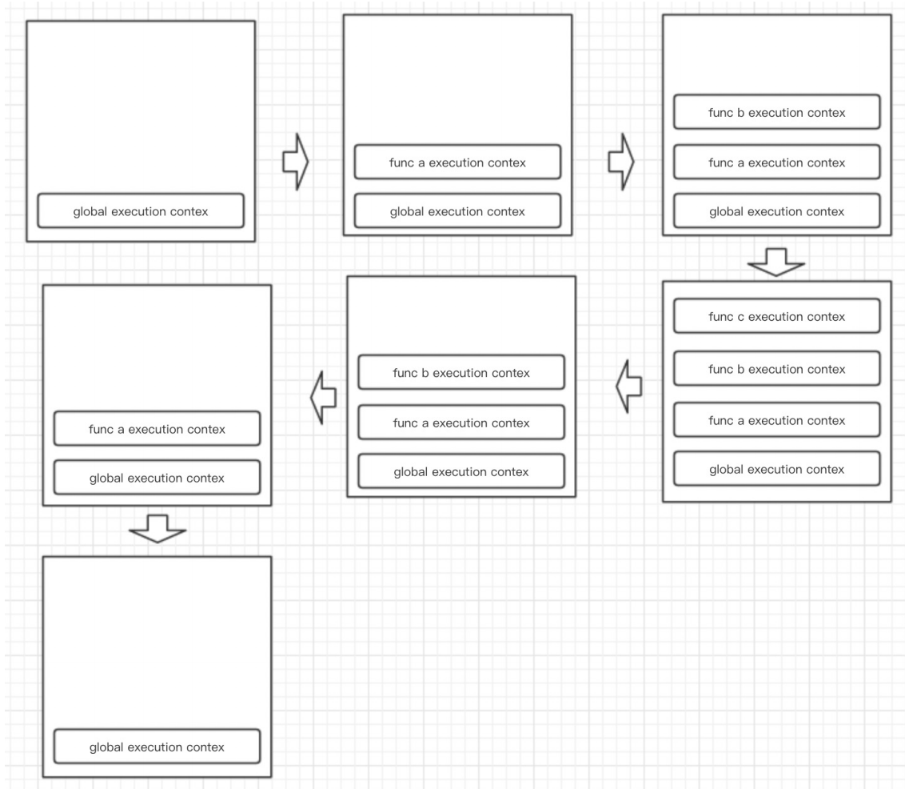
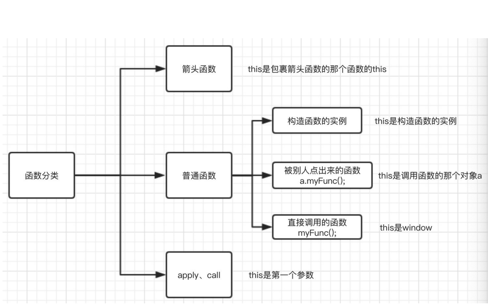

# this指针/闭包/作用域

## 1 专业术语

* 常量、变量、数据类型
* 形参、实参
* 匿名函数、具名函数、自执行函数
* 函数声明、函数表达式
* 堆、栈
* 同步、异步、进程、线程

## 2 执行上下文

当函数执行时，会创建一个称为执行上下文（execution）的环境，分为创建和执行2个阶段。

### 2.1 创建阶段

创建阶段，指函数被调用但还未执行任何代码时，此时创建了一个拥有3个属性的对象：

```javascript
executionContext = {
  scopeChain: {}, // 创建作⽤域链（scope chain） 
  variableObject: {}, // 初始化变量、函数、形参 
  this: {} // 指定this 
}
```

### 2.2 代码执行阶段

代码执行阶段主要的工作是：1、分配变量、函数的引用，赋值。2、执行代码。

**举个例子**

```javascript
// 一段这样的代码
function demo(num) {
  var name = "xiaowa";
  var getData = function getData() {};
  function c() {}
}
demo(100);

// 创建阶段大致这样，在这个阶段就出现了【变量提升（Hoisting）】
executionContext = {
  scopeChain: { ... }, 
  variableObject: {
    arguments: { // 创建了参数对象
      0: 100,
      length: 1
    },
    num: 100, // 创建形参名称，赋值/或创建引用拷贝
    c: pointer to function c(), // 有内部函数声明的话，创建引用指向函数体
    num: undefined, // 有内部函数声明a，初始化为undefined
    getData: undefined // 有内部函数声明b，初始化为undefined
  },
  this: { ... } 
}
  
// 代码执行阶段，在这个阶段，主要是赋值并执行代码
executionContext = {
  scopeChain: { ... }, 
  variableObject: {
    arguments: {
      0: 100,
      length: 1
    },
    num: 100, 
    c: pointer to function c(), 
    num: 'xiaowa', // 分配变量，赋值
    getData: pointer to function getData(), // 分配函数的引用，赋值
  },
  this: { ... } 
}
```

### 2.3 执行上下文栈

* 浏览器中的 JS 解释器是单线程的，相当于浏览器中同一时间只能做一件事。
* 代码中只有一个全局执行上下文，和无数个函数执行上下文，这些组成了执行上下文栈（Execution Stack）。
* 一个函数的执行上下文，在函数执行完毕后，会被移出执行上下文栈。

**举个例子**

```javascript
function c() {
  console.log("ok");
}
function b() {
  c();
}
function a() {
  b();
}
a();
```

这个例子的执行上下文栈是这样的：



## 3 作用域

js 中有全局作用域、函数作用域，ES6中又增加了块级作用域。作用域最大用途就是隔离变量或函数，并控制他们的生命周期。作用域是在函数执行上下文创建时定义好的，不是函数执行时定义的。

**举个例子**

```javascript
// 不要看晕了哦～
function a() {
  return function b() {
    var myName = 'b';
    console.log(myName); // b
  }
}
function c() {
  var myName = 'c';
  b();
}
var b = a();
c();

// 去掉函数b中的myName声明后
function a() {
  return function b() {
    // var myName = 'b';
    console.log(myName); // 这里会报错 Uncaught ReferenceError: myName is not defined
  }
}
function c() {
  var myName = 'c';
  b();
}
var b = a();
c();
```

### 3.1 作用域链

当一个块或函数嵌套在另一个块或函数中时，就发生了作用域的嵌套。在当前函数中如果 js 引擎无法找到某个变量，就会往上一级嵌套的作用域中去寻找，直到找到该变量或抵达全局作用域，这样的链式关系就称为作用域链（Scope Chain）

## 4 闭包

高级程序设计三中：闭包是指有权访问另外一个函数作用域中的变量的函数。可以理解为（能够读取其他函数内部变量的函数）

wiki百科的解释：<https://en.wikipedia.org/wiki/Closure_(computer_programming)>

> In [programming languages](https://en.wikipedia.org/wiki/Programming_language), a **closure**, also **lexical closure** or **function closure**, is a technique for implementing [lexically scoped](https://en.wikipedia.org/wiki/Lexically_scoped) [name binding](https://en.wikipedia.org/wiki/Name_binding) in a language with [first-class functions](https://en.wikipedia.org/wiki/First-class_function). [Operationally](https://en.wikipedia.org/wiki/Operational_semantics), a closure is a [record](https://en.wikipedia.org/wiki/Record_(computer_science)) storing a [function](https://en.wikipedia.org/wiki/Function_(computer_science))[[a\]](https://en.wikipedia.org/wiki/Closure_(computer_programming)#cite_note-1) together with an environment.[[1\]](https://en.wikipedia.org/wiki/Closure_(computer_programming)#cite_note-2) The environment is a mapping associating each [free variable](https://en.wikipedia.org/wiki/Free_variable) of the function (variables that are used locally, but defined in an enclosing scope) with the [value](https://en.wikipedia.org/wiki/Value_(computer_science)) or [reference](https://en.wikipedia.org/wiki/Reference_(computer_science)) to which the name was bound when the closure was created.[[b\]](https://en.wikipedia.org/wiki/Closure_(computer_programming)#cite_note-3) Unlike a plain function, a closure allows the function to access those *captured variables* through the closure's copies of their values or references, even when the function is invoked outside their scope.
>
> 翻译为：
>
> 在[编程语言中](https://en.wikipedia.org/wiki/Programming_language)，**闭包**（也可以是**词法闭包**或**函数闭包**）是一种在具有[一流功能](https://en.wikipedia.org/wiki/First-class_function)的语言中实现[词法作用域](https://en.wikipedia.org/wiki/Lexically_scoped) [名称绑定](https://en.wikipedia.org/wiki/Name_binding)的技术。[在操作上](https://en.wikipedia.org/wiki/Operational_semantics)，闭包是将[功能](https://en.wikipedia.org/wiki/Function_(computer_science))[[a\]](https://en.wikipedia.org/wiki/Closure_(computer_programming)#cite_note-1)与环境一起存储的[记录](https://en.wikipedia.org/wiki/Record_(computer_science))。[[1\]](https://en.wikipedia.org/wiki/Closure_(computer_programming)#cite_note-2)环境是一种将函数的每个[自由变量](https://en.wikipedia.org/wiki/Free_variable)（在本地使用，但在封闭范围内定义的变量）与[值](https://en.wikipedia.org/wiki/Value_(computer_science))或[引用](https://en.wikipedia.org/wiki/Reference_(computer_science))相关联的映射创建闭包时名称绑定到的名称。[[b\]](https://en.wikipedia.org/wiki/Closure_(computer_programming)#cite_note-3)与普通函数不同，闭包允许函数通过闭包的值或引用的副本访问那些*捕获的变量*，即使该函数在其作用域之外被调用也是如此。

```javascript
function outer() {
  var top = xxxxxxxxxx;
  function inner() {
    xxx.innerHTML = top;
  }
}
```

**平时用在哪儿？**

### 4.1 封装私有变量（amd 的框架等都使用）

```javascript
// 普通的定义类的方法
function Person() {
    this._attackVolume = 100;
}
  
Person.prototype = {
    attack(body) {
        body.bloodVolume -= this.attackVolume - body.defenseVolume;
    }
};

var person = new Person();
console.log(person._attackVolume);

// 工厂方法
function Person() {
    var _attackVolume = 100;
    return {
        attack() {
            body.bloodVolume -= this.attackVolume - body.defenseVolume;
        }
    };
}

var person = new Person();
console.log(person._attackVolume);
```

### 4.2 存储变量

```javascript
// 封装的时候
function getListDataManager() {
    // 外层scope中定义一个变量
    let localData = null;

    return {
        getData() {
            // 里面的函数使用外层的变量，而且是反复使用
            if(localData) {
                return Promise.resolve(localData);
            }
            return fetch('xxx')
                .then(data => localData = data.json());
        }
    };
}

// 用的时候
const listDataManager = getListDataManager();

button.onclick = () => {
    // 每次都会去获取数据，但是有可能是获取的缓存的数据
    text.innerHTML = listDataManager.getData();
};

window.onscroll = () => {
    // 每次都会去获取数据，但是有可能是获取的缓存的数据
    text.innerHTML = listDataManager.getData();
};
```

## 5 this

**this 指的是当前的执行上下文。**

一共有5种场景。

### 场景1: 函数直接调用时

```javascript
function myFunc() {
  console.log(this); // this是window
}
var a = 1;
myFunc(); // 函数直接调用，没有属性操作符的参与

// 解释一下“属性操作符”：比如 person.name 或者 person['name']
```

### 场景2: 函数被别人调用时

```javascript
function myFunc() {
  console.log(this); // this是对象a
}
var a = {
  myFunc: myFunc
};
a.myFunc(); // 函数被别人（a）调用
```

### 场景3: new 一个实例时

```javascript
function Person(name) {
  this.name = name;
  console.log(this); // this是指实例p
}
var p = new Person('zhaowa'); // new一个实例时
```

### 场景4: apply、call、bind时

apply、call、bind，这三个会改变 this 的指向。

```javascript
function getColor(color) {
  this.color = color;
  console.log(this); 
}
function Car(name, color) {
  this.name = name; // this指的是实例car
  getColor.call(this, color); // 这里的this从原本的getColor，变成了car
}
var car = new Car('卡车', '绿色');
```

### 场景5: 箭头函数时

箭头函数里面的 this ，就是写代码时定义的外层的 this（往上找就完事了）

```javascript
// 复习一下场景1
var a = {
    myFunc: function() {
        setTimeout(function(){
            console.log(this); // this是a
        }, 0);
    }
};
a.myFunc();

// 稍微改变一下
var a = {
    myFunc: function() {
      var that = this;
        setTimeout(function(){
            console.log(that); // this是a
        }, 0);
    }
};
a.myFunc();

// 箭头函数
var a = {
    myFunc: function() {
        setTimeout(() => {
            console.log(this); // this是a
        }, 0);
    }
};
a.myFunc();
```

**总结一下**



1. 对于直接调用的函数来说，不管函数被放在了什么地方，this都是window
2. 对于被别人调用的函数来说，被谁点出来的，this就是谁
3. 在构造函数中，类中（函数体中）出现的this.xxx = xxx中的this是当前类的一个实例
4. call、apply时，this是第一个参数。bind要优于call/apply哦，call参数多，apply参数少
5. 箭头函数没有自己的this，需要看其外层的是否有函数，如果有，外层函数的this就是内部箭头函数的this，如果没有，则this是window

⚠️  *bind返回的是一个绑定了执行上下文的函数。*

## 6 相关面试题

### 6.1 考察this三板斧

**1.1**

```javascript
function show() {
  console.log('this:', this); // 打印出：obj
}
var obj = {
  show: show
};
obj.show();


function show() {
  console.log('this:', this); // 打印出：window
}
var obj = {
  show: function() {
    show(); // 看这里，最后执行的时候，是直接调用哦，符合场景1
  }
};
obj.show(); 
```

**1.2**

```javascript
var obj = {
  show: function() {
    console.log('this:', this); // 打印出：window。  
  }
};
(0, obj.show)(); // 逗号表达式，返回的是最后一项。
/* 这里的话，返回的是个纯函数，可以理解为： 
 *  var func = (0, obj.show);
 *  func();
*/
// 执行的时候，是直接调用哦，符合场景1
```

**1.3**

```javascript
var obj = {
  sub: {
    show: function() {
      console.log('this:', this); // 打印出：sub
    }
  }
};
obj.sub.show(); // 不管点了几次，谁点出来的就是谁。 这里的话，是 sub 点出来的
```

**1.4**

```javascript
var obj = {
  show: function() {
    console.log('this:', this); // 打印出：obj
  }
};
var newObj = new obj.show(); // 这里是 obj 点出来的
```

**1.5**

```javascript
var obj = {
  show: function() {
    console.log('this:', this); // 打印出：newObj
  }
};
var newObj = new (obj.show.bind(obj))(); // new 碰到了显示绑定(bind)，new的优先级高
/* 优先级：
 * new 优先于 bind，
 * bind 优先于 . 操作符 
*/
```

**1.6**

```javascript
var obj = {
  show: function() {
    console.log('this:', this);
  }
};
var elem = document.getElementById('book-search-results');
elem.addEventListener('click', obj.show); // 打印出：window，看起来是点出来的，但实际上是点出来的函数传进去了
elem.addEventListener('click', obj.show.bind(obj)); // 打印出：obj，显示绑定到 obj
elem.addEventListener('click', function() {
  obj.show(); // 打印出：obj，是被obj点出来的
});
```

### 6.2 作用域

**2.1**

```javascript
var person = 1;
function showPerson() {
  var person = 2;
  console.log('person:', person); // 2
}
showPerson();
```

**2.2**

```javascript
var person = 1;
function showPerson() {
  console.log('person:', person); // undefined
  var person = 2;
}
showPerson();
```

**2.3**

```javascript
var person = 1;
function showPerson() {
  console.log('person:', person); // function person
  var person = 2;
  function person() {}
}
showPerson();
```

**2.4**

```javascript
var person = 1;
function showPerson() {
  console.log('person:', person); // function person
  function person() {}
  var person = 2;
}
showPerson();
```

**2.5**

```javascript
for(var i = 0; i < 10; i++) {
    console.log('i:', i); 
}
// i: 0
// i: 1
// i: 2
// i: 3
// i: 4
// i: 5
// i: 6
// i: 7
// i: 8
// i: 9

for(var i = 0; i < 10; i++) {
    setTimeout(function() {
        console.log('i:', i);
    }, 0);
}
// i: 10
// i: 10
// i: 10
// i: 10
// i: 10
// i: 10
// i: 10
// i: 10
// i: 10
// i: 10

for(var i = 0; i < 10; i++) {
    (function(i) {
        setTimeout(function() {
            console.log('i:', i);
        }, 0);
    })(i);
}
// i: 0
// i: 1
// i: 2
// i: 3
// i: 4
// i: 5
// i: 6
// i: 7
// i: 8
// i: 9
```
