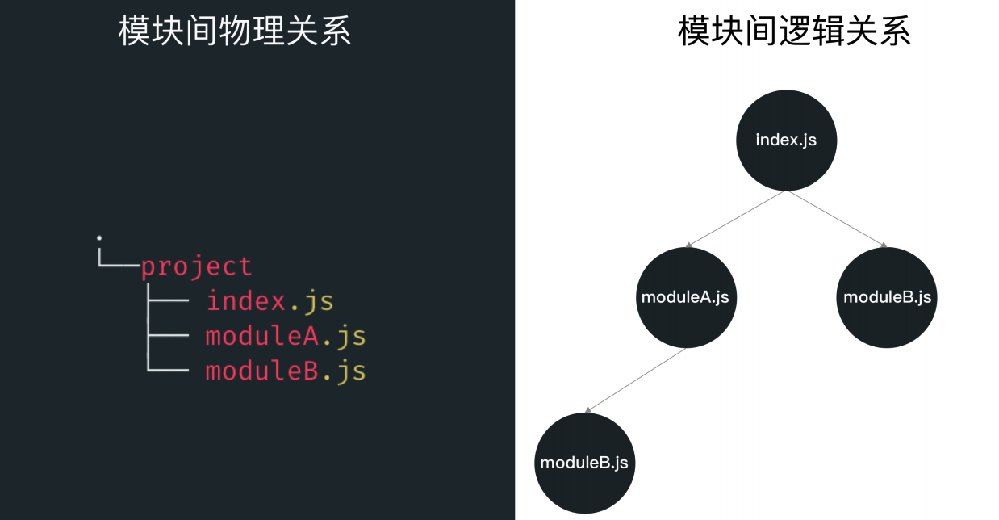
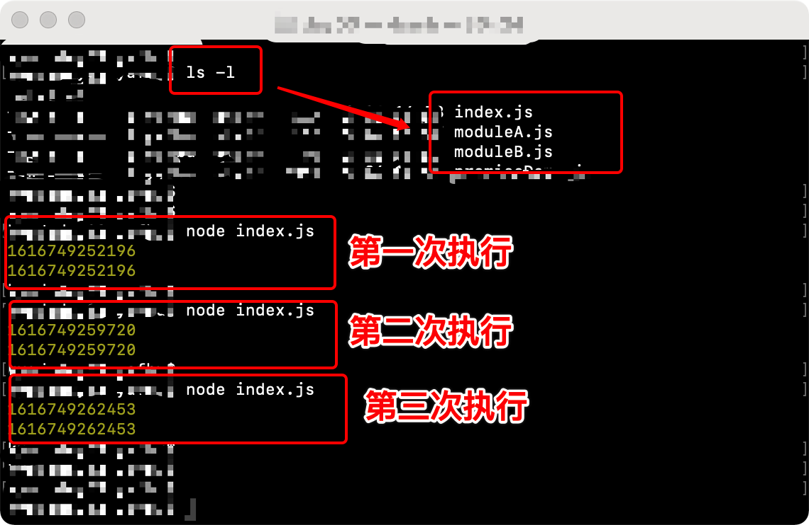
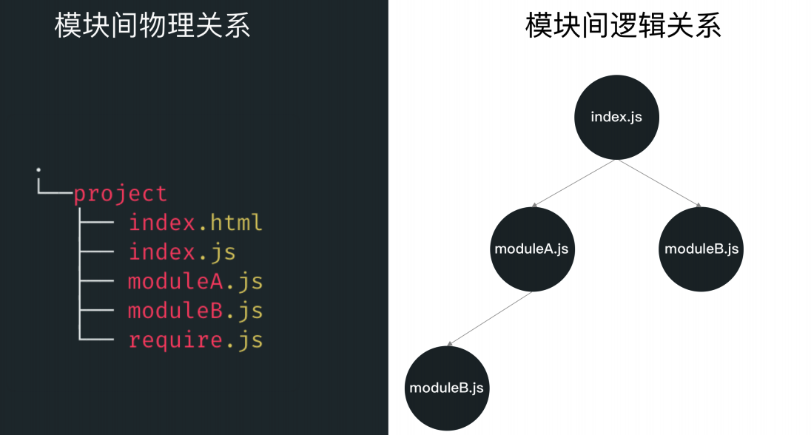
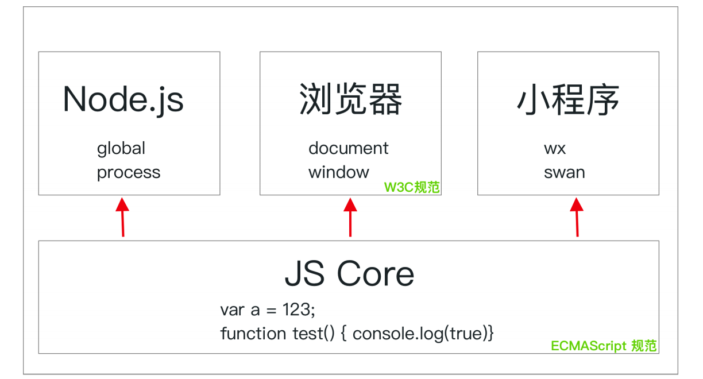
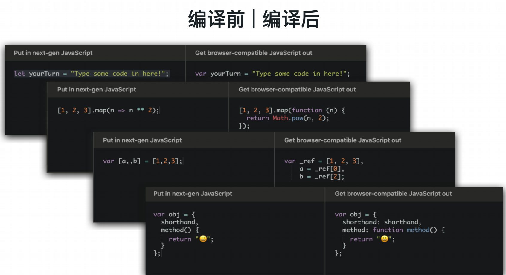
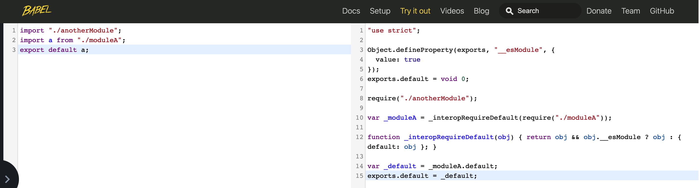

# Promise详解/JS模块化

## 1 Promise 详解

### 1.1 为什么需要 Promise

JavaScript是一门单线程语言，所以早期我们解决异步的场景时，大部分情况都是通过回调函数来进行。

例如在浏览器中发送 **ajax** 请求，就是常见的一个异步场景，发送请求后，一段时间服务端响应之后我们才能拿到结果。如果我们希望在异步结束之后执行某个操作，就只能通过回调函数这样的方式进行操作。

```javascript
var dynamicFunc = function(cb) {
    setTimeout(function() {
        cb();
    }, 1000);
}
dynamicFunc(function() {console.log(123)});
```

例如上面的这个例子，这里的dynamicFunc就是一个异步函数，里面执行的setTimeout会在1s之后调用传入的cb函数。按照上面的调用方式，最终1s之后，会打印123这个结果。

同样的，如果后续还有内容需要在异步函数结束时输出的话，就需要多个异步函数进行嵌套，非常不利于后续的维护。

```javascript
setTimeout(function() {
  console.log(123);
  setTimeout(function() {
    console.log(321);
    // ...
  }, 2000);
}, 1000);
```

为了能使回调函数以更优雅的方式进行调用，在ES6中js产生了一个名为**promise**的新规范，他**让异步操作变得近乎“同步化”**。

### 1.2 Promise 是如何使用的

在支持ES6的高级浏览器环境中，我们通过**new Promise()**即可构造一个**promise实例**。

这个构造函数接受一个函数，分别接受2个参数：resolve和reject，代表着我们需要改变当前实例的状态到“已完成”或是“已拒绝”。

```javascript
function promise1() {
    return new Promise(function (resolve, reject) {
        // 定义异步的内容
        setTimeout(function () {
            console.log('1s 后输出');
            //输出完成后，调用函数传入的resolve函数，将该promise实例标为已完成，当前promise串行继续执行
            resolve();
        }, 1000);
    });
}
```

```javascript
function promise2() {
    return new Promise(function (resolve) {
        setTimeout(function() {
            console.log('2s 后输出');
            resolve();
        }, 2000);
    });
}
```

上面的2个promise实例，串联起来即可写为：<code>promise1().then(function() { return promise2(); });</code>

```javascript
promise1()
  .then(function () {
    return promise2();
  })

// 也可以简写为：
promise1().then(promise2);
```

浏览器中执行之后，即可看到，1s之后出现**1s 后输出**字样，再经过2s出现**2s 后输出**字样。在这个例子中，我们能看到，当前promise如果状态变为已完成（执行了resolve方法），那么就会去执行then方法中的下一个promise函数。

同样的，如果我们的promise变为已拒绝状态（执行了reject方法），那么就会进入后续的异常处理函数中。

```javascript
function promise3() {
    return new Promise(function (resolve, reject) {
        var random = Math.random() * 10; // 随机一个1～10的数字
        setTimeout(function () {
            if (random >= 5) {
                resolve(random);
            } else {
                reject(random);
            }
        }, 1000);
    });
}

var onResolve = function (val) {
    console.log('已完成：输出的数字是 ', val);
};

var onReject = function (val) {
    console.log('已拒绝：输出的数字是 ', val);
}

// promise的then也可以接受2个函数，第一个参数为resolve后执行，第二个函数为reject后执行
promise3().then(onResolve, onReject);

// 也可以通过 .catch 方法拦截状态变为已拒绝时的 promise
promise3().catch(onReject).then(onResolve);

// 也可以通过 try catch 进行拦截状态变为已拒绝时的 promise
try {
    promise3().then(onResolve);
} catch (e) {
    onReject(e);
}
```

这个例子使用了三种方式拦截最终变为【已拒绝】状态的promise，分别是：

1. 使用 then 的第二个参数
2. 使用 .catch 方法捕获前方promise抛出的异常
3. 使用 try catch 拦截代码块中 promise 抛出的异常

同时我们还可以发现，在改变promise状态时，调用resolve和reject函数的时候，也可以给下一步then中执行的函数传递参数。这个例子中我们把随机生成的数字传给了resolve和reject函数，我们也就能在then中执行函数的时候拿到这个值。

总结一下本小节的内容：

1. promise会有三种状态：【进行中】【已完成】【已拒绝】，进行中状态可以更改为已完成或已拒绝，已经更改过状态后，无法继续更改（例如，从已完成改为已拒绝）。
2. ES6中的Promise构造函数，我们构造之后需要传入一个函数，他接受2个函数参数，执行第一个参数之后就会改变当前promise为“已完成”状态，执行第二个参数之后就会变为“已拒绝”状态。
3. 通过 .then 方法，即可在上一个promise达到已完成时继续执行下一个函数或promise。同时通过resolve或reject时传入参数，即可给下一个函数或promise传入初始值。
4. 已拒绝的 promise，后续可以通过 .catch 方法或 .then 方法的第二个参数或是 try catch 进行捕获。

### 1.3 封装异步操作为 promise

我们可以将任何接受回调的函数封装为一个promise，下面举几个例子来说明：

```javascript
// 原函数
function dynamicFunc(cb) {
  setTimeout(function() {
    console.log('1s 后显示');
    cb();
  }, 1000);
}

var callback = function() {
  console.log('在异步结束后 log');
}

// 用传入回调函数的方式执行
dynamicFunc(callback);
```

上面的例子就是最传统的，使用传入回调函数的方式在异步结束后执行函数。我们可以通过封装promise的方式，将这个异步函数变为promise

```javascript
function dynamicFuncAsync() {
  return new Promise(function(resolve) {
    setTimeout(function(){
      console.log('1s 后显示');
      resolve();
    });
  });
}

var callback = function() {
  console.log('在异步结束后 log');
}

dynamicFuncAsync().then(function() { callback(); });
```

再举一个例子，发送ajax请求也可以进行封装：

```javascript
function ajax(url, success, fail) {
  var client = new XMLHttpRequest();
  client.open("GET", url);
  client.onreadystatechange = function() {
    if(this.readyState !== 4) {
      return;
    }
    if(this.status === 200) {
      success(this.response);
    } else {
      fail(new Error(this.statusText));
    }
  };
  client.send();
};

ajax('/ajax.json', function(){console.log('成功')}, function(){console.log('失败')});
```

我们可以看到，调用ajax方法时需要传入success和fail的回调函数进行调用。我们可以不传入回调函数，通过封装promise的方式，在原来的执行回调函数的地方更改当前promise的状态，就可以通过链式调用。

```javascript
function ajaxAsync(url) {
  return new Promise(function(resolve, reject) {
    var client = new XMLHttpRequest();
    client.open("GET", url);
    client.onreadystatechange = function() {
      if(this.readyState !== 4) {
        return;
      }
      if(this.status === 200) {
        resolve(this.response);
      } else {
        reject(new Error(this.statusText));
      }
    };
    client.send();
  });
};

ajaxAsync('/ajax.json')
  .catch(function() {
    console.log('失败');
  })
  .then(function() {
    console.log('成功');
  })
```

总结一下当前小节：

1. 我们可以轻松的把任何一个函数或者是异步函数改为promise，尤其是异步函数，改为promise之后即可进行链式调用，增强可读性。
2. 将带有回调函数的异步改为promise也很简单，只需要在内部实例化promise之后，在原来执行回调函数的地方执行对应的更改promise状态的函数即可。

### 1.4 promise 规范解读

任何符合promise规范的对象或函数都可以成为promise，promise A plus规范地址：<https://promisesaplus.com>

上面我们熟悉了整体promise的用法，我们知道了如何去创建一个promise，如何去使用它，后面我们也熟悉了如何去改造回调函数到promise。本小节我们详细过一遍 **promise A+** 规范，从规范层面明白promise使用过程中的细节。

#### 1.4.1 术语

* **Promise：**promise是一个拥有 `then` 方法的对象或函数，其行为符合本规范。
* **具有then方法（thenable）：**是一个定义了 `then` 方法的对象或函数。
* **值（value）：**指任何 JavaScript 的合法值（包括 `undefined`，`thenable` 和 `promise`）。
* **异常（exception）：**是使用 `throw` 语句抛出的一个值。
* **原因（reason）：**表示一个 promise 的拒绝原因。

#### 1.4.2 要求

##### 1.4.2.1 promise 的状态

一个 promise 的当前状态必须为以下3种状态中的一种：**等待态（Pending）**、**已完成（Fullfilled）**、**已拒绝（Reject）**。

* 处于等待态时，promise 需满足以下条件：可以变为【已完成】或【已拒绝】
* 处于已完成时，promise 需满足以下条件：1.不能迁移至其他任何状态，2.必须拥有一个**不可变**的**值**
* 处于已拒绝时，promise 需满足以下条件：1. 不能迁移至其他任何状态，2.必须拥有一个**不可变**的**原因**

##### 1.4.2.2 必须有一个 then 方法

一个 promise 必须提供一个 `then` 方法以访问其当前值和原因。

promise 的 `then` 方法接受2个参数：`promise.then(onFullfilled, onRejected)` 它们都是可选参数，同时它们都是函数，如果 `onFullfilled` 或 `onRejected` 不是函数，则需要忽略它们。

* 如果 `onFullfilled` 是一个函数
  * 当 `promise` 执行结束后，其必须被调用，其第一个参数为 `promise` 的结果
  * 在 `promise` 执行结束前，其不可被调用
  * 其调用次数不可超过 1次
* 如果 `onRejected` 是一个函数
  * 当 `promise` 被拒绝执行后，其必须被调用，其第一个参数为 `promise` 的原因
  * 在 `promise` 被拒绝执行前，其不可被调用
  * 其调用次数不可超过 1次
* 在执行上下文堆栈仅包含平台代码之前，不得调用 `onFullfilled` 或`onRejected`
* `onFullfilled` 和 `onRejected` 必须被作为普通函数调用（即非实例化调用，这样函数内部 `this` 非严格模式下指向window）
* `then` 方法可以被同一个 `promise` 调用多次
  * 当 `promise` 成功执行时，所有 `onFullfilled` 需按照其注册顺序依次回调
  * 在 `promise` 被拒绝执行时，所有 `onRejected` 需按照其注册顺序依次回调
* `then` 方法必须返回一个 `promise` 对象 `promise2 = promise1.then(onFullfilled, onRejected);`
  * 只要 `onFullfilled` 或者 `onRejected` 返回一个值 `x`，promise2 都会进入 onFullfilled 状态
  * 如果 `onFullfilled` 或者 `onRejected` 抛出一个异常 `e`，则 promise2 必须拒绝执行，并返回拒绝原因
  * 如果 `onFullfilled` 不是函数，且 `promise1` 状态变为已完成， `promise2` 必须成功执行并返回相同的值
  * 如果 `onRejected` 不是函数，且 `promise1` 状态变为已拒绝， `promise2` 必须执行拒绝回调并返回相同的原因

```javascript
var promise1 = new Promise((resolve, reject) => { reject(); });
promise1
  .then(null, function() {
    return 123;
  })
  .then(null, null)
  .then(null, null)
  .then(
    () => {
      console.log('promise2 已完成');
    }, 
    () => {
      console.log('promise2 已拒绝');
    });
```

#### 1.4.3 promise 的解决过程

​		**Promise 解决过程**是一个抽象的操作，其需输入一个 `promise` 和一个值，我们表示为 `[[Resolve]](promise, x)` （这句话的意思就是把 promise resolve 了，同时传入 x 作为值）

```javascript
promise.then(function(x) {
  console.log('会执行这个函数，同时传入 x 变量的值', x);
});
```

如果 `x` 有 `then`方法且看上去像一个 Promise，解决程序即尝试使 `promise` 接受 `x` 的状态；否则，其用 `x` 的值来执行 `promise` 

* 如果 `promise` 和 `x` 指向同一对象，以 `TypeErroe` 为据因拒绝执行 `promise`

* 如果 x 为 promise

  * 如果 `x` 处于等待态，`promise` 需保持为等待态直至 `x` 被执行或拒绝
  * 如果 `x` 处于执行态，用相同的值执行 `promise`
  * 如果 `x` 处于拒绝态，用相同的据因拒绝 `promise` 

  ```javascript
  var promise1 = function() {
    return new Promise(function(resolve) {
      setTimeout(function() {
        console.log(1);
        resolve();
      }, 1000)
    });
  }
  
  var promise2 = function() {
    return new Promise(function(resolve) {
      setTimeout(function() {
        console.log(2);
        resolve();
      }, 2000)
    });
  }
  
  promise1()
    .then(function() {
      return promise2(); // 此处返回一个 promise 实例
    })
    .then(function() { console.log('已完成');}, function() { console.log('已拒绝'); });
  ```

* 如果 x 为 Object 或 function**（不常见）**

  * 首先尝试执行 `x.then`
  * 如果取 `x.then` 的值时抛出异常错误 `e` ，则以 `e` 为据因拒绝 `promise`
  * 如果 `then` 是函数，将 `x` 作为函数的作用域 `this` 调用。传递2个回调函数作为参数，第一个参数叫做 `resolvePromise` ，第二个参数叫做 `rejectPromise` ：
    * 如果 `resolvePromise` 以值 `y` 为参数被调用，则运行 `[[Resolve]](promise, y)` 
    * 如果 `rejectPromise` 以据因 `r` 为参数被调用，则以据因 `r` 拒绝 `promise` 
    * 如果 `resolvePromise` 和 `rejectPromise` 均被调用，或者被同一参数调用了多次，则优先采用首次调用并忽略其他的调用
    * 如果调用 `then` 方法抛出了异常 `e` 
      * 如果 `resolvePromise` 和 `rejectPromise` 已经被调用，则忽略
      * 否则以 `r` 为据因拒绝 `promise`
  * 如果取 `then` 不为函数，以 `x` 为参数将 `promise` 变为已完成状态

* 如果 `x` 不为对象或函数，以 `x` 为参数将 `promise` 变为已完成状态**（重要且常见）**

### 1.5 Promise 构造函数上的静态方法

#### 1.5.1 Promise.resolve

返回一个 promise 实例，并把它的状态设置为已完成，同时将他的结果作为传入 promise 实例的值

```javascript
var promise = Promise.resolve(123);
promise
  .then(function(val) {
    console.log('已完成', val);
  });
// 已完成 123
```

同样的，`promise.resolve` 的参数也可以处理对象、函数等内容，处理方式和上面规范中介绍的相同。

#### 1.5.2 Promise.reject

返回一个 promise 实例，并将它的状态设置为已拒绝，同时将他的结果作为原因传入 onRejected 函数

```javascript
var promise = Promise.reject(123);
promise
  .then(null, function(val) {
    console.log('已拒绝', val);
  });
// 已拒绝 123
```

#### 1.5.3 Promise.all

返回一个 promise 实例，接受一个数组，里面含有多个 promise 实例，当所有的 promise 实例都成为已完成状态时，进入已完成状态，否则进入已拒绝状态。

```javascript
var promise1 = function() {
  return new Promise(function(resolve) {
    setTimeout(function() {
      console.log(1);
      resolve();
    }, 1000)
  });
}

var promise2 = function() {
  return new Promise(function(resolve) {
    setTimeout(function() {
      console.log(2);
      resolve();
    }, 2000)
  });
}

Promise.all([promise1(), promise2()])
  .then(function() {
    console.log('全部 promise 均已完成');
  });
```

⚠️ 此时多个 promise 是**同时**进行的，也就是在上面的例子中，等待 1s 打印 1 之后，再等待 1s 就会打印 2 和「全部 promise 均已完成」。

#### 1.5.4 Promise.race

返回一个 promise 实例，接受一个数组，里面含有多个 promise 实例，当有一个 promise 实例状态改变时，就进入该状态且不可改变。这里所有的 promise 实例为**竞争**关系，只选择第一个进入改变状态的 promise 值。

```javascript
var promise1 = function() {
  return new Promise(function(resolve) {
    setTimeout(function() {
      console.log(1);
      resolve(1);
    }, 1000)
  });
}

var promise2 = function() {
  return new Promise(function(resolve) {
    setTimeout(function() {
      console.log(2);
      resolve(2);
    }, 2000)
  });
}

Promise.race([promise1(), promise2()])
  .then(function(val) {
    console.log('有一个 promise 状态已经改变', val);
  });
```

### 1.6 实现一个简单的 promise

```javascript
const isFunction = variable => typeof variable === 'function'
// 定义 promise 的三种状态常量
const PENDING = 'PENDING'
const FULFILLED = 'FULFILLED'
const REJECTED = 'REJECTED'

class Promise {
    constructor(handle) {
        this._status = PENDING // 当前状态
        this._value = undefined // 当前值
        this._fulfilledQueues = [] // 添加成功回调函数队列
        this._rejectedQueues = [] // 添加失败回调函数队列
        try {
            handle(this._resolve.bind(this), this._reject.bind(this))
        } catch (err) {
            this._reject(err)
        }
    }

    _resolve(val) {
        const run = () => {
            if (this._status !== PENDING) return
            // 依次执行成功队列中的函数，并清空队列
            const runFulfilled = (value) => {
                let cb;
                while (cb = this._fulfilledQueues.shift()) {
                    cb(value)
                }
            }
            // 依次执行失败队列中的函数，并清空队列
            const runRejected = (error) => {
                let cb;
                while (cb = this._rejectedQueues.shift()) {
                    cb(error)
                }
            }
            /* 如果 resolve 的参数为 promise 对象，则必须等待该 promise 对象状态改变后，
            当前 promise 的状态才会改变，且状态取决于参数 promise 对象的状态 */
            if (val instanceof Promise) {
                val.then(value => {
                    this._value = value
                    this._status = FULFILLED
                    runFulfilled(value)
                }, err => {
                    this._value = err
                    this._status = REJECTED
                    runRejected(err)
                })
            } else {
                this._value = val
                this._status = FULFILLED
                runFulfilled(val)
            }
        }
        setTimeout(run, 0)
    }

    _reject(err) {
        if (this._status !== PENDING) return
        // 依次执行失败队列中的函数，并清空队列
        const run = () => {
            this._status = REJECTED
            this._value = err
            let cb;
            while (cb = this._rejectedQueues.shift()) {
                cb(err)
            }
        }
        // 为了支持同步的 promise，这里采用异步调用
        setTimeout(run, 0)
    }

    then(onFulfilled, onRejected) {
        const {
            _value,
            _status
        } = this
        // 返回一个新的 promise 对象
        return new Promise((onFulfilledNext, onRejectedNext) => {
            // 封装一个成功时执行的函数
            let fulfilled = value => {
                try {
                    if (!isFunction(onFulfilled)) {
                        onFulfilledNext(value)
                    } else {
                        let res = onFulfilled(value);
                        if (res instanceof Promise) {
                            // 如果当前回调函数返回 promise 对象，必须等待其状态改变后再执行下一个回调
                            res.then(onFulfilledNext, onRejectedNext)
                        } else {
                            // 否则会将返回结果直接作为参数，传入下一个 then 的回调函数，并立即执行下一个 then 的回调函数
                            onFulfilledNext(res)
                        }
                    }
                } catch (err) {
                    // 如果函数执行出错，新的 promise 对象的状态为失败
                    onRejectedNext(err)
                }
            }
            // 封装一个失败时执行的函数
            let rejected = error => {
                try {
                    if (!isFunction(onRejected)) {
                        onRejectedNext(error)
                    } else {
                        let res = onRejected(error);
                        if (res instanceof Promise) {
                            // 如果当前回调函数返回 promise 对象，必须等待其状态改变后再执行下一个回调
                            res.then(onFulfilledNext, onRejectedNext)
                        } else {
                            // 否则会将返回结果直接作为参数，传入下一个 then 的回调函数，并立即执行下一个 then 的回调函数
                            onFulfilledNext(res)
                        }
                    }
                } catch (err) {
                    // 如果函数执行出错，新的 promise 对象的状态为失败
                    onRejectedNext(err)
                }
            }
            switch (_status) {
                // 当状态为 pending 时，将 then 方法回调函数加入执行队列等待执行
                case PENDING:
                    this._fulfilledQueues.push(fulfilled)
                    this._rejectedQueues.push(rejected)
                    break
                // 当状态已经改变时，立即执行对应的回调函数
                case FULFILLED:
                    fulfilled(_value)
                    break
                case REJECTED:
                    rejected(_value)
                    break
            }
        })
    }

    catch(onRejected) {
        return this.then(null, onRejected)
    }

    static resolve(value) {
        // 如果参数是 promise 实例，直接返回这个实例
        if (value instanceof Promise) return value
        return new Promise(resolve => resolve(value))
    }

    static reject(value) {
        return new Promise((resolve, reject) => reject(value))
    }

    static all(list) {
        return new Promise((resolve, reject) => {
            let values = []
            let count = 0
            for (let [i, p] of list.entries()) {
                // 数组参数如果不是 promise 实例，先调用 promise.resolve
                this.resolve(p).then(res => {
                    values[i] = res
                    count++
                    // 所有的状态都变成 fullfilled 时，返回的 promise 状态就变成 fulfilled
                    if (count === list.length) resolve(values)
                }, err => {
                    // 有一个被 reject 时，返回的 promise 状态就变成 rejected
                    reject(err)
                })
            }
        })
    }

    static race(list) {
        return new Promise((resolve, reject) => {
            for (let p of list) {
                //  只要有一个实例率先改变状态，新的 promise 的状态就跟着改变
                this.resolve(p).then(res => {
                    resolve(res)
                }, err => {
                    reject(err)
                })
            }
        })
    }
}
```

### 1.7 ES6/ESNext 中的 generator / async await简介

在 ES6 之后，我们可以使用 generator 和 async/await 来操作 promise，比起使用 promise 串行的调用来说，他们从语法层面让调用关系显得更加串行。

```javascript
function promise1() {
  return new Promise(function(resolve) {
    setTimeout(function() {
      console.log(1);
      resolve();
    }, 1000)
  });
}

function promise2() {
  return new Promise(function(resolve) {
    setTimeout(function() {
      console.log(2);
      resolve();
    }, 2000)
  });
}

// 使用 generator 函数
function* gen() {
  yield promise1();
  yield promise2();
}
var g = gen();
g.next();
g.next();

// 使用 async/await 函数
(async function() {
  try {
    await promise1();
    await promise2();
    console.log('已完成');
  } catch(e) {
    console.log(e);
    console.log('已拒绝');
  }
}());
```

## 2 JS中的模块化

在WEB开发的早期，为了团队协作和代码维护的方便，许多开发者会选择将 JavaScript 代码分开写在不同的文件里面，然后通过多个 script 标签来加载它们。

```html
<script src="./a.js"></script>
<script src="./b.js"></script>
<script src="./c.js"></script>
```

虽然每个代码块处在不同的文件中，但最终所有的 JS 变量还是会处在同一个 **全局作用域** 下，这时候就需要额外注意由于作用域**变量提升**所带来的问题。

```html
<!-- index.html -->
<script>
  // a.js
  var num = 1;
  setTimeout(() => console.log(num), 1000);
</script>
<script>
  // b.js
  var num = 2;
</script>
```

在这个例子中，我们分别记载了2个script标签，两段 JS 都声明了 `num` 变量。第一段脚本的本意本来是希望在 1s 后打印自己声明的 `num` 变量 **1**。但最终运行结果却打印出了第二段脚本中的 `num` 变量的结果 **2**。虽然两段代码写在不同的文件中，但是因为运行时声明变量都在全局下，最终产生了冲突。

同时，如果代码之间有依赖关系的话，需要额外关注脚本加载的顺序。如果文件依赖顺序有改动，就需要在 html手动变更加载标签的顺序，非常麻烦。

要解决这样的问题，我们就需要将这些脚本文件**模块化**：

1. 每个模块都有自己的**变量作用域**，两个模块之间的内部变量不会产生冲突。
2. 不同模块之间保留相互**导入和导出**的方式方法，模块间能够相互通信。模块的执行与加载遵循一定的规范，能保证彼此之间的依赖关系。

主流的编程语言都有处理模块化的关键词，在这些语言中，模块与模块之间的内部变量相互不影响。同时，也可以通过关键字进行模块定义，引入和导出等等。例如：JAVA 里的 `module` 关键词，python 中的 `import` 。

但是 JavaScript 这门语言在ECMAScript 6 规范之前并没有语言层面的模块导入导出关键词及相关规范。为了解决这样的问题，不同的 JS 运行环境分别有着自己的解决方案。

## 3 CommonJS 规范初探

Node.js 就是一个基于 v8 引擎，事件驱动 I/O 的服务端 JS 运行环境，在2009年刚推出时，它就实现了一套名为 **CommonJS** 的模块化规范。

在 CommonJS 规范里，每个 JS 文件就是一个 **模块（module）**，每个模块内部可以使用 `require` 函数和`module.exports` 对象来对模块进行导入和导出。

```javascript
// 一个比较简单的 CommonJS 模块
const moduleA = require("./moduleA"); // 获取相邻的相对路径 ‘./moduleA’ 文件导出的结果
module.exports = moduleA; // 导出当前模块内部 moduleA 的值
```

下面则三个模块稍微复杂一点，它们都是合法的 CommonJS 模块：

```javascript
// index.js
require("./moduleA");
var m = require("./moduleB");
console.log(m);

// moduleA.js
var m = require("./moduleB");
setTimeout(() => console.log(m), 1000);

// moduleB.js
var m = new Date().getTime();
module.exports = m;
```

* **Index.js** 代表的模块通过执行 `require` 函数，分别加载了相对路径为 `./moduleA` 和 `./moduleB` 的两个模块，同时输出 **moduleB** 模块的结果。
* **moduleA.js** 文件内也通过执行 `require` 函数加载了 `./moduleB` 模块，在1s后也输出了加载进来的结果。
* **moduleB.js** 文件内部相对来说就简单很多，仅仅定义了一个时间戳，然后直接通过 `module.exports` 导出。

它们之间的 **物理关系** 和 **逻辑关系** 如下图：



在装有 Node.js 的机器上，我们可以直接执行 `node index.js` 查看输出的结果。我们可以发现，无论执行多少次，最终的两行结果均相同。



虽然这个例子非常简单，但是我们却可以发现 CommonJS 完美的解决了最开始我们提出的痛点：

1. 模块之间内部即使有相同的变量名，它们运行时没有冲突。**这说明它有处理模块变量作用域的能力。**上面这个例子中的三个模块中均有 `m` 变量，但是并没有冲突。
2. moduleB 通过 `module.exports` 导出了一个内部变量，而它在 moduleA 和 index 模块中能被加载。**这说明它有导入导出模块的方式，同时能够处理基本的依赖关系**。
3. 我们在不同的模块加载了 moduleB 两次，我们得到了相同的结果。**这说明它保证了模块单例**。

但是，这样的 CommonJS 模块只能在 Node.js 环境中才能运行，直接在其他环境中运行这样的代码模块就会报错。这是因为只有 node 才会在解析 JS 的过程中提供一个 `require` 方法，这样当解析器执行代码时，发现有模块调用了 `require` 函数，就会通过参数找到对应模块的物理路径，通过系统调用从硬盘读取文件内容，解析这段内容最终拿到导出结果并返回。而其他运行环境并不一定会在解析时提供这么一个 `require` 方法，也就不能直接运行这样的模块了。

从它的执行过程也能看出来 CommonJS 是一个 **同步加载模块** 的模块化规范，每当一个模块 `require` 一个子模块时，都会停止当前模块的解析直到子模块读取解析并加载。

## 4 适合 WEB 开发的 AMD 模块化规范

另一个为 WEB 开发者所熟知的 JS 运行环境就是浏览器了。浏览器并没有提供像 Node.js 里一样的 `require` 方法。不过，受到 CommonJS 模块化规范的启发，WEB 端还是逐渐发展起来了 AMD，SystemJS 规范等适合浏览器端运行的 JS 模块化开发规范。

AMD 全称 **Asynchronous module definition**，意思是 **异步的模块定义**，不同于 CommonJS 规范的同步加载，AMD 正如其名所有模块默认都是异步加载，这也是早期为了满足 web 开发的需要，因为如果在 web 端也使用同步加载，那么页面在解析脚本文件的过程中可能使页面停止响应。

而 AMD 模块的定义与 CommonJS 稍有不同，上面这个例子的三个模块分别改成 AMD 规范就类似这样：

```javascript
// index.js
require(['moduleA', 'moduleB'], function(moduleA, moduleB) {
  console.log(moduleB);
});

// moduleA.js
define(function(require) {
  var m = require("moduleB");
  setTimeout(() => console.log(m), 1000);
})

// moduleB.js
define(function(require) {
  var m = new Date().getTime();
  return m;
})
```

我们可以对比看到，AMD 规范也支持文件级别的模块，模块 ID 默认为文件名，在这个模块文件中，我们需要使用 `define` 函数来定义一个模块，再回调函数中接受定义组件内容。这个回调函数接受一个 `require` 方法，能够在组件内部加载其他模块，这里我们分别传入模块 ID，就能加载对应文件内的 AMD 模块。不同于 CommonJS 的是，这个回调函数的返回值即是模块导出结果。

差异比较大的地方在于我们的入口模块，我们定义好了 moduleA 和 moduleB 之后，入口处需要加载进来它们，于是乎就需要使用 AMD 提供的 `require` 函数，第一个参数写明入口模块的依赖列表，第二个参数作为回调参数依次传入前面依赖的导出值，所以这里我们在 index.js 中只需要在回调函数中打印 moduleB 传入的值即可。

Node.js 里我们直接通过执行 `node index.js` 来查看输出的结果，在 WEB 端我们就需要使用一个 html 文件，同时在里面加载这个入口模块。这里我们再加入一个 **index.html** 作为浏览器中的启动入口。

如果想要使用 AMD 规范，我们还需要添加一个符合 AMD 规范的加载器脚本在页面中，符合 AMD 规范实现的库很多，比较有名的就是 **require.js** 。

```html
<html>
  <!-- 此处必须加载 require.js 之类的 AMD 模块化库之后才可以继续加载模块 -->
  <script src="require.js"></script>
  <!-- 只需要加载入口模块即可 -->
  <script src="index.js"></script>
</html>
```

使用 AMD 规范改造项目之后的关系如下图，在物理关系里多了2个文件，但是模块间的逻辑关系仍与之前相同。



启动静态服务之后我们打开浏览器中的控制台，无论我们刷新多少次页面，同 Node.js 的例子一样，输出的结果均相同。同时我们还能看到，虽然我们只加载了 index.js 也就是入口模块，但当使用到 moduleA 和 moduleB 的时候，浏览器就会发请求去获取对应模块的内容。


从结果上来看，AMD 与 CommonJS 一样，都完美的解决了上面说的 **变量作用域** 和 **依赖关系** 之类的问题。但是 AMD 这种默认异步，在回调函数中定义模块内容，相对来说使用起来就会麻烦一些。

同样的，AMD 的模块也不能直接运行在 node 端，因为内部的 `define` 函数，`require` 函数都必须配合在浏览器中加载 require.js 这类 AMD 库才能使用。

## 5 能同时被 CommonJS 规范和 AMD 规范加载的 UMD 模块

有时候我们写的模块需要同时运行在浏览器端和 Node.js 里面，这也就需要我们分别写一份 AMD 模块和 CommonJS 模块来运行在各自环境，这样如果每次模块内容有改动还得去两个地方分别进行更改，就比较麻烦。

```javascript
// 一个返回随机数的模块，浏览器使用的 AMD 模块
// math.js
define(function() {
  return function() {
    return Math.random();
  }
});

// 一个返回随机数的模块， Node.js 使用的 CommonJS 模块
module.exports = function() {
  return Math.random();
}
```

基于这样的问题，**UMD（Universal Module Definition）**作为一种 **同构（isomorphic）**的模块化解决方案出现，它能够让我们在一个地方定义模块内容，并同时兼任 AMD 和 CommonJS 语法。

写一个 UMD 模块也非常简单，我们只需要判断一下这些模块化规范的特征值，判断出当前究竟在哪种模块化规范的环境下，然后把模块内容用检测出的模块化规范的语法导出即可。

```javascript
(function(self, factory) {
  if(typeof module === 'object' && typeof module.exports === 'object') {
    // 当前环境是 CommonJS 规范环境
    module.exports = factory();
  } else if(typeof define === 'function' && define.amd) {
    // 当前环境是 AMD 规范环境
    define(factory)
  } else {
    // 什么环境都不是，直接挂在全局对象上
    self.umdModule = factory();
  }
}(this, function() {
  return function() {
    return Math.random();
  }
}));
```

上面就是一种定义 UMD 模块的方式，我们可以看到首先他会检测当前加载模块的规范究竟是什么。如果 `module.exports` 在当前环境中为对象，那么肯定为 CommonJS，我们就能用 `module.exports` 导出模块内容。如果当前环境中有 `define` 函数并且  `define.amd` 为 `true` ，那我们就可以使用 AMD 的 `define` 函数来定义一个模块。最后，即使没检测出来当前环境的模块化规范，我们也可以直接把模块内容挂载在全局对象上，这样也能加载到模块导出的结果。 

## 6 ESModule 规范

前面我们说到的 CommonJS 规范和 AMD 规范有这么几个特点：

1. 语言上层的运行环境中实现的模块化规范，模块化规范由环境自己定义。
2. 相互之间不能共用模块。例如：不能在 Node.js 运行 AMD 模块，不能直接在浏览器运行CommonJS模块。

在 ECMAScript 2015 也就是我们常说的 ES6 之后，JS 有了语言层面的模块化导入导出关键词与语法以及与之匹配的 ESModule 规范。使用 ESModule 规范，我们可以通过 `import` 和 `export` 两个关键词来对模块进行导入与导出。

还是之前的例子，使用 ESModule 规范和新的关键词就需要这样定义：

```javascript
// index.js
import './moduleA';
import m from './moduleB';
console.log(m);

// moduleA.js
import m from './moduleB';
setTimeout(() => console.log(m), 1000);

// moduleB.js
var m = new Date().getTime();
export default m;
```

ESModule 与 CommonJS 和 AMD 最大的区别在于，ESModule 是由 JS 解释器实现，而后两者是在宿主环境中运行时实现。ESModule 导入实际上是在语法层面新增了一个语句，而 AMD 和 CommonJS 加载模块实际上是调用了 `require` 函数。

```javascript
// 这是一个新的语法，我们没办法兼容，如果浏览器无法解析就会报语法错误
import moduleA from './moduleA';

// 我们只需要新增加一个 require 函数，就可以首先保证 AMD 或 CommonJS 模块不报语法错误
function require() {}
const moduleA = require("./moduleA");
```

ESModule 规范支持通过这些方式导入导出代码，具体使用哪种情况得根据如何导出来决定：

```javascript
import { var1, var2 } from './moduleA';
import * as vars from './moduleB';
import m from './moduleC';

export default {
  var1: 1,
  var2: 2
};

export const var1 = 1;

const obj = {
  var1,
  var2
};
export default obj;
```

这里又一个地方需要额外指出，`import { var1 } from "./moduleA"` 这里的括号并不代表获取结果是个对象，虽然与 ES6 之后的对象解构语法非常相似。

```javascript
// 这些用法都是错误的，这里不能使用对象默认值，对象 key 为变量这些语法
import { var1 = 1 } from './moduleA';
import { [test]: a } from './moduleA';

// 这个才是 ESModule 导入语句中正确的重命名方式
import { var1 as customVal1 } from './moduleA';

// 这些用法都是合理的，因为 CommonJS 导出的就是个对象，我们可以用操作对象的方式来操作导出结果
const { var1 = 1 } = require("./moduleA");
const { [test]: var1 = a } = require("./moduleA");

// 这种用法是错误的，因为对象不能这么使用
const { var1 as customVal1 } = require("./moduleA");
```

用一张图来表示各种模块规范语法和它们所处环境之间的关系：



⚠️ 区分 **语法层面** 和 **运行环境层面**

每个 JS 的运行环境都有一个解析器，否则这个环境也不会认识 JS 语法。它的作用就是用 ECMAScript 的规范去解释 JS 语法，也就是处理和执行语言本身的内容。
例如按照逻辑正确执行 `var a = "123";` ，`function func(){ console.log('hahaha'); }` 之类的内容。

在解析器的上层，每个运行环境都在在解释器的基础上封装一些环境相关的 API。例如 Node.js 中的 `global` 对象、`process` 对象，浏览器中的 `window` 对象，`document` 对象等等。这些运行环境的 API 受到各自规范的影响，例如浏览器端的 W3C 规范，它们规定了 `window` 对象和 `document` 对象上的 API 内容，以使得我们能让 `document.getElementById` 这样的 API 在所有的浏览器上运行正常。

事实上，类似于 `setTimeout` 和 `console` 这样的 API，大部分也不是 JS Core 层面的，只不过是所有运行环境实现了相似的结果。

`setTimeout` 在 ES7 规范之后才进入 JS Core 层面，在这之前都是浏览器和 Node.js 等环境进行实现。

`console` 类似 `promise`，有自己的规范，但实际上也是环境自己进行实现的，这也就是为什么 Node.js 的`console.log` 是异步的而浏览器是同步的一个原因。同时，早期的 Node.js 版本是可以使用 `sys.puts` 来代替 `console.log` 来输出至 stdout 的。

ESModule 就属于 JS Core 层面的规范，而 AMD，CommonJS 是运行环境的规范。所以，想要使运行环境支持ESModule 其实是比较简单的，只需要升级自己环境中的 JS Core 解释引擎到足够的版本，引擎层面就能认识这种语法，从而不认为自己是个 **语法错误（syntax error）**，运行环境中只需要做一些兼容工作即可。

Node.js 在 V12 版本之后才可以使用 ESModule 规范的模块，在 V12 没进入 LTS 之前，我们需要加上
`--experimental- modules` 的 flag 才能使用这样的特性，也就是通过
`node --experimental-modules index.js` 来执行。浏览器端 Chrome 61 之后的版本可以开启支持 ESModule 的选项，只需要通过 `` 这样的标签加载即可。

这也就是说，如果想在 Node.js 环境中使用 ESModule，就需要升级 Node.js 到高版本，这相对来说比较容易，毕竟服务端 Node.js 版本控制在开发人员自己手中。但浏览器端具有分布式的特点，是否能使用这种高版本特性取决于用户访问时的版本，而且这种解释器语法层面的内容无法像 AMD 那样在运行时兼容，所以想要直接使用就会比较麻烦。

## 7 后模块化时代

通过前面的分析我们可以看出来，使用 ESModule 的模块明显更符合 JS 开发的历史进程，因为任何一个支持 JS 的环境，随着对应解释器的升级，最终一定会支持 ESModule 的标准。但是，WEB 端受制于用户使用的浏览器版本，我们并不能随心所欲的随时使用 JS 的最新特性。为了能让我们的新代码也运行在用户的老浏览器中，社区涌现了越来越多的工具，它们能静态将高版本规范的代码编译为低版本规范的代码，最为大家所熟知的就是 **Babel**

它把  JS Core 中高版本规范的语法，也能按照相同语义在静态阶段转化为低版本规范的语法，这样即使是早期的浏览器，它们内置的 JS 解释器也能看懂。



然后，不幸的是，对于模块化相关的 `import` 和 `export` 关键字，`Babel` 最终会将它编译为包含 `require` 和`exports` 的 CommonJS 规范。[点击连接在线查看编译结果](https://babeljs.io/repl)



这就造成了另外一个问题，这样带有模块化关键词的模块，编译之后还是没办法直接运行在浏览器中，因为浏览器端并不能运行 CommonJS 的模块。为了能在 WEB 端直接使用 CommonJS 规范的模块，除了编译之外，我们还需要一个步骤叫做 **打包（bundle）**。

打包工具的作用，就是将模块化内部实现的细节抹平，无论是 AMD 还是 CommonJS 模块化规范的模块，经过打包处理之后能变成能直接运行在 WEB 或 Node.js 的内容。

### 7.1 打包工具初探

browserify 和 webpack 是非常优秀的打包工具，browserify 能够处理 CommonJS 模块化规范的包变为 web 能直接使用的，webpack 则能处理任何模块化规范的内容。

以 browserify 为例，我们使用 `npm install -g browserify` 安装成功后，
使用 `browserify main.js -o bundle.js` 命令即可把 main.js 打包处理为 bundle.js ，
从而能直接通过 `<script src="bundle.js"></script>` 标签对该文件进行引用。
