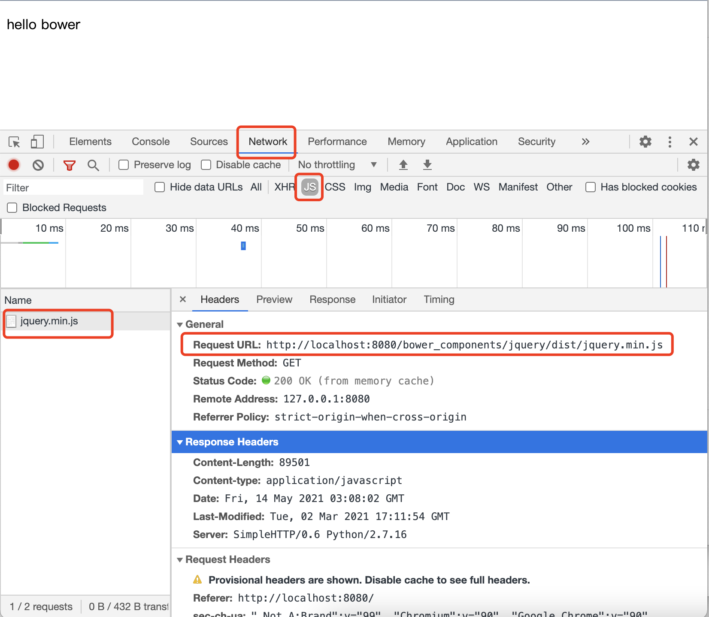

# 包管理工具：bower（体验）

## 安装 bower

```bash
npm i -g bower
```

## 使用 bower 安装一下 jquery

```bash
bower install jquery
```

## 在 html 文件，通过 script 标签，引入 jquery

```html
<!DOCTYPE html>
<html lang="en">
    <head>
        <meta utf="utf-8">
        <title>bower</title>
    </head>
    <body>
        <p>hello bower</p>
        <script src="./bower_components/jquery/dist/jquery.min.js"></script>
    </body>
</html>
```

## 启动一个静态服务，查看效果

1. 启动静态服务

   ```bash
   python -m SimpleHTTPServer 8080
   ```

2. 查看效果

   直接在浏览器里面访问：  http://localhost:8080/

3. 使用开发者工具（F12），便可以看到加载的效果

   
