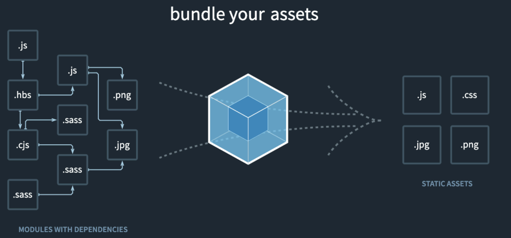

# 前端工程化的发展

## 1 什么是工程化？什么是前端工程化？

随着发展的逐步发展，作为⼯程师除了需要关注需要写的**⻚⾯，样式和逻辑**之外，还需要⾯对⽇益复杂的系统性问题，⽐如模块化⽂件的组织、ES6 JS ⽂件的编译、打包压缩所有的 JS 代码、优化和合并图⽚静态资源等等事情。

例如如下图所示就是前端⼯程化中⼀次打包的过程，中间的图标就是前端打包⼯具 **webpack**，左侧就是我们项⽬中出现的源⽂件，例如我们会通过 sass 这种预处理样式来更好的组织我们的样式代码，经过 webpack 处理，他能将所有的第三⽅ js ⽂件都处理为标准的 ES5 js，将 sass ⽂件处理为浏览器可以直接使⽤的 css ⽂件。



**⼀句话总结：**前端⼯程化，就是在使⽤⼯具处理那些与实际业务⽆关的内容，⽐如处理 JS 编译、打包、压缩、图⽚合并优化等等各个⽅⾯的⼯程性代码。

## 2 前端工程化具体类目

### 2.1 包管理工具

对于⼀⻔成熟的语⾔来说，在有语⾔规范的同时，社区或者制定语⾔规范的组织也会有模块化的规范和模块存储到平台，每个⼈都能将⾃⼰写好的模块化代码发布到平台上，同时任何⼈也可以下载公共平台上其他⼈的模块化代码。这种模块化的代码我们⼀般称之为 **包（package）**，平台我们称之为 **包管理平台**，这种⾏为我们称之为 **包管理（package manager）**。

对于 JS 来说，现阶段⼤家⽐较熟悉的就是 node.js 环境⾃带的 npm ⼯具，**npm** 全称是 **node package manager**，就是 node.js 的包管理⼯具，对于⼀个符合规范的包来说，我们可以通过 `npm publish` 发布包，同样的，也可以通过 `npm install` 来下载别⼈发布的包，实现⼤家的模块复⽤。

社区中常⻅的包管理⼯具有，bower，npm 和 yarn。⽬前还在经常使⽤的是 npm 和 yarn。

#### 2.1.1 bower

**bower** 最早出现是使⽤在浏览器项⽬中。安装 bower 命令后，通过 `bower install jquery` ，就可以将 jquery 下载到 *bower_components* ⽬录中，我们就可以在 html ⽂件加上 `<script src="bower_components/jquery/dist/jquery.min.js"></script>` 。免去了我们直接从官⽹下载然后挪动到项⽬中的烦恼。

bower 也⽀持⼀些配置，我们只需要在项⽬根⽬录下增加 `.bowerrc` 配置即可：

```json
{
  "directory": "app/components/",
  "timeout": 120000,
  "registry": {
    "search": [
      "http://localhost:8000",
      "https://registry.bower.io"
    ]
  }
}
```

上⾯的配置主要配置了我们下载后的模块存储⽬录，下载超时时间和下载的地址等等。

如果想要发布⼀个 bower 模块的话，需要我们这个项⽬下配置 bower.json ，然后通过 `bower register` 命令发布。

bower 内容的介绍⽐较简单，现在新项⽬中使⽤已经不多，包管理⼯具这⼀⼩节的重点是 npm。

#### 2.1.2 npm

**npm** 是伴随着 node.js 下载会⼀同安装的⼀个命令，它的作⽤与 bower ⼀样，都是下载或发布⼀些 JS 模块。

我们可以使⽤ `npm --version` 查看安装的 npm 版本，不同版本带有不同功能。

同时，我们可以通过 `npm install` 来安装⼀个模块，例如上⾯的例⼦中，我们就可以通过 `npm install jquery` 来安装 jquery，npm 会将模块安装到 node_modules ⽬录中。

⼀个合格的 npm 包，必须拥有 package.json 这个文件，⾥⾯有以下⼏个常⻅字段：

* **name**:	包或者模块的名称
* **version**:	版本
* **main(重要)**:	默认加载的⼊⼝⽂件
* **scripts**:	定义⼀些脚本
* **dependencies**:	运⾏时需要的模块
* **devDependencies**:	本地开发需要运⾏的模块
* **optionalDependencies**:	可选的模块，即使安装失败安装进程也会正常退出
* **peerDependencies**:	必要依赖的版本（难点⭐️）

其中 dependencies 和 devDependencies ⾥⾯的版本号通过 **“⼤版本.次要版本.⼩版本”** 的格式规定。我们通过 `npm install` 安装的模块，最终都会在⾥⾯进⾏记录。同时，我们通过 `npm install` 时，还会安装这⾥记录但是 node_modules 中没有的模块。

如果前⾯带有波浪号（~），则以⼤版本号和次要版本号为主，例如 "~1.3.2" 的版本，最终安装时就会安装 1.3.x 的最新版本。

如果前⾯带有插⼊号（^），则以⼤版本号为主，例如 "^1.3.2" 的版本，最终安装就会安装 1.x.x 的最新版本。

⚠️ ⾼版本的 npm 会将所有依赖进⾏「打平」操作，这样能保证尽可能少的安装相同的模块。

所有下载的模块，最终都会记录在 `package-lock.json` 完全锁定版本，下次我们再 npm install 时，就会先下载 package-lock ⾥⾯的版本。

#### 2.1.3 yarn

**[yarn](https://yarnpkg.com/)** 是⼀个新兴的包管理⼯具，他与 npm 有着相似的功能，最⼤的优势就是**并发**和**快**。

我们可以通过 `yarn add` 来安装⼀个模块，通过 `yarn xxx` 来运⾏ scripts 中的脚本。

#### 2.1.4 devDependencies、dependencies、optionDependencies 和 peerDependencies 区别

devDependencies 是指使⽤**本地开发**时需要使⽤的模块，⽽真正的业务运⾏时不⽤的内容。

dependencies 是指**业务运⾏**时需要的模块

optionalDependencies 是**可选模块**，安不安装均可，即使安装失败，包的安装过程也不会报错

peerDependencies ⼀般⽤在**⼤型**框架和库的插件上，例如我们写 webpack--xx-plugin 的时候，对于使⽤者⽽⾔，他⼀定会先有 webpack 再安装我们的这个模块，这⾥的 peerDependencies 就是约束了这个例⼦中webpack 的版本。

#### 2.1.5 npm 中 --save-dev 和 --save 之间的区别

--save-dev 和 --save 都会把模块安装到 node_modules ⽬录下，但 --save-dev 会将依赖名称和版本写到 devDependencies 下，⽽ --save 会将依赖名称和版本写到 dependencies 下。

如果我们使⽤ `npm --production install` 这样的命令安装模块的话，就只会安装 --save 安装的包。

### 2.2 源代码静态检查和格式化工具

静态检查指的是我们在本地写源代码时，我们使⽤的编辑器对我们所写代码的 **提示**，**检查** 和 **格式化**。在⼤型项⽬中，**提示** 这⼀步因⼈⽽异⼤部分不做共同要求，检查和格式化⼀般会对团队使⽤的内容进⾏约束，以保证⼤家能写出「正确」的代码和统⼀的代码⻛格。

对于代码的检查和格式化，在前端发展中⽐较经典的是 **jslint**，**jshint**，**eslint** 和 **prettier**。

他们基本上都是⼀类的⼯具，再细分的话，jslint，jshint 和 eslint 是⼀类，他们专⻔处理 JS 格式化和静态语法检查；prettier 是另⼀类，他能处理多语⾔的格式化。

#### 2.2.1 eslint

我们以 **[eslint](https://eslint.org/)** 为例，只需要在项⽬中通过 `npm install --save-dev eslint` 安装他，通过配置 **.eslintrc** （rc：runtime config）我们就可以使⽤了。配合 eslint 的编辑器插件，我们就可以在编辑代码时 eslint 对我们的代码进⾏提示和修复。

通过配置 `eslint index.js` 这样的脚本，就可以对脚本⽂件进⾏静态校验。

⚠️ 这⾥是 `--save-dev` 因为我们只需要在项⽬开发过程中使⽤它⽽不是运⾏过程使⽤这个模块。

### 2.3 ES6 及其他泛 JS 语言的编译

⼤部分时候，我们不能直接在线上使⽤ ES6 语法规范的 JS 代码，我们就需要通过⼯具对 JS 进⾏编译。同时，有些项⽬我们可能会使⽤ coffeescript，typescript，flow，elm，ocaml 等可以编译为 JS 语⾔的泛 JS 语⾔书写代码，这就需要在调试或发布时，使⽤编译⼯具将对应代码编译为 JS 代码才能直接运⾏。

在编译过程中，JS ⽐较常⻅的⼯具是 babel，⽽其他的语⾔则对应有⾃⼰的编译器，例如 coffeescript 使⽤ coffeescript 编译器进⾏编译为 js，typescript 使⽤ typescript 编译器编译为 js。

#### 2.3.1 babel

babel 官⽹为 <https://babeljs.io/> 

对于⼀个项⽬来说，我们可以通过 `npm install --save-dev @babel/core @babel/cli` 来安装 babel 所需要的⼯具。

* `@babel/core` 是 babel 内部核⼼的编译和⽣成代码的⽅法
* `@babel/cli` （cli：command line tool）是 babel 命令⾏⼯具内部解析相关⽅法

安装了这两个包之后，我们就能够使⽤ babel 相关⽅法对代码进⾏操作，接下来我们需要配置，告诉 babel 我们需要将代码变成什么。

增加⼀个 babel 的 preset，preset 代表的是我们希望编译的结果的预设值。在最新的 babel ⼯具链中，统⼀使⽤了 `@babel/preset-env` 作为**环境预设值**。我们安装 `npm install --save-dev @babel/preset-env` 之后，新建 **.babelrc** ⾥⾯，通过配置

```json
{
  "presets": ["@babel/preset-env"] 
} 
```

在 scripts 内定义⼀个脚本执⾏ `babel index.js -o output.js` ，我们在 index.js 中写的 es6 语法就会被编译。

这⼀步只是编译语法层⾯的内容，如果我们使⽤了⼀些新的⽅法的话，还需要增加⼀个 polyfill

使⽤ `npm install @babel/polyfill` 安装了所有符合规范的 polyfill 之后，我们需要在⼊⼝⽂件引⼊这个模块，就能正常的使⽤规范中定义的⽅法了。

关于 targets 的配置，可以参考 <https://caniuse.com/>

```json
{
    "presets": [
        [
            "@babel/preset-env",
            {
                "targets": "> 1.5%"
            }
        ]
    ]
}
```

### 2.4 JS 打包工具

对于 JS 这⻔语⾔的不同环境来说，有 CommonJS，AMD 和 ESModule 这⼏种常⻅的模块化规范，这⼏种规范都有⾃身的缺点。

CommonJS 不经处理只能运⾏在 node.js，AMD 不经处理⽆法运⽤在各个平台，需要搭配符合 AMD 规范的其他库例如 require.js ⼀起使⽤。ESModule 虽然从语⾔层⾯上解决了规范问题，但是即使经过 babel 编译，也会将 import，export 之类的关键词编译为 CommonJS 的 require 和 exports ，我们还是⽆法直接在浏览器中使⽤。

为了能使任何⼀个模块都能⾃由的切换所使⽤的环境，例如在浏览器使⽤ CommonJS 封装好的模块，我们就需要经过打包这个步骤。

browserify 、 rollup 等等⼯具都是处理诸如此类内容。

#### 5.1 browserify

地址：<http://browserify.org/>  我们通过 `npm install --save-dev browserify` 安装 browserify，我们写⼀个简单的 commonJS 模块，通过 `browserify index.js -o output.js` 命令就可以将 CommonJS 模块化的包转化为通⽤的任何环境均可以加载的模块化规范。

#### 5.2 rollup

rollup 是⼀个新兴的打包⼯具，它最先提出⼀个概念叫 tree shaking，他可以移除我们代码中⽆⽤的其他代码。

通过 ESModule 写的模块，在经过 rollup 处理之后，会对未使⽤的导出内容进⾏标记，在压缩过程就会将这类未使⽤的内容移除。

### 2.5 JS 压缩工具

经过编译和打包的 JS 代码，最终要在线上经过压缩处理之后，才能最终在⽹站上⾯向⽤户显示。对于 JS 压缩⼯具来说，⽬前有⾮常多，但⽤的最多的还是 uglify 系列，uglify 最新是版本 3，不同 uglify 的实现原理和性能都有极⼤的不同。

#### 6.1 uglify

uglify3 地址 <https://github.com/mishoo/UglifyJS2>

安装成功之后⾮常简单，只需要通过 `uglifyjs index.js -o output.js` 就可以输出压缩的结果。同时我们可以通过添加 `--source-map` 在运⾏时⽣成 sitemap ⽂件，⽅便我们进⾏ debug。

## 3 其他类目工具

### 3.1 任务处理工具（gulp/grunt）

上⾯我们说的所有⼯具都是针对某⼀个垂直领域来说的，⽐如 编译、打包、压缩等等，我们需要通过不同的命令去运⾏和操作我们的 JS ⽂件。

本⼩节说的任务处理⼯具，就是这⼀类脚本⼯具，他们能通过脚本的形式将不同的⼯具进⾏组合输出。

流式处理⼯具⽐较常说的两个是 grunt 和 gulp。本⼩节我们分别介绍⼀下这两个⼯具。

#### 3.1.1 grunt （使用已经不多了，可以忽略）

grunt 官⽹ <https://gruntjs.com/> 。⾸先通过 `npm install --save-dev grunt` 安装 grunt ⼯具，新建gruntfile.js 通过 gruntfile.js 中的配置来让 grunt 做不同的操作。

这⾥我们安装 `npm --save-dev @babel/core @babel/preset-env grunt-babel grunt-contrib-uglify` 来完整的进⾏⼀个项⽬的构建，通过配置 gruntfile 脚本，我们分别执⾏了编译、压缩的过程⽣成最后 js 脚本。

#### 3.1.2 gulp（使用已经不多了，但是可以学习一下它的设计思路）

gulp 官⽹ <https://gulpjs.com/>。同样的我们使⽤ `npm install --save-dev gulp` 安装 gulp ⼯具，新建gulpfile.js 配置。

我们同样实现相同的功能来重新配置⼀下 gulp 任务。

gulp 相⽐于 grunt 来说，配置更加清晰，是⼀个链式调⽤的写法。

### 3.2 通用处理工具（fis3/webpack）

通⽤处理⼯具这⾥我们的分类是从功能上来讲，具备上⾯列举类⽬的多种功能的集合。这⾥我们列举的⼏个⼯具是 fis3 和 webpack。

fis 是国内百度公司在早期发布的⼀款前端通⽤处理⼯具（⽐ webpack 早），fis3 是它的第三代，使⽤ node.js 重写了。

fis3 和 webpack 他们有个最⼤的特点就是，他们已经不再是⼀个普通⼯具，⽽是⼀个具有插件化的系统，有着丰富和完善的社区环境，他们属于 **前端解决⽅案** 这么⼀个领域。理论上他们可以做⾮常多的事情，⽽不像上⾯介绍的⼤部分⼯具，只能处理某⼀个垂直分类下的内容。

**[webpack](https://webpack.js.org/)** 实际上和 gulp grunt 这类的任务处理⼯具有些类似，但是它本身具有打包的功能，同时也⽀持通过中间件和插件实现其他领域的功能，最终通过⼀个命令就能处理完成所有操作。

webpack 通过 **webpack.config.js** 配置，配置 loader 中间件来对不同⽂件进⾏操作，同时通过插件化的配置，⽀持例如压缩等等操作，这⾥我们重新通过 webpack 来演示⼀下之前的例⼦。
