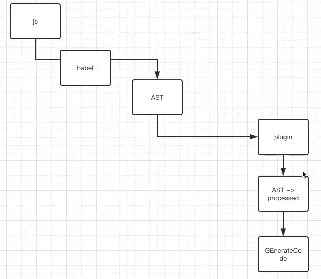
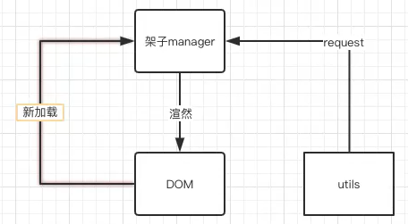

# ES6实战

## Babel（编译）



## proxy

## decorators

## async/await

## treeshaking（import export）

ES6 之前，在 **CommonJS 模块** 的情况下，我们经常使用到的是：`module.exports = {};` 从而导出一个模块。它导出的对象里面可以挂很多方法，比如：

```javascript
module.exports = {
  request: function () {}
};

// 相对应的引入是：
var utils = require('./utils/index');

// 当你 require 一个文件时，实际上会拿到 module.exports 对象
```

编译之后，会包在一个**闭包**里面：

```javascript
// 这里的 module, exports 都是局部变量
function factory(module, exports) {
  // 这里会优先判断 这个函数有没有返回值
  // return {};
  module.exports = {
    request: function () {}
  };
  
  // 下面的写法也是 OK 的
  module.exports.xxx = {};
  
  // 下面的方法看上去可以，但是 实际应用会有问题。
  // 直接修改局部变量，导出的结果不会有变更，事与愿违！
  module = {
    exports: {}
  };
  
  // 但是，下面的写法是 错误的
  export = {};
}
```

ES6 中，我们使用 import/export 语法，看上去更简洁一些。

```js
// 定义的同时进行导出
export const request = params => {
  params.method = params.method || 'GET'; // 默认情况下，GET 请求
    return fetch(
        params.url,
        params
    )
    .then(res => res.json()); 
};

// 上面的写法属于简写，当然也可以将定义和导出分开写：
const request = params => { ... };
export { request };
                                                   
// 相对应的引入是：
import { request } from './utils/index';
```

⚠️ 相关面试题：ES6 Module 和 CommonJS 有什么不同？

**一般答案：**

CommonJS 是对模块的浅拷贝，ES6 Module 是对模块的引用，即 ES6 Module 只存只读，不能改变其值，具体点就是指针指向不能变，类似 const import 的接口是 read-only（只读状态），不能修改其变量值。

**更多的不同**（高级答案）：

（最底层的不同）

ES6 中，import 时，只装载你导入部分的成员，其余的并不会装载。

实际实现中呢？webpack 并不是纯的 node 环境，webpack 在编译的过程中，他不是不装载，其实是直接把没有被 import 的部分，干掉了(删除了)。这一优化技术，也称 “**tree-shaking**”。【这里，webpack 借助了 rollup 的思想】

**推荐：**直接用 import/export 的写法。

### VUE 3.0 的实现方法

```js
export * from '@vue/runtime-dom'

// 按需导入，并没有真正的缩小，只是给了大家一个 treeshaking 的机会
import {h, reactive, createRenderer, effect} from 'vue';
import Vue from 'vue';

new Vue({
  render() {
    
  },
  el: '#app'
});
// 整个 default 直接导入
```

## 解构与参数采集

## 项目实战（使用 ES6 完成今日头条）

### 1. 使用node.js  express 框架书写简单 API

### 2. 使用 ES6 完成今日头条

```bash
# watch 查看一下
./node_modules/.bin/webpack --watch
```

查看浏览器的加载结果，<http://localhost:8099/static/dist/index.js> 请求结果正常，则工程搭建成功。

#### 基本的流程

从入口开始：project/static/src/index.js

基本流程/业务逻辑：



#### 封装请求方法

先从 utils 开始写起，封装请求方法（当下采用的是，封装 fetch 方法）

#### 节流/防抖

多次操作（如：点击），请求资源时，需要并成一次操作

##### 节流（throttle）

开始触发点击的时候，预期在3s后执行，3s内的点击操作，**丢弃**处理，当3s时间已过，再有action来时，循环往复

⚠️ 不停的***丢弃***后来者

##### 防抖（debounce）

开始触发点击的时候，预期在3s后执行，3s内的点击操作，**丢弃**之前的action【花费的时间，可能大于3s】

⚠️ 不停的***等待***后来者
