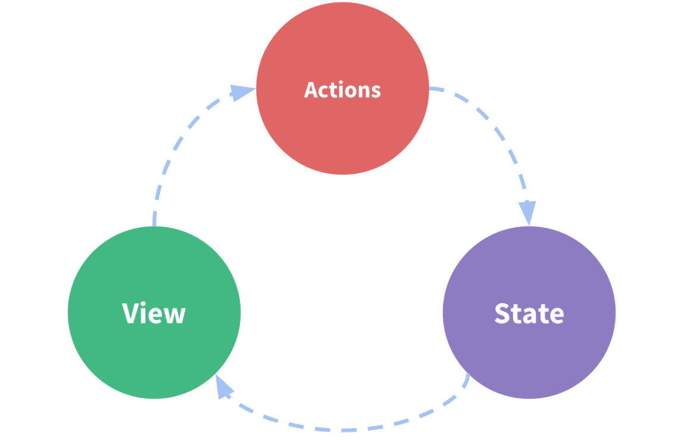

# vuex 与服务端渲染

## vue.js 状态管理及 ssr（路由及状态同构）

### 前端状态管理出现的意义及解决的问题

随着前端应用的逐步复杂，我们的组件中需要使用越来越多的状态。有的时候我们需要使用**子组件将状态传递给父组件**就会比较**复杂**，***数据的向上传递过程*** 我们可能会使用**回调函数**或是**数据绑定**的形式去处理，就会让代码晦涩难懂。



#### [例 1-1：数据置于所有组件的公共父级当中](./1-vue-basic/index.html)

#### [例 1-2：通过 prototype 来共享数据](./1-vue-basic/index2.html)

我们需要一种方式，能够**让数据在所有组件中共享，同时能以简单的方式进行传递**，这种组织数据的方式就是**状态管理**。我们很自然的就想到，把数据放到所有需要使用的组件的公共祖先上，在使用时自上而下传递即可。

在 vue.js 中，我们主要说的状态管理库就是 **vuex**，当然，只要你能实现有条理的组织数据，那么它都可以认为是一种状态管理库。

事实上，我们可以简单的这样理解【状态管理】这个词，vuex 实际上做的事情就是：

* 在顶层实现一个数据管理的仓库 store，将所有组件间需要共享的数据放置于此
* 同时组件也可以对这个 store 内的数据进行更新，同时更新完之后响应式更新所有使用此数据组件的视图

### vuex 介绍及深入使用

在说 vuex 之前，我们必须说一说 **flux 架构**，flux 架构可谓是状态管理的**鼻祖**。

flux 架构最早由 facebook 推出，主要是为了处理当时他们的 react 框架下状态管理的问题，但在当时来讲，整个设计比较复杂，后来人们简化了其中的一些理念，但是保留了核心思想，继而依据框架实现了很多不同的状态管理库，例如 **redux**，**vuex** 等等。其中 redux 大多数被用在了 react 项目中，而 vuex 就是在 vue 框架中实现的这么一个 flux 架构的状态管理库。

**flux 架构约定**，存放数据的地方称为 store，store 内部的 state 是数据本身，我们必须通过 action 才能修改 store 里的 state。这里的 action 指的意思是行为，在大部分实现里面是一个函数，通过调用函数来更改 store 内部的 state。


```js
// 借助 vuex 定义一个 全局 store
const store = new Vuex.Store({
  state: {
    count: 0,
    status: 'fetching',
    data: []
  },
  // 通过 mutation 来同步改变 state
  mutations: {
    addCount(state, payload) {
      state.count++;  
      console.log(payload);
    },
    fetchSuccess(state, payload) {
      state.status = 'success';
      state.data = payload;
    },
    fetchFailed(state) {
      state.status = 'failed';
    }
  },
  // 通过 action 来异步更改 state，在 action 中，我们还是需要调用 mutation。
  actions: {  
    fetchData(context) {
      try {
        setTimeout(function() {
          context.commit('fetchSuccess', [{ title: 'hello list1', id: 1 }, { title: 'hello list2', id: 2 }]);
        }, 1000);
      } catch (e) {
        context.commit('fetchFailed');
      }
    }
  }
});

new Vue({
  el: '#app',
  store: store, // 引用全局 store
  mounted() {
    this.$store.dispatch('fetchData'); // 在生命周期中调用 dispatch action 发布一个异步的 action
  }
});
```

```html
<div id="app">
  <div>
    当前的 count：{{ $store.state.count }}
    <!-- 在组件中通过 commit 进行调用更改 state -->
    <button @click="$store.commit('addCount', 'hello-mutation')">add</button>
    <button @click="$store.commit('subCount')">sub</button>
  </div>
  
  <!-- 一个简单的渲染列表的例子，在生命周期中调用 dispatch action 发布一个异步的 action -->
  状态：{{ $store.state.status }}
  <div v-if="$store.state.status === 'fetching'">
    获取中...
  </div>
  <div v-else-if="$store.state.status==='success'">
    <div v-for="item in $store.state.data" :key="item.id">
      <p>{{ item.title }}</p>
    </div>
  </div>
  <div v-else>
    获取失败
  </div>
</div>
```

#### [例 2-1：vuex-通过 mutation 来同步改变 state](./2-vuex/index.html)

#### [例 2-2：vuex-通过 action 来异步更改 state](./2-vuex/index2.html)

### vue.js 服务端渲染介绍

大多数我们使用的 UI 框架如 vue 和 react，都是在**客户端**进行**渲染**，也就是说每个用户在加载进来我们所有的 html 文件和 js 文件之后，才开始渲染页面的内容。

但是这样做会有两个**问题：**

1. 如果用户网络速度比较慢，如果我们渲染的内容比较多的话，就会产生一个延迟，造成不好的用户体验。
2. 某些爬虫，例如百度的搜索收录的爬虫，在爬取你的页面时，获取不到你的页面的真实内容，导致站点 SEO 权重变低。

**所以**很多需要 SEO 的页面，都需要在服务端提前渲染好 html 的内容，在用户访问时先返回给用户内容，这样对用户和爬虫都非常友好。

#### [例 3-1：vuex-通过 action 来异步更改 state](./2-vuex/index2.html)

我们可以通过直接在页面上右击查看网页源代码，来查看一个页面是否有服务端渲染。vue.js 的服务端渲染非常简单，我们只需要在 node.js 中通过 `vue-server-renderer` 模块，调用对应服务端渲染的渲染器对组件渲染即可，他就会生成组件对应的 html 内容。渲染成功的 html 标签，我们可以直接返回到客户端作为初始请求 html 的返回值。

#### 例2

我们需要**注意**的一点是，在服务端渲染组件，我们使用不了 window、location 等浏览器环境中的对象，所以如果组件内部使用了这种内容会报错。

同时，在服务端渲染时我们要**注意**，组件的生命周期也会只执行 beforeCreate 和 created 这两个，所以在此声明周期里面不能使用 window，但是可以在其他声明周期比如 mounted 中使用。还有渲染的数据，对于服务端渲染的组件来说，我们不应该发请求获取组件数据，而是应该直接渲染时使用数据进行渲染。

#### 例3

路由也是如此，在 vue 客户端使用路由的时候，我们也需要在服务端对路由进行匹配，从而得知具体需要渲染的组件是哪个。

#### 例4

还有什么呢？？？
