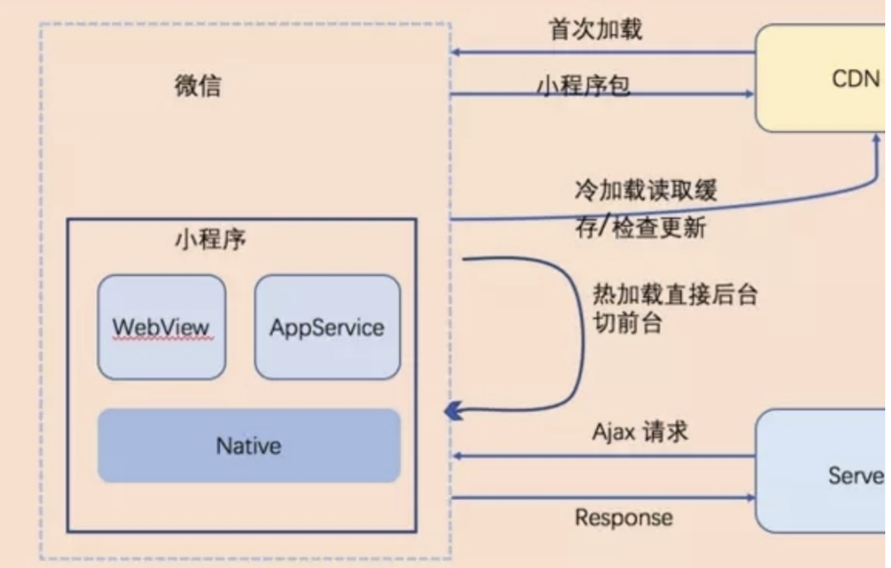

# 小程序初级

关注一下【R.E.管理器】和【反编译wxapkg】

## 小程序的基础使用

### 小程序介绍

> 小程序并非凭空冒出来的⼀个概念。当微信中的 **WebView** 逐渐成为移动 Web 的⼀个重要⼊⼝时，微信就有相关的 **JS-SDK** 了。
>
> **JS-SDK** 解决了移动⽹⻚能⼒不⾜的问题，通过暴露微信的接⼝使得 Web 开发者能够拥有更多的能⼒，然⽽在更多的能⼒之外，JS-SDK 的模式并没有解决使⽤移动⽹⻚遇到的体验不良的问题。

微信⾯临的问题是如何设计⼀个⽐较好的系统，使得所有开发者在微信中都能获得⽐较好的体验。这个问题是之前的 **JS-SDK** 所处理不了的，需要⼀个全新的系统来完成，它需要使得所有的开发者都能做到:

* 快速的加载
* 更强大的能力
* 原生的体验
* 易用且安全的微信数据开放
* 高效和简单的开发

那么⼩程序和H5的区别是什么呢？

* **运行环境：** 小程序基于浏览器内核重构的内置解析器，而 **`h5`** 的宿主环境是浏览器。所以小程序中没有 **`DOM`** 和 **`BOM`** 的相关 API，**`jQuery`** 和一些 **`NPM`** (2.2.1版本前) 包都不能在小程序中使用；
* **系统权限：** 小程序能获得更多的系统权限，如网络通信状态、数据缓存能力等；
* **渲染机制：** 小程序的逻辑层和渲染层是分开的，而 **`h5`** 页面 **`UI`** 渲染跟 **`JavaScript`** 的脚本执行都在一个单线程里，互斥。所以 h5 页面中长时间的脚本运行可能会导致页面失去响应。

其实，⼩程序开发过程中我们⾯对的是 **`iOS`** 和 **`Android`** 微信客户端和辅助开发的小程序开发者工具。根据官方文档，这三大环境也是有所区别的：

|     运行环境     |     逻辑层     |     渲染层     |
| :--------------: | :------------: | :------------: |
|       iOS        | JavaScriptCore |   WKWebView    |
|     Android      |   X5 JSCore    |   X5 浏览器    |
| 小程序开发者工具 |      NWJS      | Chrome WebView |

### 小程序生命周期

关于⼩程序的⽣命周期，可以分为两个部分来理解：**应⽤⽣命周期** 和 **⻚⾯⽣命周期**。

#### 应用的生命周期

1. ⽤户⾸次打开⼩程序，触发 `onLaunch`（全局只触发⼀次）。
2. ⼩程序初始化完成后，触发 `onShow` ⽅法，监听⼩程序显示。
3. ⼩程序从前台进⼊后台，触发 `onHide` ⽅法。
4. ⼩程序从后台进⼊前台显示，触发 `onShow` ⽅法。
5. ⼩程序后台运⾏⼀定时间，或系统资源占⽤过⾼，会被销毁。

#### 页面的生命周期

1. ⼩程序注册完成后，加载⻚⾯，触发 `onLoad` ⽅法。
2. ⻚⾯载⼊后触发 `onShow` ⽅法，显示⻚⾯。
3. ⾸次显示⻚⾯，会触发 `onReady` ⽅法，渲染⻚⾯元素和样式，⼀个⻚⾯只会调⽤⼀次。
4. 当⼩程序后台运⾏或跳转到其他⻚⾯时，触发 `onHide` ⽅法。
5. 当⼩程序有后台进⼊到前台运⾏或重新进⼊⻚⾯时，触发 `onShow` ⽅法。
6. 当使⽤重定向⽅法 `wx.redirectTo()` 或关闭当前⻚返回上⼀⻚ `wx.navigateBack()` ，触发 `onUnload`。

⚠️ **应⽤⽣命周期** 会影响到 **⻚⾯⽣命周期**。

### 小程序基础 API 及项目结构

[微信开放文档-小程序](https://developers.weixin.qq.com/miniprogram/dev/api/)

#### 创建小程序工程

```shell
cd demo

# TODO: 自己完善一下
# 注册账号，获取appid
```

#### 项目结构

```sh
.
├── README.md
├── generator.js  # generator（可选）
├── index.js      # service 插件
├── package.json
├── prompts.js    # prompt 文件（可选）
└── ui.js         # Vue UI 集成（可选）
```

#### 一个页面（eg: demo）包含文件类型

```shell
./miniprogram/pages/demo/
├── demo.js    # 针对.wxml生效（必须）
├── demo.json  # demo页面的配置（可选）
├── demo.wxml  # xxx（必须）
└── demo.wxss  # xxx（必须）
```

### 小程序的 demo 项目（代码）

### 小程序架构——双线程模型

小程序的**渲染层**和**逻辑层**分别由2个线程管理：

* **渲染层：** 界⾯渲染相关的任务全都在 **`WebView`** 线程里执行。一个小程序存在多个界面，所以渲染层存在多个 **`WebView`** 线程。
* **逻辑层： **采⽤ **`JsCore`** 线程运行 JS 脚本。

视图层和逻辑层通过系统层的 **`WeixinJsBridage`** 进行通信：逻辑层把数据变化通知到视图层，触发视图层页面更新，视图层把触发的事件通知到逻辑层进行业务处理。

（⻚⾯渲染的具体流程是：在渲染层，宿主环境会把 **`WXML`** 转化成对应的 **`JS`** 对象，在逻辑层发生数据变更的时候，我们需要通过宿主环境提供的 **`setData`** 方法把数据从逻辑层传递到渲染层，再经过对比前后差异，把差异应用在原来的 **`DOM`** 树上，渲染出正确的 UI 界面）


***双线程模型*** 是小程序框架与业界大多数前端 **`Web`** 框架不同之处。基于这个模型，可以更好地管控以及提供更安全的环境。

### 运行机制

* **热启动：** 假如⽤户已经打开过某⼩程序，然后在⼀定时间内再次打开该⼩程序，此时⽆需重新启动，只需将后台态的⼩程序切换到前台，这个过程就是热启动；
* **冷启动：** ⽤户⾸次打开或⼩程序被微信主动销毁后再次打开的情况，此时⼩程序需要重新加载启动，即冷启动。
* **销毁：** 只有当⼩程序进⼊后台⼀定时间，或者系统资源占⽤过⾼，才会被真正的销毁。



## 自己仿写一个简易小程序（代码）

使⽤⼯具：web Worker + templatejs

* 事件驱动
* 安全的沙箱环境，不允许开发者直接访问DOM及某些有害 Api


[代码见: ./course](./course)

`live-server` 可以快速的起一个本地服务

## 查看小程序源代码的技巧
