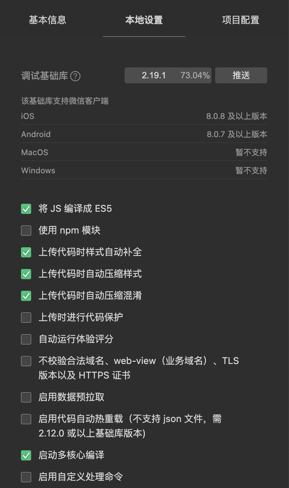

# 工程化开发小程序

这里我们关注的是：**小程序端** 和 **浏览器端**

## 小程序工程化详解

任何一个平台的小程序内容，都有自己的**项目结构**要求，例如微信小程序中需要 `app.json` 配置，里面需要配置一些小程序规范的配置，同时每个小程序页面都要求使用 `.wxml` `.wxss` 之类的小程序内部文件格式。

这就导致了，如果我们使用小程序开发时，就必须得重新按照流程进行开发，无法将现有业务进行迁移。

同时，小程序内部工具会带有编译相关的功能，例如在**微信小程序开发者工具**当中，我们可以选择自动编译 ES6 到 ES5，同时上传时自动压缩代码。



之前我们已经学习了如何开发基本的小程序，接下来我们主要会讲解一下使用工具进行小程序的开发。

当然，小程序环境类似于 node.js 环境，我们都知道在大部分情况下，我们的 node.js 应用是不需要打包和编译的，因为 node.js 原生支持 CommonJS 模块化规范。

事实上，小程序本身也支持**模块化规范**，所以我们并不需要刻意的把小程序用工程化的形式来进行表现。因为反倒是会将小程序项目弄复杂。

所以，在**小程序的工程化**当中，我们更多的是**指多端同构小程序的内容**。例如能否只进行一次编码，就能将这部分代码同时运行在多端（微信/百度/支付宝/h5等）。

## 小程序工程化框架实战

这节课我们会讲一些 ***同构*** 框架，来方便我们进行 h5 和 小程序之间的迁移。

### wept 和 kbone

[wept](https://github.com/wetools/wept) 是一个将**小程序**代码实时运行和显示在**浏览器端**的一个工具。

[kbone](https://github.com/Tencent/kbone) 是另一个腾讯官方出品的浏览器 h5 和 小程序实时预览的框架。

他们都是在工程化领域的框架，通过框架内部的实现，让小程序的开发和同构变得非常简单，唯一有区别的地方在于，wept 是将小程序代码转化为了 h5，而 kbone 是将 h5 代码转化为可以在小程序运行时执行的内容。

kbone 是官方新出的框架，我们可以重点学习一下它的使用和源码详情。

### wept

**wept**（ Wechat app page development tool ）同构鼻祖，可以学一下其原理。

```sh
# 1. 安装 wept
npm install --save-dev wept
# 2. 运行一下 wept 工具
./node_modules/.bin/wept
# 这个时候就可以在浏览器中欣赏效果啦 http://localhost:3000/
```

源码学习：https://github.com/wetools/wept

* /bin/ 下面的4的小工具，是从微信小程序开发者工具中拷贝所得。解决了wxml->html，wxss->css

局限性：依赖了微信小程序开发者工具中的 bin工具，每次别人发版本，我们也需要更新，耦合性太大。

⚠️ 我们需要关注的是 **思路**。

### kbone

**kbone** 一个致力于微信小程序和 Web 端同构的解决方案。

```sh
# 借助 脚手架工具(kbone-cli) 体验一把 kbone
# 安装 kbone-cli
npm install -g kbone-cli
# 1. 创建项目`kbone-template`（根据需要选择模板即可，推荐React）
kbone init kbone-template
# 2. 进入项目，按照 README.md 的指引进行开发即可
cd kbone-template
npm run mp # 开发小程序端
npm run web # 开发 web 端
npm run build # 构建 web 端
```

直接使用 `kbone-cli` 创建的工程，看上去结构比较复杂。

我们可以先自己手动创建一个 `kbone-hello-world` 项目。
