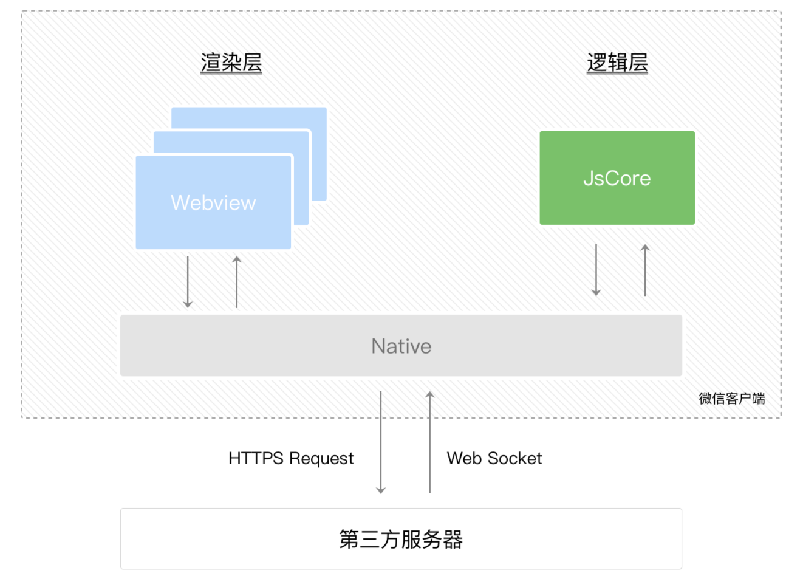
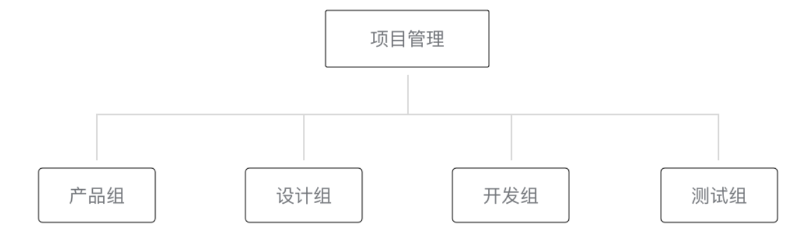
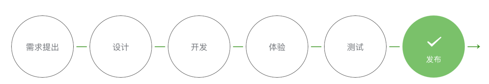

# 小程序 官方文档学习

[微信开放文档-小程序](https://developers.weixin.qq.com/miniprogram/dev/framework/)

## 开发 ⭐️⭐️⭐️⭐️⭐️

### 指南

#### 起步

##### 小程序简介

1. 小程序技术发展史
2. 小程序与普通网页开发的区别
3. 体验小程序

##### 开始

1. [申请账号](https://mp.weixin.qq.com/wxopen/waregister?action=step1)
2. 安装开发者工具
3. 你的第一个小程序
4. 编译预览

##### 小程序代码构成

```sh
./miniprogram/pages/index/
├── index.js    # 脚本逻辑文件，针对.wxml生效（必须）
├── index.json  # 配置文件（🉑️选）
├── index.wxml  # 模板文件（必须）
└── index.wxss  # 样式文件（🉑️选）
```

###### JSON 配置

在小程序中，JSON 扮演的**静态配置**的角色。

我们可以看到在项目的**根目录**有一个 `app.json` 和 `project.config.json`，此外在 `pages/logs` 目录下还有一个 `logs.json`。

**小程序配置 `app.json`** ，当前小程序的全局配置。

```json
{
  "pages":[
    "pages/index/index",
    "pages/logs/logs"
  ],
  "window":{
    "backgroundTextStyle":"light",
    "navigationBarBackgroundColor": "#fff",
    "navigationBarTitleText": "小程序卡片",
    "navigationBarTextStyle":"black"
  },
  "style": "v2",
  "sitemapLocation": "sitemap.json",
  ...
}
```

**工具配置 `project.config.json`** ，使用小程序开发者工具时的个性化配置，例如：界面颜色、编译配置等等。

**页面配置 `app.json`**

###### WXML 模板

充当 `HTML` 角色，例如：`pages/index/index.wxml`

```html
<!--index.wxml-->
<view class="container">
  <view class="userinfo">
    <button wx:if="{{!hasUserInfo && canIUse}}"> 获取头像昵称 </button>
    <block wx:else>
      <image src="{{userInfo.avatarUrl}}" background-size="cover"></image>
      <text class="userinfo-nickname">{{userInfo.nickName}}</text>
    </block>
  </view>
  <view class="usermotto">
    <text class="user-motto">{{motto}}</text>
  </view>
</view>
```

小程序同样支持把**渲染**和**逻辑**分离，JS 只需要管理状态即可，然后通过一种模板语法来描述状态和界面结构的关系即可。

WXML 这样写：

```html
<text>{{msg}}</text>
```

JS 只需要管理状态即可：

```js
this.setData({ msg: "hello world" })
```

###### WXSS 样式

充当 `CSS` 角色，例如：`pages/index/index.wxss`

```css
/**index.wxss**/

Page {
  text-align: center;
}

/* 图片宽度铺满 */
image {
  width: 100%;
}

.userinfo {
  display: flex;
  flex-direction: column;
  align-items: center;
  color: #aaa;
}

.userinfo-avatar {
  overflow: hidden;
  width: 128rpx;
  height: 128rpx;
  margin: 20rpx;
  border-radius: 50%;
}

.usermotto {
  margin-top: 200px;
}
```

⚠️ 也可以写一个 `app.wxss` 作为全局样式，会作用于当前小程序的所有页面。

###### JS 逻辑交互

一个服务仅仅只有界面展示是不够的，还需要和用户做交互：响应用户的点击、获取用户的位置等等。在小程序里面，我们就通过编写 `JS` 脚本文件来处理用户的操作。

```html
<view>{{msg}}</view>
<button bindTap="clickMe">点击我</button>
```


例如：`pages/index/index.js`

```js
// index.js
const app = getApp() // 获取应用实例

Page({
  data: {
    msg: 'Hello World',
  },

  // 事件处理函数
  clickMe: function() {
    this.setData({
      msg: 'hi boys'
    });
  },
})
```

##### 小程序宿主环境

我们称微信客户端给小程序所提供的环境为**宿主环境**。小程序借助宿主环境提供的能力，可以完成许多普通网页无法完成的功能。

###### 渲染层和逻辑层

小程序的运行环境分为：**渲染层** 和 **逻辑层**。其中 WXML模板 和 WXSS样式 工作在渲染层，JS脚本 工作在逻辑层。

小程序的**渲染层**和**逻辑层**分别由2个线程管理：

* **渲染层**的界面使用了 WebView 进行渲染；
* **逻辑层**采用 JsCore线程运行 JS脚本。

一个小程序存在多个界面，所以渲染层存在多个 WebView 线程，这两个线程的通信会经由微信客户端（下文中也会采用 Native 来代替微信客户端）做中转，逻辑层发送网络请求也经由 Native 转发，小程序的通信模型如下图所示：



###### 程序与页面

微信客户端在打开小程序之前，会把整个小程序的代码包下载到本地。

紧接着通过 `app.json` 的 `pages` 字段就可以知道你当前小程序的所有页面路径。（第一个页面就是**首页**）

于是微信客户端就把首页的代码装载进来，通过小程序底层的一些机制，就可以渲染出这个首页。

小程序启动之后，在 `app.js` 定义的 `APP` 实例的 `onLaunch` 回调会被执行：

```js
// app.js
App({
  onLaunch() {
    // 小程序启动之后 触发
    ...
  }
})
```

整个小程序只有一个 APP 实例，是全部页面共享的。

###### 组件

小程序提供了丰富的基础组件给开发者，开发者可以像搭积木一样，组合各种组件拼合成自己的小程序。

###### API

为了让开发者可以很方便的调起**微信提供的能力**，例如获取用户信息、微信支付等等，小程序提供了很多 API 给开发者去使用。

要获取用户的地理位置时，只需要：

```js
wx.getLocation({
  type: 'wgs84',
  success: (res) => {
    var latitude = res.latitude // 纬度
    var longitude = res.longitude // 经度
  }
})
```

调用微信扫一扫能力，只需要：

```js
wx.scanCode({
  success: (res) => {
    console.log(res)
  }
})
```

需要**注意**的是：多数 API 的回调都是异步，你需要处理好代码逻辑的异步问题。

##### 小程序协同工作和发布

以往我们在开发完网页之后，需要把网页的代码和资源放在服务器上，让用户通过互联网来访问。在小程序的平台里，开发者完成开发之后，需要在开发者工具提交小程序的代码包，然后在[小程序后台](https://mp.weixin.qq.com/)发布小程序，用户可以通过搜索或者其它入口来进入该小程序。

###### 协同工作



* 项目管理负责统筹整个项目的进展和风险、把控小程序对外发布的节奏，
* 产品组提出需求，
* 设计组与产品讨论并对需求进行抽象，设计出可视化流程与图形，输出设计方案。
* 开发组依据设计方案，进行程序代码的编写，代码编写完成后，产品组与设计组体验小程序的整体流程，
* 测试组编写测试用例并对小程序进行各种边界测试。



⚠️ 项目管理者控制整个小程序的发布、回退、下架等敏感操作，不应该把敏感操作的权限分配给不相关人员。

###### 小程序的版本

一般的软件开发流程，开发者编写代码自测开发版程序，直到程序达到一个**稳定可体验**的状态时，开发者会把这个体验版本给到产品经理和测试人员进行体验测试，最后修复完程序的Bug后发布供外部用户正式使用。

小程序的版本：开发者版本｜体验版本｜审核中版本｜线上版本。

###### 发布上线

一个小程序从开发完到上线一般要经过 **预览**-> **上传代码** -> **提交审核** -> **发布**等步骤。

小程序提供了两种发布模式：**全量发布** 和 **分阶段发布（灰度发布）**。一般来说，普通小程序发布时采用全量发布即可；当小程序承载的功能越来越多，使用的用户数越来越多时，采用分阶段发布是一个非常好的**控制风险**的办法。

###### 运营数据

有两种方式可以方便的看到小程序的**运营数据**。

方法一：登录小程序管理后台 --> 数据分析，点击响应的 tab 可以看到相关的数据。

方法二：使用小程序数据助手，在微信中方便的查看运营数据。

##### [小程序开发指南](https://developers.weixin.qq.com/ebook?action=get_post_info&docid=0008aeea9a8978ab0086a685851c0a)

#### 目录结构

小程序包含一个描述整体程序的 app 和多个描述各自页面的 page。

一个小程序**主体部分**由 3 个文件组成，必须放在项目的根目录，如下：

```sh
./miniprogram-demo/
├── app.js    # 小程序逻辑（必须）
├── app.json  # 小程序公共配置（必须）
└── app.wxss  # 小程序公共样式表（🉑️选）
```

一个**小程序页面**由 4 个文件组成，分别是：

```sh
./miniprogram-demo/pages/index/
├── index.js    # 页面逻辑（必须）
├── index.json  # 页面配置（🉑️选）
├── index.wxml  # 页面结构（必须）
└── index.wxss  # 页面样式表（🉑️选）
```

⚠️ 为了方便开发者减少配置项，描述文件的4个文件必须具有**相同的路径和文件名**。

#### 配置小程序

##### 全局配置

##### 页面配置

##### sitemap 配置

#### 小程序框架

小程序开发**框架的*目标*** 是：通过尽可能简单、高效的方式让开发者可以在微信中开发具有原生APP体验的服务。

##### 场景值

场景值，用来描述用户进入小程序的路径。

###### 获取场景值

开发者可以通过下列方式获取场景值：

* 对于小程序，可以在 App 的 `onLaunch` 和 `onShow` ，或 `wx.getLaunchOptionsSync` 中获取上述场景值。
* 对于小游戏，可以在 `wx.getLaunchOptionsSync` 或 `wx.onShow` 中获取上述场景值。

###### 返回来源信息的场景

部分场景值还可以获取来源应用、公众号 或 小程序的AppID。

##### 逻辑层 App Service

小程序开发框架的逻辑层使用 **JavaScript 引擎** 为小程序提供开发者 JavaScript 代码的运行环境以及微信小程序的特有功能。

开发者写的所有代码最终将会打包成一份 `JavaScript` 文件，并在小程序启动的时候运行，直到小程序销毁。这一行为类似 [ServiceWorker](https://developer.mozilla.org/en-US/docs/Web/API/Service_Worker_API)，所以逻辑层也称之为 App Service。

在 `JavaScript` 的基础上，我们增加了一些功能，以方便小程序的开发：

- 增加 `App` 和 `Page` 方法，进行 **程序注册** 和 **页面注册**。
- 增加 `getApp` 和 `getCurrentPages` 方法，分别用来获取 `App` 实例和当前页面栈。
- 提供丰富的 **API** ，如微信用户数据，扫一扫，支付等微信特有能力。
- 提供 **模块化** 能力，每个页面有独立的 **作用域**。

⚠️ 小程序框架的逻辑层并非运行在浏览器中，因此 `JavaScript` 在 web 中的一些能力无法使用，如 `window`，`document` 等。

###### 注册小程序

每个小程序都需要在 `app.js` 中调用 `App` 方法注册小程序实例，绑定生命周期回调函数、错误监听、页面不存在监听函数等。

```js
// app.js
App({
  onLaunch(options) {
    // Do something initial when launch.
  },
  onShow(options) {
    // Do something when show.
  },
  onHide() {
    // Do something when hide.
  },
  onError(msg) {
    console.log(msg)
  },
  globalData: {
    userInfo: null,
    msg: 'I am global data'
  }
})

```

整个小程序只有一个 App 实例，是全部页面共享的。开发者可以通过 `getApp` 方法获取到全局唯一的 App 实例，获取App上的数据或调用开发者注册在App上的函数。

```js
// xxx.js
// 获取应用实例
const appInstance = getApp()
console.log(appInstance.globalData.msg) // I am global data
```

###### 注册页面

对于小程序中的每个页面，都需要在页面对应的 `js` 页面中进行注册，指定页面的初始数据、生命周期回调、事件处理函数等。

1、使用 Page 构造器注册页面

```js
//index.js
Page({
  data: {
    text: "This is page data."
  },
  onLoad: function(options) {
    // 页面创建时执行
  },
  onShow: function() {
    // 页面出现在前台时执行
  },
  onReady: function() {
    // 页面首次渲染完毕时执行
  },
  onHide: function() {
    // 页面从前台变为后台时执行
  },
  onUnload: function() {
    // 页面销毁时执行
  },
  onPullDownRefresh: function() {
    // 触发下拉刷新时执行
  },
  onReachBottom: function() {
    // 页面触底时执行
  },
  onShareAppMessage: function () {
    // 页面被用户分享时执行
  },
  onPageScroll: function() {
    // 页面滚动时执行
  },
  onResize: function() {
    // 页面尺寸变化时执行
  },
  onTabItemTap(item) {
    // tab 点击时执行
    console.log(item.index)
    console.log(item.pagePath)
    console.log(item.text)
  },
  // 事件响应函数
  viewTap: function() {
    this.setData({
      text: 'Set some data for updating view.'
    }, function() {
      // this is setData callback
    })
  },
  // 自由数据
  customData: {
    hi: 'MINA'
  }
})
```

2、在页面中使用 behaviors

页面可以引用 behaviors。behaviors 可以用来让多个页面有相同的数据字段和方法。

```js
// my-behavior.js
module.exports = Behavior({
  data: {
    sharedText: 'This is a piece of data shared between pages.'
  },
  methods: {
    sharedMethod: function() {
      this.data.sharedText === 'This is a piece of data shared between pages.'
    }
  }
})
```

```js
// page-a.js
var myBehavior = require('./my-behavior.js')
Page({
  behaviors: [myBehavior],
  onLoad: function() {
    this.data.sharedText === 'This is a piece of data shared between pages.'
  }
})
```

3、使用 Component 构造器构造页面

`Page` 构造器适用于简单的页面。但对于复杂的页面，`Page` 构造器可能并不好用。

此时，可以使用 `Componet` 构造器来构造页面。`Component` 构造器的主要区别是：方法需要放在 `methods: { ... }` 里面。

示例：

```js
Component({
  data: {
    text: "This is page data."
  },
  methods: {
    onLoad: function(options) {
      // 页面创建时执行
    },
    onPullDownRefresh: function() {
      // 下拉刷新时执行
    },
    // 事件响应函数
    viewTap: function() {
      // ...
    }
  }
})
```

这种创建方式非常类似于 自定义组件，可以像自定义组件一样使用 `behaviors` 等高级特性。

###### 页面生命周期


###### 页面路由

在小程序中所有页面的路由全部由框架进行管理。

1、页面栈

开发者可以使用函数 `getCurrentPages()` 获取当前页面栈。

2、路由方式

3、注意事项

###### 模块化

可以将一些**公共的代码**抽离成为一个单独的 js 文件，作为一个模块。模块只有通过 `module.exports` 或者 `exports` 才能对外暴露接口。

⚠️ `exports` 是 `module.exports` 的一个引用，因此在模块里边随意更改 `exports` 的指向会造成未知的错误。所以更**推荐**开发者采用 `module.exports` 来暴露模块接口，除非你已经清晰知道这两者的关系。

⚠️ 小程序目前不支持直接引入 `node_modules` , 开发者需要使用到 `node_modules` 时候**建议**拷贝出相关的代码到小程序的目录中，或者使用小程序支持的 **npm** 功能。

```js
// common.js
function sayHello(name) {
  console.log(`Hello ${name} !`)
}
function sayGoodbye(name) {
  console.log(`Goodbye ${name} !`)
}

module.exports.sayHello = sayHello
exports.sayGoodbye = sayGoodbye
```

在需要使用这些模块的文件中，使用 `require` 将公共代码引入：

```js
var common = require('common.js')

Page({
  helloMINA: function() {
    common.sayHello('MINA')
  },
  goodbyeMINA: function() {
    common.sayGoodbye('MINA')
  }
})

```

**文件作用域**

在 JavaScript 文件中声明的变量和函数只在该文件中有效；不同的文件中可以声明相同名字的变量和函数，不会互相影响。

通过全局函数 `getApp` 可以获取全局的应用实例，如果需要全局的数据可以在 `App()` 中设置，如：

```js
// app.js
App({
  globalData: 1
})
```

```js
// a.js
var localValue = 'a'; // 这个 localValue 只在当前文件`a.js`中有效
var app = getApp(); // 获取App实例
app.globalData++; // 获取全局实例的数据，并变更它
```

```js
// b.js
var localValue = 'b'; // 你可以在文件`b.js`中重新定义 localValue，而不会干扰`a.js`中的 localValue
console.log(getApp().globalData) // 如果`a.js`在`b.js`之前运行，现在 globalData 应该是 2
```

###### API

小程序开发框架提供丰富的微信原生 API，可以方便的调起微信提供的能力，如获取用户信息、本地存储、支付功能等。

通常，在小程序 API 有以下几种类型：

1、事件监听 API

```js
wx.onCompassChange(function(res) {
  console.log(res.direction);
})
```

2、同步 API

```js
try {
  wx.setStorageSync('key', 'value')
} catch (e) {
  console.error(e)
}
```

3、异步 API

大多数 API 都是异步的。如 `wx.request` , `wx.login` 等。这类 API 接口通常都接收一个 Object 类型的参数，这个参数都支持按需指定以下字段来接收接口调用结果。

**Object 参数说明：**

* success：接口调用成功的回调函数
* fail：接口调用失败的回调函数
* complete：接口调用结束的回调函数（调用成功、失败 都会执行）
* 其他：接口定义的其他参数

**回调函数的参数：**

`success`，`fail`，`complete` 函数调用时会传入一个 Object 类型参数，包含以下字段：

* errMsg：错误信息，如果调用成功返回 `${apiName}:ok`
* errCode：错误码，仅部分API支持，成功时为 0
* 其他：借口返回的其他数据

```js
wx.login({
  success: res => {
    // 发送 res.code 到后台换取 openId, sessionKey, unionId
    console.log(res.code);
  }
})
```

4、异步 API 返回 Promise

异步 API 支持 callback & promise 两种调用方式。当接口参数 Object 对象中不包含 success/fail/complete 时将默认返回 promise，否则仍按回调方式执行，无返回值。

⚠️ 注意事项：

* 部分接口如 `downloadFile`, `request`, `uploadFile`, `connectSocket`, `createCamera`（小游戏）本身就有返回值， 它们的 promisify 需要开发者自行封装。
* 当没有回调参数时，异步接口返回 promise。此时若函数调用失败进入 fail 逻辑， 会报错提示 `Uncaught (in promise)`，开发者可通过 catch 来进行捕获。
* `wx.onUnhandledRejection` 可以监听未处理的 Promise 拒绝事件。

```js
// callback 形式调用
wx.chooseImage({
  success(res) {
    console.log('res:', res)
  }
})

// promise 形式调用
wx.chooseImage().then(res => console.log('res: ', res))

```

5、云开发 API

开通并使用**微信云开发**，即可使用云开发API，在小程序端直接调用服务端的**云函数**。

```js
wx.cloud.callFunction({
  // 云函数名称
  name: 'cloudFunc',
  // 传给云函数的参数
  data: {
    a: 1,
    b: 2,
  },
  success: function(res) {
    console.log(res.result) // 示例
  },
  fail: console.error
})

// 此外，云函数同样支持promise形式调用
```

##### 视图层 View

框架的视图层由 WXML 与 WXSS 编写，由组件来进行展示。

将逻辑层的数据反映成视图，同时将视图层的事件发送给逻辑层。

###### WXML

WXML（WeiXin Markup Language）是框架设计的一套标签语言，结合基础组件、事件系统，可以构造出页面的结构。

WXML 具有什么能力？

* 数据绑定
* 列表渲染
* 条件渲染
* 模板
* ……

```html
<!--wxml-->
<view>
  <!--数据绑定-->
  <view>{{message}}</view>
  <!--列表渲染-->
  <view wx:for="{{array}}">{{item}}</view>
  <!--条件渲染-->
  <view wx:if="{{view == 'WEBVIEW'}}">WEBVIEW</view>
  <view wx:elif="{{view == 'APP'}}">APP</view>
  <view wx:else="{{view == 'MINA'}}">MINA</view>
</view>
```

```js
// page.js
Page({
  data: {
    message: 'hi',
    array: [1, 2, 3, 4, 5],
    view: 'MINA'
  }
})
```

模板示例：

```html
<!--wxml-->
<template name="staffName">
  <view>
    FirstName: {{firstName}}, LastName: {{lastName}}
  </view>
</template>

<template is="staffName" data="{{...staffA}}"></template>
<template is="staffName" data="{{...staffB}}"></template>
<template is="staffName" data="{{...staffC}}"></template>
```

```js
// page.js
Page({
  data: {
    staffA: {firstName: 'Hulk', lastName: 'Hu'},
    staffB: {firstName: 'Shang', lastName: 'You'},
    staffC: {firstName: 'Gideon', lastName: 'Lin'}
  }
})
```

###### WXSS

WXSS (WeiXin Style Sheets)是一套样式语言，用于描述 WXML 的组件样式。

为了适应广大的前端开发者，WXSS 具有 CSS 大部分特性。同时为了更适合开发微信小程序，WXSS 对 CSS 进行了扩充以及修改。

与 CSS 相比，WXSS 扩展的特性有：

- 尺寸单位： **rpx** (responsive pixel)，可以根据屏幕宽度进行自适应。
- 样式导入：**@import**
- 内联样式：style 接收动态的样式 `<view style="color:{{color}};" />`
- 选择器：`.class`，`#id`，`element`，`element,element`，`::after`，`::before`，

###### WXS

WXS（WeiXin Script）是小程序的一套脚本语言，结合 `WXML`，可以构建出页面的结构。

⚠️ 注意事项：

* WXS 不依赖于运行时的基础库版本，可以在所有版本的小程序中运行。
* WXS 与 JavaScript 是不同的语言，有自己的语法，并不和 JavaScript 一致。
* WXS 的运行环境和其他 JavaScript 代码是隔离的，WXS 中不能调用其他 JavaScript 文件中定义的函数，也不能调用小程序提供的API。
* WXS 函数不能作为组件的事件回调。
* 由于运行环境的差异，在 iOS 设备上小程序内的 WXS 会比 JavaScript 代码快 2 ~ 20 倍。在 android 设备上二者运行效率无差异。

以下是一些使用 WXS 的简单示例：

1、页面渲染

```html
<!--wxml-->
<wxs module="m1">
var msg = "hello world";

module.exports.message = msg;
</wxs>

<view> {{m1.message}} </view>
```

2、数据处理

```js
// page.js
Page({
  data: {
    array: [1, 2, 3, 4, 5, 1, 2, 3, 4]
  }
})
```

```html
<!--wxml-->
<!-- 下面的 getMax 函数，接受一个数组，且返回数组中最大的元素的值 -->
<wxs module="m1">
var getMax = function(array) {
  var max = undefined;
  for (var i = 0; i < array.length; ++i) {
    max = max === undefined ?
      array[i] :
      (max >= array[i] ? max : array[i]);
  }
  return max;
}

module.exports.getMax = getMax;
</wxs>

<!-- 调用 wxs 里面的 getMax 函数，参数为 page.js 里面的 array -->
<view> {{m1.getMax(array)}} </view>
```

###### 事件系统

事件分类：**冒泡事件** 和 **非冒泡事件**。

###### 简易双向绑定

###### 基础组件

###### 获取界面上的节点信息

###### 响应显示区域变化

###### 分栏模式

###### 动画

###### 初始渲染缓存

#### 小程序运行时

#### 自定义组件

#### 插件

#### 基础能力

#### 连接硬件能力

#### 开放能力

#### 安全指引

#### 健康运营指引

#### 企业微信兼容

#### 调试

#### 性能与体验

#### 基础库

#### 实时日志

#### 小程序测速

#### 小程序搜索

#### 小程序直播

#### 行业能力

#### 城市服务

#### 交易组件

#### 小程序联盟

### 框架

### 组件

### API

### 服务端

### 工具

### 云开发

### 云托管

### 扩展能力

### 更新日志

## 介绍 ⭐️

## 设计 ⭐️⭐️⭐️

## 运营 ⭐️⭐️

## 数据 ⭐️⭐️⭐️

## 社区 ⭐️

### 微信学堂

#### 名片小程序跨终端升级

##### 使用 **Uni-App** 开发名片App

💡实现一套代码多端跨平台 **iOS**/**android**/**微信小程序**/**H5**

1. 什么是**Uni-App?**
   * Union Application
   * 前端框架
   * 基于 Vue.js
   * 开发规范同小程序
   * 一套代码即可编译到 **iOS**、**android**、**小程序**、**H5** 等多个平台

2. 为什么使用**Uni-App?**
   * 同一套代码编译多端
   * 接近原生，效果更好
   * 开发效率高
   * 开发（人力/维护。时间）成本低
   * 学习成本低
3. 开发工具 **HBuilderX**
   * 官网：https://www.dcloud.io
   * 下载、安装、配置
   * 直接进入开发环节
4. others

others
