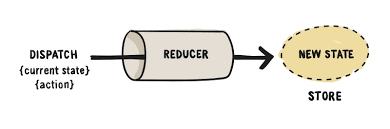
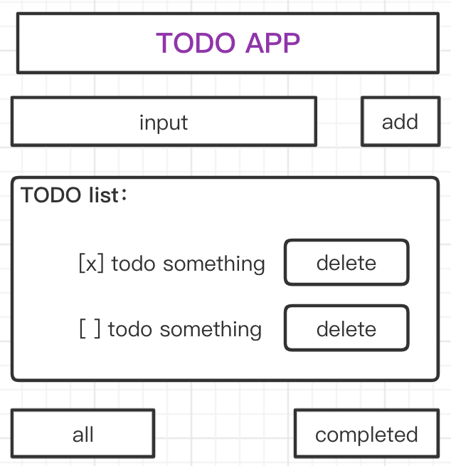
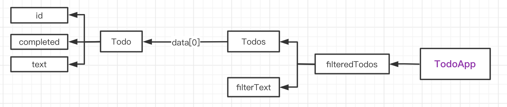

# redux & mobx 状态管理详解

## 什么是状态管理

React.js 是一个 ui 渲染库，其核心概念就是 **data -> UI** 的逻辑。

```js
// 映射关系
y = f(x)
UI = React(data) // data -> UI
```

**为什么要做状态管理？**

====**答：** React.js 是 UI 库，并不提供状态管理方案。

在复杂的业务逻辑下，组件的状态，需要被其他组件所**共享**，由此发展出了状态管理。在 react 生态中，有2个状态管理方案是最有名的，即redux 和 mobx。

## Redux

### Redux 的核心概念



#### action

action 是一种用户端发出的动作，可以是 button 的 onClick，也可以是组件首次渲染发出的请求数据动作，等等

```js
/**
 * Action creator
 */
const REMOVE_ITEM = "removeItem";

export const removeTodo = (id) => {
    return {
        type: REMOVE_ITEM,
        payload: { id }
    };
};
```

#### dispatch

dispatch 是一个方法，它的作用就是把 action 发送到 store 中，同时，会经历所有的 middleware，来为 redux 提供更多的扩展功能

#### reducer

在 redux 中有一个强约束，所有对 store 的修改，必须是经过 reducer 来完成的。每一次经历了 reducer 改动的 store，必须是 immutable 的改动，基于这个约束，我们就可以用“**时间旅行**”的方式来进行调试

```js
// const REMOVE_ITEM = "removeItem";

const initialState = [];

/**
 * immutable 不可变类型
 */
export const reducer = (state = initialState, action) => {
    switch (action.type) {
        case REMOVE_ITEM: {
            const id = action.payload.id;
            return state.filter((todo) => todo.id !== id);
        }
        default:
            return state;
    }
};
```

#### store

store 是所有状态的中心，并且提供 api 给外部调用，以此完成中心化的状态管理过程

```js
// store.js
import { createStore, compose, applyMiddleware } from 'redux';
import { reducer } from './reducer';

const composeEnhancers = window.__REDUX_DEVTOOLS_EXTENSION_COMPOSE__ || compose;

export const store = createStore(
    reducer,
    composeEnhancers(applyMiddleware(...[ReduxThunk]))
);
```

### Redux Demo

使用 Redux 进行状态管理，进行一个 Demo 项目。通过这个项目，了解如何借用 redux 来实现产品的业务逻辑。

```sh
# 利用脚手架 创建一个demo项目
npx create-react-app redux-demo

# 使用 npm:
npm init react-app redux-demo
# 使用 yarn:
yarn create react-app redux-demo

cd redux-demo
yarn start
```

```sh
# 安装 redux：
yarn add redux
yarn add react-redux
```

#### 思路

**需求：**实现一个 TodoApp（CRUD，create｜read｜update｜delete）

**特点：**麻雀虽小，五脏俱全



**步骤：**

1. 先分析需求--页面布局，初步构建页面组件 `/src/components/`

2. 创建 状态管理 redux 文件夹，处理数据 `/src/redux/`

   * action 实现：Action creator
   * reducer 实现

3. 构建 store

4. 使用 react-redux 的 **Provider** 包裹你的整个组件 `TodoApp`

5. 引用 react-redux 的 **useDispatch**, **useSelector**

6. 实际项目中，不可能是一个简单的 reducer，或许会有很多个。这时候，我们借用 redux 的 `combineReducers` 将所有的 reducer 组合成一个 rootReducer，在 redux 的 createStore 里使用的时候，我们可以用 rootReducer

7. 还有一个异步的遗留问题：

   解决方案：使用 **redux-thunk**

### Redux 原理解析

⚠️ Redux 有一个全局的 store

```js
/**
 * Redux 原理解析
 * @desc 并没有什么黑魔法哦～
 */
const addAction = {
  type: 'increment',
}

let state = {
  count: 0,
}

const reducer = (state, action) => {
  switch (action.type) {
    case 'increment': {
      return {
        ...state,
        count: state.count + 1,
      }
    }
    default:
      return state;
  }
}

const dispatch = (action) => {
  state = reducer(state, action);
}

console.log(state.count); // 0
dispatch(addAction); // dispatch
console.log(state.count); // 1
```

## Mobx

### Mobx 的核心概念


#### observable

在 mobx 中，observable 修饰过的对象，就可以被 mobx 监控，一旦该对象有任何变化，都会通知所有他的观察者。

#### action

所有的 observable 对象改变方法都应该被 action 修饰，mobx 在对 observable 对象修改时，有机会增加日志记录、批量更新等优化

#### computed

computed 修饰过的对象是一种计算属性，这也是 mobx 的优势，其概念就对应 vue.js 中的 computed，一旦 computed 内部的依赖更新了，computed 就会被重新计算

### Mobx Demo

使用 mobx 进行状态管，进行一个 Demo 项目。借用 mobx 进行状态管理，来实践一个产品的业务逻辑。

```sh
# 利用脚手架 创建一个demo项目（这里我们尝试一下 ts 构建）
yarn create react-app mobx-app --template typescript

cd mobx-demo
yarn start
```

```sh
# 安装 mobx
yarn add mobx
yarn add mobx-react
```

⚠️ 使用装饰器功能，需要在 tsconfig.json 里面配置 `"experimentalDecorators": true`

#### 思路

1. 先分析需求--页面布局，初步构建页面组件 `/src/components/`
2. 创建 状态管理 mobx 文件夹，处理数据 `/src/mobx/todo.ts`
3. 在 todo.ts 里面利用装饰器进行处理 `import { observable, computed, action } from 'mobx'`

#### 实现

```tsx
// App.tsx
import React from 'react';
import './App.css';

import { TodoApp } from './components/TodoApp';
import { Todos } from './mobx/todo';

const todos = new Todos();

function App() {
  return <TodoApp todos={todos} />;
}

export default App;
```

```tsx
// TodoApp.tsx
import React, { useState } from 'react';
import { Todos } from '../mobx/todo';
import { observer } from 'mobx-react';

const filterInfos = [
    {
        label: 'all',
        value: '',
    },
    {
        label: 'completed',
        value: 'completed',
    }
];

interface TodoAppProps {
    todos: Todos;
}

export const TodoApp: React.FC<TodoAppProps> = observer((props) => {
    const { todos } = props;
    const [text, setText] = useState('');

    const onChangeInput = (e: React.FormEvent<HTMLInputElement>) => {
        setText(e.currentTarget.value);
      };

    const addTodo = () => {
        todos.addTodo(text);
        setText('');
    };

    return (
        <div>
            <h1>Mobx-demo: TodoApp</h1>
            <div>
                <div>
                    <input value={text} onChange={onChangeInput} />
                    <button onClick={addTodo}>add</button>
                </div>
                <ul>
                    {
                        todos.filteredTodos.map((todo) => {
                            const { id, text, completed } = todo;
                            return (
                                <li key={id}>
                                    <input
                                        type="checkbox"
                                        checked={completed}
                                        onChange={() => {
                                            todos.toggleTodo(id);
                                        }}
                                    />
                                    {text}
                                    <button onClick={() => {
                                        // removeTodo
                                        const idx = todos.data.findIndex((todo) => todo.id === id);
                                        todos.data.splice(idx, 1);
                                    }}>delete</button>
                                </li>
                            );
                        })
                    }
                </ul>
                <div>
                    {
                        filterInfos.map((info) => {
                            const { label, value } = info;
                            return (
                                <button key={value} onClick={() => {
                                    todos.setFilterText(value);
                                }}>
                                    {label}
                                </button>
                            );
                        })
                    }
                </div>
            </div>
        </div>
    );
});

```

```ts
import { observable, computed, action } from 'mobx';

// 模拟异步方法
const delay = (ms: number) => new Promise((resolve) => setTimeout(resolve, ms));

class Todo {
    id: number = Math.random();

    @observable
    text: string = '';

    @observable
    completed: boolean = false;

    @action
    toggleTodo = () => {
        this.completed = !this.completed;
    };
}

class Todos {
    @observable
    data: Todo[] = [];

    @observable
    filterText: string = '';

    @computed
    get filteredTodos() {
        return this.data.filter((todo) => {
            if(this.filterText === 'completed') {
                return todo.completed;
            }
            return true
        });
    };

    @action
    async addTodo(text: string) {
        await delay(2000);
        const todo = new Todo();
        todo.text = text;
        this.data.push(todo);
    }

    @action
    setFilterText(text: string) {
        this.filterText = text;
    }

    toggleTodo(id: number) {
        const idx = this.data.findIndex((todo) => todo.id === id);
        this.data[idx].toggleTodo();
    }
}

const TodosInstance = new Todos();

export { Todo, Todos, TodosInstance };
```

### Mobx 原理解析



## Redux *VS* Mobx 工程实践对比

通过对 2 个 Demo 项目进行对比，来展示两种状态方案的优劣。

### Redux

并没有什么黑魔法

* **优势**：注重维护

* **劣势**：写起来比较麻烦

#### 时间旅行

在 devtools 里，可以通过播放条滑动，查看各个瞬间的状态

### Mobx

黑魔法比较多

* **优势**：
  * 自带性能优化
  * 写起来比较快

* **劣势**：
  * 新的 key 没监听上
  * mobx4 和 mobx5 版本差异性比较大
  * devtools ，没有 redux 的好用，记录层级不是很清楚

### 如何抉择

* 注重**维护**【推荐 redux】
* 注重**性能**【推荐 mobx】

⚠️ 选择状态管理方案，需要关注团队技术栈，和书写风格！
