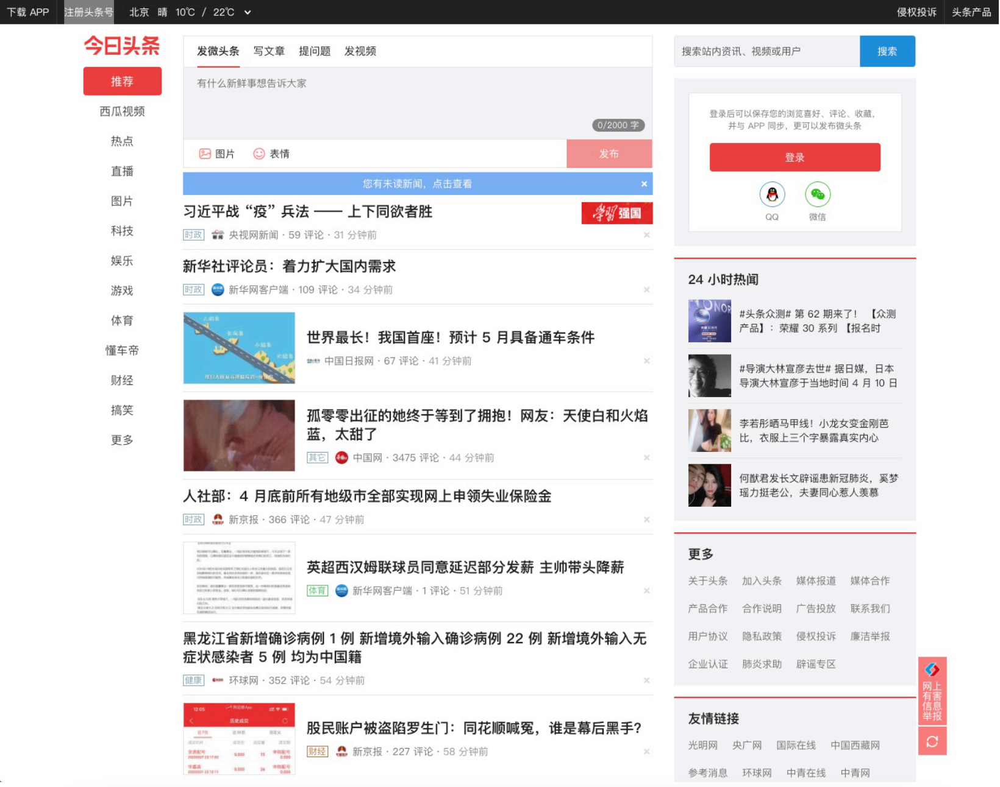
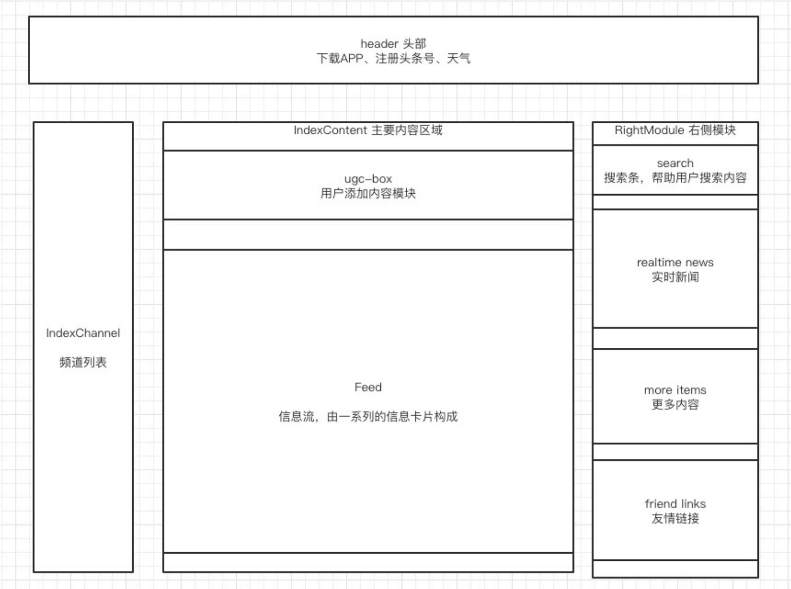

# React 实战 - 今日头条 H5

## 界面分析

访问 https://www.toutiao.com/

## 原型分析

将界面进行第一次拆解，划分模块区域

## 技术架构分析

通过分析模块，考虑实现中可能会遇到的问题，引入各种方案

### 样式

想要像素级复刻的话，css 可以直接使用 toutiao 的 css 文件

### 状态管理

redux、react-redux、@redux/toolkit

### 数据

分析今日头条的 API，构建 mock data，来完成数据的模拟

## 实战

实践页面中最核心的 Feed 组件，来体会生产级别的 react 项目代码。

1. 初步构建页面组件
2. 正确获取信息流数据
3. 将数据链接到 Feed 组件
