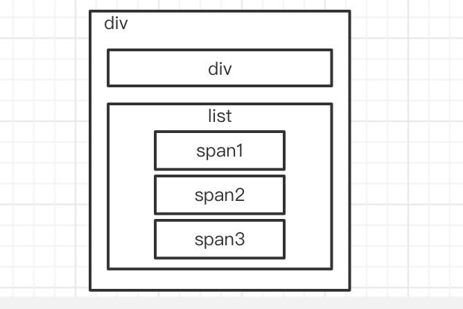

# react.js 核心模块源码解析

```sh
# 源码
https://github.com/facebook/react.git
```

## 课程安排

1. 旧版本的 react
2. v15
3. 源码

## 旧版本的 react

### react 应用 `/origin-old`

```sh
.
├── src/
    ├── index.jsx
├── index.html
├── package.json
└── webpack.config.js # webpack 配置

# 编译
./node_modules/.bin/webpack --watch
```

### 核心源码解析 `/fake`

```sh
.
├── index.html
├── index.js # 应用 React 和 ReactDOM
├── react.js # 包含 React（负责 createElement 和 Component）
├── react-dom.js # 包含 ReactDOM（负责 render：把 element 渲染到 container 上）
└── reconciler.js # 类比于 vue 中的 snabdom -- 比较`DIFF`用！
```

#### `react.js`

```js
(function (global) {
    global.React = {
        createElement, // 创建 vdom 的方法
        Component // 组件的基类
    }
})(window);
```

#### `react-dom.js`

```js
(function (global) {
    global.ReactDOM = {
        render // 渲染组件树 vdomTree
    };
})(window);
```

#### `reconciler.js`

```js
/**
 * 调和器
 * 类比于 vue 中的 snabdom -- 比较`DIFF`用！
 */
(function (global) {
    global.Reconciler = {
        // 更新组件树
        updateContainer(element, container) {
        },
      
        updateChild(oldChild, newChild, container, inst) {
        },
      
        flattern(children, prefix = '', res = {}) {
        },
      
        // 更新组件树实现（核心）
        updateChildren(oldChildren, newChildren, container) {
        }
    };
})(window);
```

#### 实例模块分析

```html
<div id="app">
  <div className="appContainer">
    <div></div>
    <span>111</span>
    <span>222</span>
    <span>333</span>
  </div>
</div>
```



### 项目结构 `/origin`

```sh
.
├── src/
    ├── index.jsx
├── index.html
├── package.json
└── webpack.config.js
```

others：

## 核心模块源码

/vue/src/core

