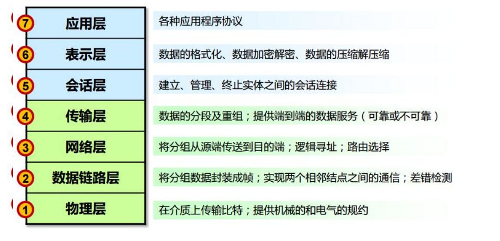
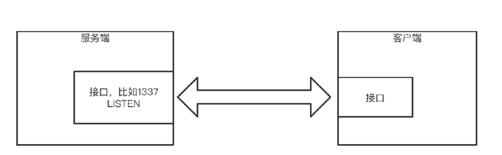
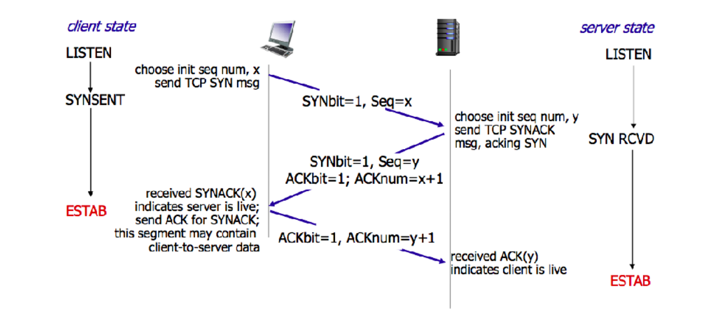
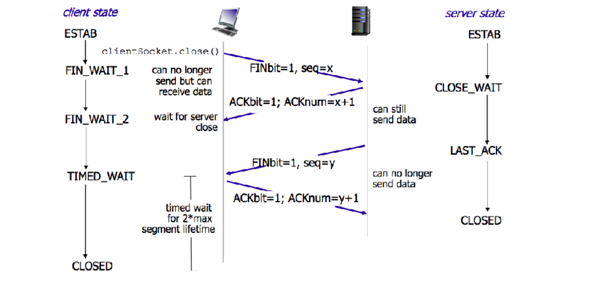

# node.js 网络 http 详解


## OSI 模型



💡 软件开发，重点关注：

* 应用层 HTTP
* 传输层 TCP

两种整合模型称呼：

* 五层模型：应用层+表示层+会话层 =》 应用层

* 四层模型：应用层+表示层+会话层 =》 应用层；物理层+数据链路层 =〉物理层

## HTTP-应用层协议

### HTTP-请求

```sh
# HTTP 请求
<方法><资源地址><协议版本>
<请求部首>

<请求体>
```

### HTTP 方法

* **GET**: 通常⽤于请求服务器发送某些资源 ⭐️

* **HEAD**: 请求资源的头部信息，并且这些头部与 HTTP GET ⽅法请求时返回的⼀致。该请求⽅法的⼀个使⽤场景是在下载⼀个⼤⽂件前先获取其⼤⼩再决定是否要下载，以此可以节约带宽资源
* **OPTIONS**: ⽤于获取⽬的资源所⽀持的通信选项（跨域请求时，会用到）
* **POST**: 发送数据给服务器 ⭐️
* **PUT**: ⽤于新增资源或者使⽤请求中的有效负载**替换**⽬标资源的表现形式
* **DELETE**: ⽤于**删除**指定的资源
* **PATCH**: ⽤于对资源进⾏部分**修改**
* **CONNECT**: HTTP/1.1 协议中预留给能够将连接改为管道⽅式的代理服务器
* **TRACE**: 回显服务器收到的请求，主要⽤于测试或诊断

#### GET  *vs* POST

* **【数据载体不同】**GET 通过 url 传递信息； POST 通过 body 传递信息
* GET url 利于缓存结果
* POST 多次调⽤，可能造成多次提交；GET 不会

#### POST  *vs* PUT

* **【语义不同】**POST ⽤于新增资源、PUT 指向单⼀资源
* POST /article 新增⽂章
* PUT /article/1 对 id 是 1 的 article 进⾏修改

#### PUT  *vs* PATCH

* 都是对单⼀资源的修改
* 内容不同 PUT 影响**全量**内容；PATCH 是修改**部分**内容

### HTTP 部首

```sh
• Content-Type # 资源的格式【响应】
• Accept # 资源的格式【请求】

# 缓存相关的
• Date # 日期【响应】
• Expires # 资源失效，基于绝对时间【响应】
• Last-Modified # 资源最后修改时间，基于绝对时间【响应】⭐️⭐️⭐️
• If-Modified-Since # 【响应】
• ETag # 服务端根据xxx形成的一段hash【响应】
• If-None-Match # 【响应】
• Cache-Control # 服务端可以设置cache-control，基于相对时间【响应】⭐️⭐️⭐️⭐️⭐️
• ...

# ⚠️ 注意区分【请求】、【响应】
# 缓存是一种手段，注意避免的情况
```

### HTTP-响应

``` sh
# HTTP 响应
<协议版本><状态码><状态码短语>
<响应部首>

<响应体>
```

#### HTTP 状态码

* 2XX 成功 - 200 OK
* 3XX 重定向 - 301 永久重定向、304 资源未更改
* 4XX 客户端错误 - 401 没有权限、404 资源未找到
* 5XX 服务端错误 - 500 服务器端内部错误

### HTTP 请求响应示例

``` sh
# 请求
GET / HTTP/1.1
Host: www.example.com
Accept: text/html
Accept-Language: en,zh-CN;q=0.9,zh;q=0.8,en-US;q=0.7,zh-TW;q=0.6
User-Agent: Mozilla/5.0 (Macintosh; Intel Mac OS X 10_13_3) AppleWebKit/537.36 (KHTML, like Gecko) Chrome/80.0.3987.163 Safari/537.36
```

```sh
# 响应
HTTP/1.1 200 OK
Date: Mon, 23 May 2005 22:38:34 GMT
Content-Type: text/html; charset=UTF-8
Content-Length: 138
Last-Modified: Wed, 08 Jan 2003 23:11:55 GMT
Server: Apache/1.3.3.7 (Unix) (Red-Hat/Linux)
ETag: "3f80f-1b6-3e1cb03b"
Accept-Ranges: bytes
Connection: close
```

```html
<!--响应体-->
<html>
  <head>
    <title>An Example Page</title>
  </head>
  <body>
    <p>Hello World, this is a very simple HTML document.</p>
  </body>
</html>
```

### HTTP 实例讲解

Node.js API 实现 http 通讯 `server.js`

## 套接字 Socket



## TCP-传输层协议

* 三次握手
* 四次挥手

### TCP 三次握手



三次握手：建立连接

1. 客户端->服务端：发起一个请求
2. 服务端->客户端：接收到请求，
3. 客户端->服务端：

### TCP 四次挥手



四次挥手：断开连接

1. 客户端->服务端：
2. 服务端->客户端：
3. 服务端->客户端：
4. 客户端->服务端：

### TCP 实例

socat + telnet 进行 tcp 通信

### TCP 实例讲解

Node.js net API 实现 tcp 通信 `socket-server.js`

## Websocket

```sh
# 请求
GET /HTTP/1.1
Host: server.example.com
Upgrade: websocket
Connection: Upgrade
Sec-WebSocket-Key: x3JJHMbDL1EzLkh9GBhXDw==
Sec-WebSocket-Protocol: chat, superchat
Sec-WebSocket-Version: 13
Origin: http://example.com
```

```sh
# 响应
HTTP/1.1 101 Switching Protocols
Upgrade: websocket
Connection: Upgrade
Sec-WebSocket-Accept: HSmrc0sMlYUkAGmm5OPpG2HaGWk=
Sec-WebSocket-Protocol: chat
```

⚠️ Websocket 是独立的，并不是基于 http 的

Websocket 全双工

### Websocket 示例讲解

Node.js http API 完成 websocket 协议切换

* 客户端： `ws-client`
* 服务端： `ws-server.js`

## Node 服务的部署

使⽤ pm2 启动服务端、进⾏运维

```sh
npm install -g pm2
pm2 start ws-server.js —name my-server
pm2 list
pm2 monit
pm2 logs ws-server.js
```
