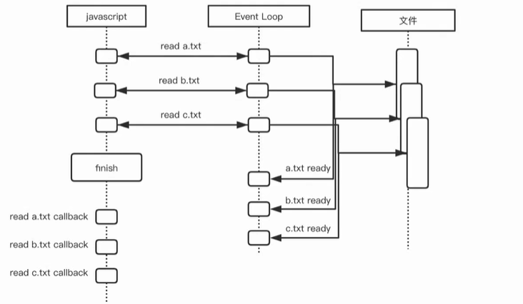

# node.js 原理详解

## Event Loop 事件循环模型

### 调用栈的三种情况

#### 正常调用栈

```js
function multiply(a, b) {
  return a * b;
}

function square(n) {
  return multiply(n, n);
}

function printSquare(n) {
  console.log(square(n));
}

printSquare(4);

// 调用栈: printSquare(4) -> square(4) -> multiply(4, 4)
```

#### 调用栈出错

```js
function multiply(a, b) {
  throw new Error();
}

function square(n) {
  return multiply(n, n);
}

function printSquare(n) {
  console.log(square(n));
}

printSquare(4);

// 调用栈: printSquare(4) -> square(4) -> multiply(4, 4) 
// 在 multiply(4, 4) 这里会报错
```

#### 调用栈溢出

```js
function fn(a) {
  fn(a);
}

fn(1);

// 调用栈: fn(1) -> fn(1) -> fn(1) -> ...
// 调用栈溢出，即`死循环`
// 写递归时，一定要注意！！！
```

### 阻塞调用&异步调用

#### 阻塞调用

💡同步调用

```js
const fs = require('fs');

fs.readFileSync('./a.txt'); // 同步读取文档内容
fs.readFileSync('./b.txt');
fs.readFileSync('./c.txt');

console.log('finish');

// ❓同步带来的问题：我们代码的书写顺序，和执行顺序是一致的
// 时序：read a.txt -> read b.txt -> read c.txt -> finish
// IO 操作时，等～
// CPU 利用率不高，浪费时间
```

#### 异步调用

💡非阻塞调用

```js
const fs = require('fs');

fs.readFile('./a.txt');
fs.readFile('./b.txt');
fs.readFile('./c.txt');
                
console.log('finish')

// event loop，事件循环机制
```



```js
const fs = require('fs');

// 异步调用举例
fs.readFile('./a.txt', (err, data) => {
  // 可以打印一下 err 信息，看一下。
  // 可能是文件不存在，可能是无权限 ……
  if (err) {
    console.log(err);
    return;
  }
  
  // handle data
  console.log(data);
  
  // IO 读取文件是单线程的吗？？
  // ------并不是程序所应该关心的，文件系统跟你的操作系统相关
  
  if (data.length < 1) {
    // 
    fs.readFile('./b.txt', (err, bFileData) => {
      // error
      
      // bFileData
      
      fs.readFile('./b.txt', (err, cFileData) => {
        // error
        
        // cFileData
      })
    })
  } else {
    // demo
  }
});

// ⚠️ 回调地狱

// 优化回调地狱 async/await
callback(null, {});

async function main() {
  const aFileContent = await fs.readFilePromise('./a.txt');
  const bFileContent = await fs.readFilePromise('./b.txt');
  const cFileContent = await fs.readFilePromise('./c.txt');
}
```

⚠️ 区别**异步调用**和**阻塞调用**的时序图！！！

### ❗️事件循环讲解

```js
setTimeout(() => {
  console.log('timeout');
}, 5000)

console.log('hello');

// 输出：
// hello
// timeout
```

⚠️ 注意4个阶段：调用栈｜定时器｜log｜任务队列

#### 宏任务

* setTimeout
* setInterval
* js 主代码

#### 微任务

* process.nextTick
* Promise

#### 宏任务 *vs* 微任务

任务队列被分为：**宏任务队列** 和 **微任务队列**

微任务队列**率先**执行，直到清空

当微任务队列为空时，执行宏任务队列

```js
// 宏任务
setTimeout(() => {
  console.log('timeout');
}, 0)

new Promise((resolve) => {
  console.log('promise'); // ⚠️Promise 的 resolve，也微任务
  resolve();
}).then(() => {
  console.log('then');
})

// 宏任务
console.log('hello');

// 输出：
// promise
// hello
// then
// timeout
```

⚠️ 调用栈｜定时器｜微任务｜宏任务｜log

❓**宏任务** 和 **微任务** 如何区分？？

------看调用的对象。比如说：setTimeout 的 callback 一定是一个宏任务，Promise 的 resolve，是微任务

## Buffer

* Buffer 是 UInt8Array（即，8位无符号整型）
* 是数组，且每个 item 有效范围是 0～255

```js
Buffer.from([1, 1, 1, 1]);
// <Buffer 01 01 01 01>

Buffer.from([257, 257.5, -255, '1']);
// <Buffer 01 01 01 01>

Buffer.from('abcd');
// 字母默认 utf8编码，查utf8编码表可知
// <Buffer 61 62 63 64>
```

## Events

* on 方法，注册事件回调
* emit 方法，手动触发事件

```js
const EventEmitter = require('events');

class MyEventEmitter extends EventEmitter {}

const myEventEmitter = new MyEventEmitter();

myEventEmitter.on('ping', function() {
  console.log('pong');
})

myEventEmitter.emit('ping');
```

## Stream

* Node.js 中很多对象都是 Stream，例如 HTTP 的请求，进程日志输出，文件的读写
* Stream 本身是一个 EventEmitter
* Stream 内部含有 Buffer
* 当 Stream 中 Buffer 有数据可读时，emit data 事件，通知外部读取数据
* 当 Stream 可写时，通过调用 `write()` `end()` API 来写入数据到内部 Buffer 中

### Stream 的类型

* 可读 Writable
* 可写 Readble
* 双工 Duplex
* 转换 Transform

```js
const EventEmitter = require('events');

// Stream 继承自 EventEmitter
class Stream extends EventEmitter {
  construct() {
    this._buffer = Buffer.alloct(1000);
  }
}

const stream = new Stream();

// provider
// 注册 data 事件
stream.emit('data', '1234');

const httpServer;
httpServer.on('data', (data) => {
  data instanceof Buffer
  
  // Buffer extends UInt8Array
  
  Buffer.from([1, 1, 1, 1]);
  // <Buffer 1 1 1 1>
  
  console.log('data::', data);
})

// consumer
stream.on('data', (data) => {
  console.log('data::', data);
})
```

## Node.js 全局对象

### 常见的全局对象

* setInterval & clearInterval
* setTimeout & clearTimeout
* console
* process

### 全局对象与模块

* __filename

* __dirname
* exports
* module
* require()

⚠️ 这5个 API 看上去像是全局对象，但其实是在模块加载的时候进行**注入**，所以要和全局对象进行区分。
