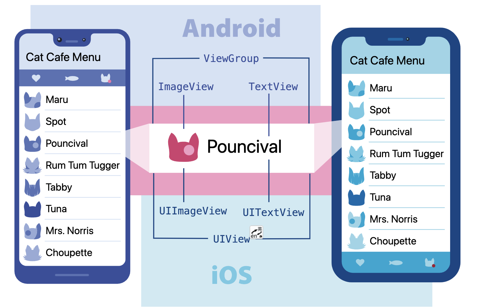
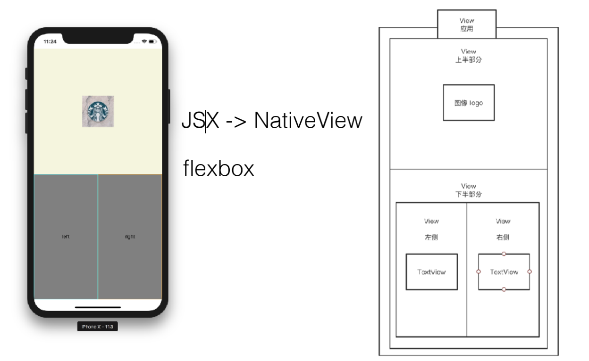

# React Native 入门与原理介绍

## 什么是 React Native

**问题：**假如我开发了⼀款 iOS App，⽕了。我该如何照顾到 Android ⽤户呢？

**可能的答案：**再学⼀遍 Android，开发⼀个相同功能的应⽤

React 的语法跨平台，Learn once, write everywhere

💡前端已经不再是一个单一的网页前端的概念，而是分为了**桌面浏览器端**，**移动端**，**小程序端**，**iOS** 和**安卓应用端**等。

## 为什么要学 React Native

* 移动互联网趋势（移动端优先）
* 多端代码同构
* 组件化

现在好多场景，都是优先**移动端**。

## React Native 的优势

Android 和 iOS应用中多种视图的一些示例。



## 开发环境配置

* Node.js LTS 12
* npm install -g expo-cli （全局安装 `expo-cli`）
* expo init xxx

### ⭐️Android，iOS 环境配置

官方： <https://reactnative.dev/docs/next/environment-setup>

中文： <https://reactnative.cn/docs/environment-setup>

📋注意事项：

* Android 应用可以在 MacOS 和 windows 进行开发

* iOS 必须要有 MacOS

### 🌰eg: 开发平台 MacOS + 目标平台 iOS

#### 1、安装依赖

必须安装的依赖有：**Node**、**Watchman**、**Xcode** 和 **CocoaPods**。

```bash
# 推荐使用`Homebrew`来安装 Node 和 Watchman
brew install node
brew install watchman

# watchman，监视文件系统变更的工具。安装此工具可以提高开发时的性能（packager 可以快速捕捉文件的变化从而实现实时刷新）。
```

⚠️ 安装 Xcode

会同时安装 **Xcode IDE**、**Xcode 的命令行工具**和 **iOS 模拟器**。

⚠️ 安装 CocoaPods （安装可能不顺利，请尝试使用代理软件或寻找一些国内可用的镜像源。）

```bash
brew install cocoapods
# CocoaPods，包管理器（可以理解为针对 iOS 的 npm）。
```

❓❓❓开了科学上网，但是事实上 终端 terminal 并没有科学上网，这时候要咋办呢？？

------设置代理即可。（科学上网，才设置 1080 端口）

```bash
# 为你的命令行设置`加速`
export http_proxy=http://localhost:1080;
export http_proxy=https://localhost:1080;
```

#### 2、创建新项目

```bash
npx react-native init demo

# 可选参数
npx react-native init demo --template react-native-template-typescript
```

#### 3、编译并运行 React Native 应用

```bash
cd demo
# 编译
yarn ios # 或者 yarn react-native run-ios
# 启动`Metro`服务对`js`代码进行实时打包处理（类似 webpack）
# `Metro`服务也可以使用`yarn start`命令单独启动
yarn start
```

### ⭐️沙盒环境

官方沙盒环境大量依赖于国外网络环境，也不能直接安装第三方原生组件。不建议国内用户使用

```bash
# 全局安装 expo-cli
yarn global add expo-cli
```

```bash
# 初始化一个项目
expo init expo-demo

cd expo-demo
yarn start # 或 expo start
```

💡[举个例子🌰](./react-native-demos)

## React Native 组件应用

### React Native 样式处理

```js
import React from 'react';
import { StyleSheet } from 'react-native';

const styles = StyleSheet.create({
  root: {
    padding: 10,
  },
  countContainer: {
    alignItems: "center",
    padding: 10,
  },
  button: {
    alignItems: "center",
    backgroundColor: "#ddd",
    padding: 10,
  },
});

export default function App() {
  return (
    <View style={styles.root}>
  		<View style={[styles.container, style.horizontal]}></View>
  	</View>
  );
}
```

### React Native 布局



### React Native 变形

* 类⽐ css 中的 transform 属性

### React Native 异形屏

```jsx
export const SafeAreaViewDemo = () => {
  return (
    <SafeAreaView style={styles.container}>
      <Text>Page content</Text>
    </SafeAreaView>
  );
};
```

### React Native TextInput

* TextInput Demo
* Platform specifified code

### React Native 触摸样式

* Button
* TouchableHighlight
* TouchableNativeFeedback (Android）
* TouchableOpacity

### React Native 图片

* 本地静态资源图⽚
* 通过网络动态资源图片
* 背景图片

### React Native 列表

* ScrollView
* FlatList
* SectionList

### React Native 开关按钮

* Switch
* onValueChange
* value
* 设置颜⾊在不同平台有不同的渲染

### React Native 状态栏

* 系统最上⾯的状态栏
* 显示、隐藏
* 内容模式 default、light-content、dark-content

### React Native 活动指示器

* 表示正在处理的状态
* 具体的展示与平台相关


### React Native 网络请求

```js
import { useCallback } from 'react';

const onPress = useCallback(() => {
  setLoading(true);
  setData([]);
  fetch("https://reactnative.dev/movies.json")
    .then((response) => response.json())
    .then((json) => {
    return delay(2000).then(() => json);
  })
    .then((json) => setData(json.movies))
    .catch((error) => console.error(error))
    .finally(() => setLoading(false));
}, []);
```

### React Native API 应用

### 告警窗口

* 弹出告警界⾯
* 可以设置标题、消息、自定义按钮

### 模态框弹窗

* Modal
* 可⻅ visible
* 动画类型 none，fade，slide
* 透明背景

### 动画

* 基于时间的变化
* ⾃带 View、Text、Image、ScrollView、FlatList、SectionList ⽀持动画

### 响应手势

* View -> Responder
* PanResponder

### 响应事件参数

```js
onPanResponderMove: (event, gestureState) => {}
```

* nativeEvent
  * changedTouches: 在上一次事件之后，所有发生变化的触摸事件的数组集合（即上一次事件后，所有移动过的触摸点）
  * identifier: 触摸点的 ID
  * locationX: 触摸点相对于父元素的横坐标
  * locationY: 触摸点相对于父元素的纵坐标
  * pageX: 触摸点相对于根元素的横坐标
  * pageY: 触摸点相对于根元素的纵坐标
  * target: 触摸点所在的元素 ID
  * timestamp: 触摸事件的时间戳，可用于移动速度的计算
  * touches: 当前屏幕上的所有触摸点的集合

* 一个 gestureState 对象有如下的字段：
  * stateID: 触摸状态的 ID。在屏幕上有至少一个触摸点的情况下，这个ID会一直有效。
  * moveX: 最近一次移动时的屏幕横坐标
  * moveY: 最近一次移动时的屏幕纵坐标
  * x0: 当响应器产生时的屏幕横坐标
  * y0: 当响应器产生时的屏幕纵坐标
  * dx: 从触摸操作开始时的累计横坐标路程
  * dy: 从触摸操作开始时的累计纵坐标路程
  * vx: 当前的横向移动速度
  * vy: 当前的纵向移动速度
  * numberActiveTouches: 当前在屏幕上的有效触摸点的数量

### 振动

* Vibration.vibrate（pattern, repeat）
* pattern 是 number 或者 number 的数组
* Vibration.cancel()

### 获取 window 长度宽度

window = useWindowDimensions();

window.width
window.height
