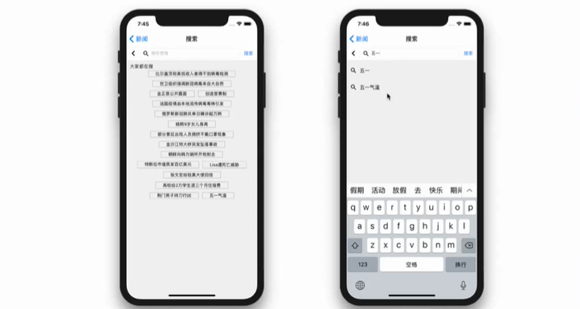

# React Native 实战

[使用 React Native 开发一个《今日头条》（实战）](./react-native-toutiao)

## 项目初始化

```bash
# 全局安装 expo-cli
yarn global add expo-cli
# 或
npm i -g expo
```

```bash
# 初始化一个项目（使用 tabs template）
expo init rn-toutiao

cd rn-toutiao
yarn start # 或 expo start
```

## 导航

理解一下数据结构：**堆**（桌子--书1/书2/书x）、**层**（书本页面）

手机屏幕（底部tabs）

```bash
npm install
@react-navigation/native
@react-navigation/stacks
@react-navigation/bottom-tabs

expo install
react-native-reanimated
react-native-gesture-handler
react-native-screens
react-native-safe-area-context
@react-native-community/masked-view
```

❓从 `/App.js` 看起，看看这个初始化的工程都干了些啥事？

## 头条页面 tabs

* 搜索页
* 列表页
* 详情页

| 新闻页 | 详情页 | 搜索页 |
| ---------------------------- | --------------------------- | ---------------------------- |
|  |  |  |

## API

* 新闻信息流 <http://is.snssdk.com/api/news/feed/v51/?category=${channel}>
* 搜索补全 <http://www.yidianzixun.com/home/q/search_channel?word=xxx&appid=web_yidian>
* 热搜词汇 <http://www.yidianzixun.com/home/q/hot_search_keywords?appid=web_yidian>

## 实现步骤

先分析一下 **头条App** 的实现。

1. 修改主页 HomeScreen
   * 导航 BottomTabNavigator
2. 新闻页 components
   * 搜索页入口 NewsHeader
   * 渠道的选择列表 NewsChannelList
     * 热点
     * 社会
     * ……
   * 列表页 NewsList
3. Others
