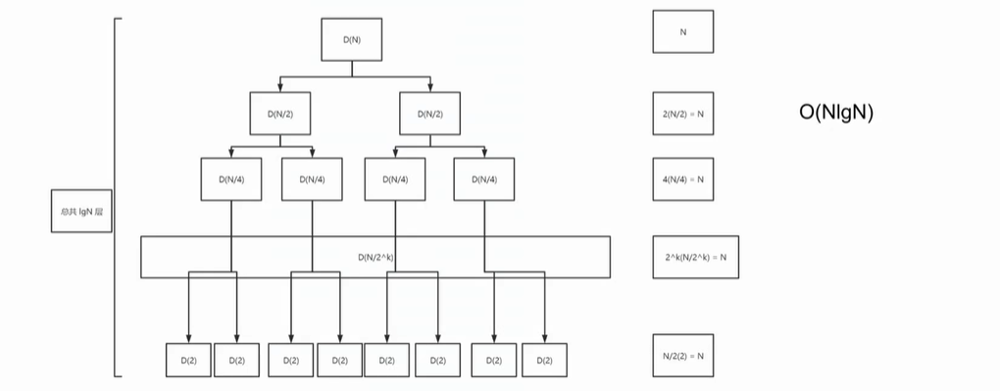
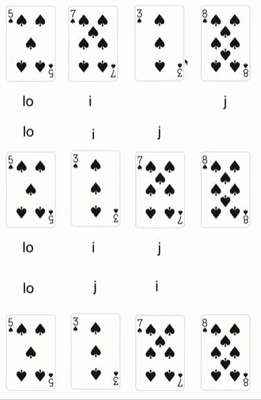
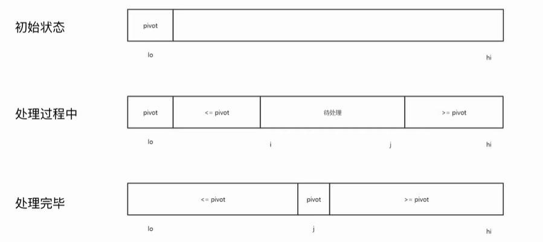

# 排序算法

## 排序在解决什么问题

| 姓名 | 年龄 | 班级 | 评分 |
| ---- | ---- | ---- | ---- |
| 张三 | 20   | 一班 | A    |
| 李四 | 21   | 三班 | B    |

例如：大学中的学生，每个人都有自己的个人信息，成绩等信息。需要根据某一种信息，以某种方式（升序/降序）重新排列这组数据。

举些常见的🌰：

* 淘宝页面显示，以升序排列价格
* 对字符串进行排序（搜索引擎，输入 长尾词）
* 对文件夹进行排序（源信息：名称/时间/大小/……）

1. 需求具有相似性，但是输入的**数据格式**完全不同。有没有办法用同一种方式来解决重新排列的问题呢？

   -------答案：排序算法

2. 排序算法如何处理全然不同的数据类型呢？

   -------答案：将比较的过程，进行抽象，JavaScript 传入回调函数。

   排序：

   ```js
   var a = [1, 2, 3, 4, 5, 6, 7, 8, 9, 10];
   a.sort();
   // 结果：[1, 10, 2, 3, 4, 5, 6, 7, 8, 9]

   /*❓10 在 1 和 2 之间 ？？？
   	答案：因为 JS 默认都当成了 string 类型 */
   ```

   解决上述问题：

   ```js
   // 👍推荐
   var a = [1, 2, 3, 4, 5, 6, 7, 8, 9, 10];
   a.sort((a, b) => a - b);
   // 结果：[1, 2, 3, 4, 5, 6, 7, 8, 9, 10]

   /* ⚠️ 手动传入 compare 回调后，修复！*/
   ```

   ❗️总结：通过调用方传入**比较**方法，将数据之间的比较与算法解耦，使得算法能够处理任意的数据格式。

### 全序关系

数学逻辑上的理解。


### Compare  回调函数

工程上的理解。

```js
function compare(a, b) {
  return a - b;
}

/*
 * 返回值 <0，则 a<b
 * 返回值 >0，则 a>b
 * 返回值 =0，则 a=b
 */
```

#### Date 与 compare

```js
class Date {
    constructor(year, month, day) {
        this.year = year;
        this.month = month;
        this.day = day;
    }

    compareTo(other) {
        if (this.year < other.year) {
            return -1;
        }
        if (this.year > other.year) {
            return 1;
        }
        if (this.month < other.month) {
            return -1;
        }
        if (this.month > other.month) {
            return 1;
        }
        if (this.day < other.day) {
            return -1;
        }
        if (this.day > other.day) {
            return 1;
        }
        return 0;
    }
}
```

### 两个常用函数 less & swap

`less(a, b)` 当 a<b 时，返回 true，否则返回 false

```js
function less(a, b) {
  return a - b < 0;
}
```

`swap(a, i, j)` 对数组 a，在 i, j 上的值进行交换

```js
function swap(a, i, j) {
  const temp = a[i];
  a[i] = a[j];
  a[j] = temp;
}
```

## 常见排序算法

常见的排序算法（10个）：冒泡排序、选择排序、插入排序、归并排序、快速排序、希尔排序、堆排序、计数排序、桶排序、基数排序

冒泡排序，其实没什么意义……

### 1、选择排序 (selection sort)

#### 基本思路

遍历数组 a，每次在当前的 index 上，找到剩余数组中的最小值的索引，为 min，进行 swap a[index], a[min]

[可视化工具演示](https://visualgo.net/zh/sorting)

#### 代码实现

```js
// 1.指针右移
i++;

// 2.找到右边数组中最小值
for(let j=i+1; j<len; j++) {
  if(less(a[j], a[min])) {
    min = j;
  }
  swap(a, i, min);
}

//3.交换
swap(a, i, min);
```

```js
// 选择排序
function selectionSort(a) {
    const len = a.length;
    for(let i=0; i<len; i++) {
        let min = i;
        for(let j=i+1; j<len; j++) {
            if (less(a[j], a[min])) {
                min = j;
            }
            swap(a, i, min);
        }
    }
}
```

#### 复杂度分析

选择排序，一共经历（N-1）+（N-2）+ ... + 1 + 0 次 compare 和 N 次 swap

$$（N-1）+（N-2）+ ... + 1 + 0 ～ N^2 / 2$$

**复杂度：**$$O(N^2)$$

***❗️结论：***时间主要消耗在 compare 上，swap 的用时可以忽略，并且即使是已经排序完成的数组需要花费同样的时间。

### 2、插入排序 (insertion sort)👍

#### 基本思路

遍历数组 a，在当前的 index 上，向前比较，如果顺序不对就进行交换

[可视化工具演示](https://visualgo.net/zh/sorting)

#### 代码实现

```js
// 1.指针右移
i++;

// 2.向左边的值查看顺序，不符合则交换，直到符合
for(let j=i; j>0; j--) {
  if(less(a[j], a[j-1])) {
    swap(a, i, j-1);
  } else {
    break;
  }
}
```

```js
// 插入排序
function insertionSort(a) {
    const len = a.length;
    for(let i=0; i<len; i++) {
        for(let j=i; j>0; j--) {
            if (less(a[j], a[j-1])) {
                swap(a, j, j-1);
            } else {
                break;
            }
        }
    }
}
```

#### 复杂度分析

针对随机排序，且无重复值的数组，插入排序平均需要进行 ~$$\frac{1}{4}N^2$$ 次 compare 和 ~$$\frac{1}{4}N^2$$ 次 swap

**复杂度：**$$O(N^2)$$

##### Best Case

已经排好序的数组

进行插入排序，需要 N-1 次 compare 和 0 次 swap。

复杂度：$$O(N)$$

##### Worst Case

数组排好序，且逆序，没有重复值。

插入排序，需要 ~$$\frac{1}{2}N^2$$ 次 compare 和 ~$$\frac{1}{2}N^2$$ 次 swap。

复杂度：$$O(N^2)$$

### 3、归并排序 (merge sort)

#### 基本思路

将数组分为两部分，递归地，对两个数组分别排序，然后合并两个部分

[可视化工具演示](https://visualgo.net/zh/sorting)

**归并：**对已经排序的两个数组合并成一个数组

例如：`[3, 5, 7, 8]` 和 `[2, 4, 6, 9]`

结果：`[2, 3, 4, 5, 6, 7, 8, 9]`

#### 代码实现

```js
/**
 * 归并代码实现
 *
 * @param {*} a 要排序的数组
 * @param {*} aux 辅助数组
 * @param {*} lo 低位
 * @param {*} mid 中位
 * @param {*} hi 高位
 */
function _merge(a, aux, lo, mid, hi) {
    for(let k=lo; k<=hi; k++) {
        aux[k] = a[k];
    }

    let i = lo; j = mid + 1;
    for(let k=lo; k<=hi; k++) {
        if (i > mid) {
            a[k] = aux[j++];
        } else if (j > hi) {
            a[k] = aux[i++];
        } else if (less(aux[j], aux[i])) {
            a[k] = aux[j++];
        } else {
            a[k] = aux[i++];
        }
    }
}
```

```js
// 归并排序
function mergeSort(a) {
    const aux = a.slice();
    _sort(a, aux, 0, a.length-1);
}

function _sort(a, aux, lo, hi) {
    if (hi <= lo) {
        return;
    }
    let mid = lo + (hi - lo) / 2;
    _sort(a, aux, lo, mid);
    _sort(a, aux, mid+1, hi);
    _merge(a, aux, lo, mid, hi);
}

/**
 * 归并代码实现
 *
 * @param {Array} a 要排序的数组
 * @param {*} aux 辅助数组
 * @param {*} lo 低位
 * @param {*} mid 中位
 * @param {*} hi 高位
 */
function _merge(a, aux, lo, mid, hi) {
    for(let k=lo; k<=hi; k++) {
        aux[k] = a[k];
    }

    let i = lo;
    let j = mid + 1;
    for(let k=lo; k<=hi; k++) {
        if (i > mid) {
            a[k] = aux[j++];
        } else if (j > hi) {
            a[k] = aux[i++];
        } else if (less(aux[j], aux[i])) {
            a[k] = aux[j++];
        } else {
            a[k] = aux[i++];
        }
    }
}
```

#### 复杂度分析

##### 树形分析



##### 代数分析

$$D(N) = 2D(N/2) + N(N>1); D(1)=0$$

$$\begin{aligned}  D(N)/N&=2D(N/2)/N + 1 \\ &=D(N/2)/(N/2) + 1 \\ &=D(N/4)/(N/4) + 1 + 1 \\ &=D(N/8)/(N/8) + 1 + 1 + 1 \\ & ... \\ &=D(N/N)/(N/N) + 1 + 1 + ... + 1 \\ &=lgN \\ \end{aligned}$$

$$D(N) = NlgN$$

**复杂度：**$$O(NlgN)$$

#### 归并排序的优化 1

归并排序在当前数组长度较小时，会分配很多小数组，此时可以使用插入排序来替代小数组的排序

```js
const CUTOFF = 7; // 数组长度，不建议设置的太大，小数组适用
function _sort(a, aux, lo, hi) {
    if (hi <= lo) {
        return;
    }
    if (hi <= lo + CUTOFF - 1) {
        return insertionSort(a, lo, hi);
    }
    let mid = lo + (hi - lo) / 2;
    _sort(a, aux, lo, mid);
    _sort(a, aux, mid+1, hi);
    _merge(a, aux, lo, mid, hi);
}
```

#### 归并排序的优化 2

对于已经排序好的数组，则不需要再进行归并排序

```js
function _sort(a, aux, lo, hi) {
    if (hi <= lo) {
        return;
    }
    let mid = lo + (hi - lo) / 2;
    _sort(a, aux, lo, mid);
    _sort(a, aux, mid+1, hi);
    // 排序后，比较前半数组的最后一个值与后半数组的第一个值
    if (!less(a[mid+1], a[mid])) {
        return;
    }
    _merge(a, aux, lo, mid, hi);
}
```

### 4、快速排序(quick sort)👍

#### 基本思路

基于某个值 a[i]，对数组**分区**成两个部分

对各自的分区进行整理，a[i] 左边数组的所有值都小于等于 a[i]，a[i] 右边的所有值都大于等于 a[i]

递归

对整理后的两个数组，递归调用上述方法

##### 分区

如右图所示：

重复下列过程，直到 i 和 j 相交

从左向右找到下一个 i，此时 `a[i] >= a[lo]`

从右向左找到下一个 j，此时 `a[j] <= a[lo]`

交换 a[i]，a[j]

最终，交换 a[lo] 和 a[j]

##### 分区过程

注释：pivot（拐点）



[可视化工具演示](https://visualgo.net/zh/sorting)

#### 代码实现

```js
/**
 * 分区过程
 *
 * @param {*} a 要排序的数组
 * @param {*} lo 低位
 * @param {*} hi 高位
 * @returns
 */
function partition(a, lo, hi) {
    let i = lo;
    let j = hi + 1;
    while (true) {
        // 确定 i
        while (less(a[++i], a[lo])) {
            if (i == hi) {
                break;
            }
        }
        // 确定 j
        while (less(a[lo], a[--j])) {
            if (j == lo) {
                break;
            }
        }

        // 处理完毕 跳出
        if (i >= j) {
            break;
        }
        swap(a, i, j); // 交换 a[i] a[j]
    }
    swap(a, lo, j); // 交换a[lo] a[j]
    return j;
}
```

```js
// 快速排序
function quickSort(a) {
    sort(a, 0, a.length - 1);
}

function sort(a, lo, hi) {
    if (hi <= lo) {
        return;
    }
    let j = partition(a, lo, hi);
    sort(a, lo, j - 1);
    sort(a, j + 1, hi);
}

// 分区过程
function partition(a, lo, hi) {
    let i = lo;
    let j = hi + 1;
    while (true) {
        // 确定 i
        while (less(a[++i], a[lo])) {
            if (i == hi) {
                break;
            }
        }
        // 确定 j
        while (less(a[lo], a[--j])) {
            if (j == lo) {
                break;
            }
        }

        // 处理完毕 跳出
        if (i >= j) {
            break;
        }
        swap(a, i, j); // 交换 a[i] a[j]
    }
    swap(a, lo, j); // 交换a[lo] a[j]
    return j;
}
```

有一些快速排序的实现，生成额外的数组，这样可以更容易实现分区，不过没有必要。

快速排序，不需要申请额外的空间

#### 复杂度分析

对长度为 N 的数组，且无重复的 key，快速排序需要进行 ~$$2NlgN$$ 次 compare 和 ~$$\frac{1}{3}NlgN$$ 次 swap

**复杂度：**$$O(NlgN)$$

##### Worst Case

退化成冒泡排序，$$N + (N-1) + (N-2) + ... + 1$$ ~ $$\frac{1}{2}N^2$$

最差情况，从 $$NlogN$$ --> $$N^2$$

❗️解决方案：可以对数组在排序进行 shuffle 的操作。（随机打乱顺序）

#### 快速排序的优化 1

在处理长度较小数组的时候，使用插入排序替代

```js
const CUTOFF = 10; // 数组长度，不建议设置的太大，小数组适用
function sort(a, lo, hi) {
    if (hi <= lo + CUTOFF - 1) {
        return;
    }
    let j = partition(a, lo, hi);
    sort(a, lo, j - 1);
    sort(a, j + 1, hi);
}
```

#### 快速排序的优化 2

更换选择 pivot 的算法，最好的情况就是选择到了中位数。所以解决方案就是要尽量推断出中位数。

随机选择 3 个值，取其中位数。

```js
function sort(a, lo, hi) {
    if (hi <= lo) {
        return;
    }

    // 随机选择 3 个值，取中位数。
    const m = medianOf3(a, lo, lo+(hi-lo)/2, hi);
    swap(a, lo, m);

    let j = partition(a, lo, hi);
    sort(a, lo, j - 1);
    sort(a, j + 1, hi);
}
```

## 稳定度

快速排序是 **非稳定排序**

什么是稳定性？

| i    | j    | 0    | 1    | 2    | 3    |
| ---- | ---- | ---- | ---- | ---- | ---- |
|      |      | B1   | C1   | C2   | A1   |
| 1    | 3    | B1   | C1   | C2   | A1   |
| 1    | 3    | B1   | A1   | C2   | C1   |
| 0    | 1    | A1   | B1   | C2   | C1   |

C1 C2 在排序后顺序转换成了 C2 C1

## 排序算法对比

### 插入排序 $N^2$

| 电脑     | 千级 | 百万级   | 十亿级 |
| -------- | ---- | -------- | ------ |
| 家用电脑 | 立刻 | 2.8 小时 | 317 年 |
| 超级电脑 | 立刻 | 1 秒     | 1 星期 |

### 归并排序 $NlgN$

| 电脑     | 千级 | 百万级 | 十亿级  |
| -------- | ---- | ------ | ------- |
| 家用电脑 | 立刻 | 1 秒   | 18 分钟 |
| 超级电脑 | 立刻 | 立刻   | 立刻    |

### 快速排序 $NlgN$

| 电脑     | 千级 | 百万级 | 十亿级  |
| -------- | ---- | ------ | ------- |
| 家用电脑 | 立刻 | 0.6 秒 | 12 分钟 |
| 超级电脑 | 立刻 | 立刻   | 立刻    |

‼️算法的复杂程度的减少，远比电脑性能重要

### 总结

| 排序算法                   | 平均时间复杂度 | 最坏时间复杂度 | 空间复杂度 | 稳定性 |
| -------------------------- | -------------- | -------------- | ---------- | ------ |
| 选择排序（selection sort） | $O(N^2)$       | $O(N^2)$       | $O(1)$     | 不稳定 |
| 插入排序（insertion sort） | $O(N^2)$       | $O(N)$ - 最好  | $O(1)$     | 稳定   |
| 归并排序（merge sort）     | $O(NlgN)$      | $O(NlgN)$      | $O(N)$     | 稳定   |
| 快速排序（quick sort）     | $O(NlgN)$      | $O(N^2)$       | $O(1)$     | 不稳定 |


