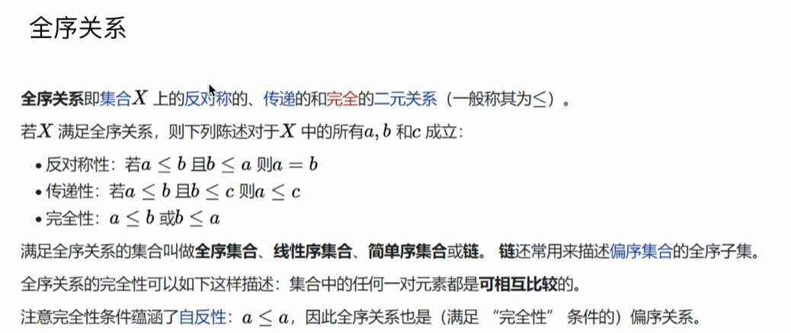

# 排序算法

## 排序在解决什么问题

| 姓名 | 年龄 | 班级 | 评分 |
| ---- | ---- | ---- | ---- |
| 张三 | 20   | 一班 | A    |
| 李四 | 21   | 三班 | B    |

例如：大学中的学生，每个人都有自己的个人信息，成绩等信息

需要根据某一种信息，以某种方式（升序/降序）重新排列这组数据。

举些常见的🌰：

* 淘宝页面显示，以升序排列价格
* 对字符串进行排序（搜索引擎，输入 长尾词）
* 对文件夹进行排序（源信息：名称/时间/大小/……）

❓需求具有相似性，但是输入的**数据格式**完全不同。有没有办法用同一种方式来解决重新排列的问题呢？

-------答案：排序算法

❓排序算法如何处理全然不同的数据类型呢？

-------答案：将比较的过程，进行抽象，JavaScript 传入回调函数。

排序：

```js
var a = [1, 2, 3, 4, 5, 6, 7, 8, 9, 10];
a.sort();
// 结果：[1, 10, 2, 3, 4, 5, 6, 7, 8, 9]

/*❓10 在 1 和 2 之间 ？？？
	答案：因为 JS 默认都当成了 string 类型 */
```

解决上述问题：

```js
// 👍推荐
var a = [1, 2, 3, 4, 5, 6, 7, 8, 9, 10];
a.sort((a, b) => a - b);
// 结果：[1, 2, 3, 4, 5, 6, 7, 8, 9, 10]

/* ⚠️ 手动传入 compare 回调后，修复！*/
```

❗️总结：通过调用方传入**比较**方法，将数据之间的比较与算法解耦，使得算法能够处理任意的数据格式。

### 全序关系

数学逻辑上的理解。



### Compare  回调函数

工程上的理解。

```js
function compare(a, b) {
  return a - b;
}

/*
 * 返回值 <0，则 a<b
 * 返回值 >0，则 a>b
 * 返回值 =0，则 a=b
 */
```

#### Date 与 compare

```js
class Date {
    constructor(year, month, day) {
        this.year = year;
        this.month = month;
        this.day = day;
    }

    compareTo(other) {
        if (this.year < other.year) {
            return -1;
        }
        if (this.year > other.year) {
            return 1;
        }
        if (this.month < other.month) {
            return -1;
        }
        if (this.month > other.month) {
            return 1;
        }
        if (this.day < other.day) {
            return -1;
        }
        if (this.day > other.day) {
            return 1;
        }
        return 0;
    }
}
```

### 两个常用函数 less & swap

less(a, b) 当 a<b 时，返回 true，否则返回 false

```js
function less(a, b) {
  return a - b < 0;
}
```

swap(a, i, j) 对数组 a，在 i, j 上的值进行交换

```js
function swap(a, i, j) {
  const temp = a[i];
  a[i] = a[j];
  a[j] = temp;
}
```

## 常见排序算法

### 选择排序

基本思路：

遍历数组 a，每次在当前的 index 上，找到剩余数组中的最小值的索引，为 min，进行 swap a[i], a[min]

[可视化工具演示](https://visualgo.net/zh/sorting)

### 冒泡排序

基本思路：

## 常见排序算法复杂度分析
