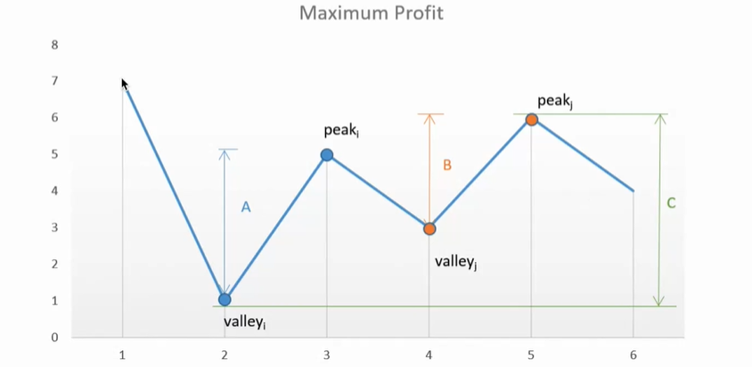
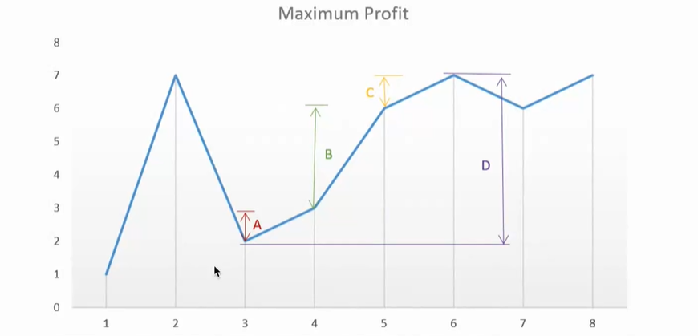

# 贪心算法与动态规划

## 贪心算法

**贪心算法**是一种在每一步选择中都采取在当前状态下最好或最优（即最有利）的选择，从而希望导致结果是最好或最优的算法。贪心算法不是对所有问题都能得到整体最优解，主要的难点是贪心策略的选择，选择的贪心策略必须具备无后效性，即某个状态以前的过程不会影响以后的状态，只与当前状态有关。

### 买卖股票问题

有一个股市大盘，每天会展示当前的股票价格，如果我们同一时刻只能有一笔交易（要再买股票前必须先卖出）我们应该以怎么样的策略来买卖股票？才能使我们的整体收益最大呢？

分析问题的两个注意点：

* 股票必须先买入，之后才能卖出
* 同一时刻只能有一笔交易，也就是必须先卖出之后，才能买入股票

例如用一个数组 array 来表示股票的情况，数组中的每个元素代表着股票价格，数组中的索引 n 代表着第 n+1 天的情况。

以 array 为 [1, 2, 3, 4, 5] 为例，在第1天（股票价格=1）的时候买入，在第5天（股票价格=5）的时候卖出，这笔交易所能获得利润 = 5-1=4。

以 array 为 [5, 4, 3, 2, 1] 为例，无论在哪天买入，哪天卖出，我们都会亏损，所以最好的策略就是我们不买卖股票，收益为 0。

以 array 为 [7, 1, 5, 3, 6, 4] 为例，我们就需要绘制图像，通过图像来对比出整体流程中的**波峰**和**波谷**，添加每个波峰和波谷的差值。



如上图所示，我们在第2天以1元买入，在第3天以5元卖出，在第4天以3元买入，在第5天以6元卖出，整体收益最大，最大收益为4+3=7元。

对于我们的代码来讲，我们如何判断出当前的波峰和波谷呢？事实上我们并不需要那么复杂的寻找波峰和波谷，对于波峰和波谷来说，主要趋势是上涨的，那么对于波峰和波谷之间的每一次上涨，最终他们的幅度都是相同的。



以上图为例，第3天是一个波谷，第6天是一个波峰，对于这一次的上涨来说，我们的收益为 7-2=5，也就是图中 D 这条线代表的高度，但同样的，对于每一天来说，他们都是一个小的上涨，只要后一天股票的价格比前一天高，那么最终在这个连续的周期内，最终股票的价格的幅度都是确定的。例如，第3天买入第4天卖出，那么这一段收益为1，第4天买入第5天卖出，那么这一段收益为3，第5天买入第6天卖出，这一段收益为1，加起来的收益为 1+3+1，总收益还是 5，与实际波峰波谷计算的结果完全相同。

所以对于这个问题我们能快速的转化和分析出问题的结果，那就是，对于这个股票买卖的问题，只要后一天比前一天的价格高，那么我们就计算他们的差值，最终加和这部分上升的利润就是我们的结果。

我们也能轻易的写出来我们的代码：

```js
var maxProfit = function(prices) {
    var count = 0;
    for(var i=1; i<prices.length; i++) {
        var price = prices[i];
        var prevPrice = prices[i - 1];
        if (price > prevPrice) {
            count += price - prevPrice;
        }
    }
    return count;
}
```

在这个例子中，我们也可以利用反证法证明我们的贪心算法的正确性，也就是假设我们的算法不是最优解，因为我们无法反证为真，那么当前的算法即为为优解：

假设“贪心算法”得到的解不是最优解，即我们对于股票买卖还能够找到一个解法比我们上面的“贪心算法”过程得到的利润还多。

对于每两天之间的利润差，后一天价格减去前一天价格，只会有**负数、0、正数**三种情况，我们的贪心解法，正是每次加和时都使用正数的情况。

1. 如果可行解在 “贪心算法” 的基础上，选择了差为 0 的项，得到的结果与 “贪心算法” 得到的结果一样，因此加上差分为 0 的项不会比 “贪心算法” 得到的结果更好；
2. 如果可行解在 “贪心算法” 的基础上，选择了差分为 负数 的项，加上一个负数得到的结果一定比 “贪心算法” 得到的结果要少；
3. 如果可行解在 “贪心算法” 的基础上，去掉了任何一个差分为 正数 的项，同上，得到的结果一定比 “贪心算法” 得到的结果要少，因此，“贪心算法” 的所有组成项不能删除任何一个。

综上，除了 “贪心算法” 以外，找不到一个更优的解法，因此 “贪心算法” 就是最优解。

这就是一道简单的入门级别题目，使用贪心算法的思路，能让我们快速的把复杂问题简化，每一天只考虑在当前状态下的最优解，最终将每一步的最优解进行合并的这样一种思路，从证明和结果来看，对于本题都是一个合适的解法，最终的代码逻辑也比较简单。

对于大部分的问题，贪心算法通常都不能找出最佳解，因为他们一般没有测试所有可能的解。贪心算法容易**过早做决定**，因而没法达到最佳解。

### 电梯问题

假设我们有一个电梯，我们需要从底部爬到顶部。对于电梯他有如下的一个设定。如果我们到了某个楼层，那么我们最远可以直接向上传送当前元素的结果。我们要做的就是判断是不是能够到达电梯顶部。

简单来说，我们给定一个非负整数数组，你最初位于数组的第一个位置。数组中的每个元素代表你在该位置可以跳跃的最大长度。判断你是否能够到达最后一个位置。

以数组 array [2, 3, 1, 1, 4] 为例，我们可以先跳1步，从位置 0 到达位置 1，然后再从位置 1 跳 3 步到达最后一个位置。

以数组 array [3, 2, 1, 0, 4] 为例，总会到达索引为 3 的位置。但该位置的最大跳跃长度是 0，所以你永远不可能到达最后一个位置。

我们可以使用贪心的方法解决这个问题。设想一下，对于数组中的任意一个位置，我们如何判断他是否可以到达？

根据题目的描述，只要存在一个位置 x，他本身可以到达，并且他跳跃的最大长度为 x + nums[x] ，这个值大于等于 y，即 x + nums[x] > y，那么位置 y 也可以到达。

换句话说，对于每一个可以到达的位置 x，他使得 x+1 ~ x+nums[x] 的位置都可达。

这样一来，我们依次遍历数组中的每一个位置，并实时维护最远到达的位置。对于当前遍历到的位置 x，如果他在 最远可以到达的位置 的范围内，那么我们就可以从起点通过若干次跳跃到达该位置，因此我们可以用 x+nums[x] 更新 最远可以到达的位置。

在遍历的过程中，如果 最远可以到达的位置 大于等于组组中的最后一个位置，那就说明最后一个位置可达，我们就可以直接返回 true。反之，如果在遍历结束后，最后一个位置仍然不可达，我们就返回 false。

以 [2, 3, 1, 1, 4] 为例：

我们一开始在位置 0，可以跳跃的最大长度为 2，因此最远可以到达的位置被更新为 2；

我们遍历到位置 1，由于 1 <= 2，因此位置 1 可达。我们用 1 加上 它可以跳跃的最大长度 3，将最远可以到达的位置更新为 4。由于 4 大于等于 最后一个位置 4，因此我们直接返回 true。

我们再来看看题目中的示例二：

以 [3, 2, 1, 0, 4] 为例：

我们一开始在位置 0，可以跳跃的最大长度为 3，因此最远可以到达的位置被更新为 3；

我们遍历到位置 1，由于 1 <= 3，因此位置 1 可达。加上 它可以跳跃的最大长度 2，没有超过最远可以到达的位置；

位置2、位置3 同理，最远可以到达的位置不会被更新；

我们遍历到位置4，由于 4 > 3，因此位置4不可达，我们也就不考虑它可以跳跃的最大长度了。

在遍历完成之后，位置4仍然不可达，因此我们返回 false。

```js
function canJump(nums) {
    var length = nums.length;
    var maxPos = 0;
    for(var i=0; i<length; i++) {
        if (i <= maxPos) {
            maxPos = Math.max(maxPos, i + nums[i]);
            if (maxPos >= length -1) {
                return true;
            }
        }
    }
    return false;
}
```

如果我们给这个题目加一些限制，比如使用最少的跳跃次数跳跃到数组的最后一个位置，这道题目就变复杂了很多。

在上面的例子中，我们通过每次计算能够到达的最远距离来判断我们是否能到达数组的最后一个位置。但这次加上了一个限制，是否能够**用最小的跳跃次数**达到结果。

以数组 array [2, 3, 1, 1, 4] 为例，跳到最后一个位置的最小跳跃长度是 2。我们可以从下标为 0 跳到下标为 1 的位置，跳1步，然后跳 3 步到达数组的最后一个位置。

```js
function jumpSteps(nums) {
    var length = nums.length;
    var end = 0;
    var maxPosition = 0;
    var steps = 0;
    for(var i=0; i<length-1; i++) {
        maxPosition = Math.max(maxPosition, i + nums[i]);
        if (i == end) {
            end = maxPosition;
            steps++;
        }
    }
    return steps;
}
```

#### 复杂度分析

* 时间复杂度：$O(n)$ ，其中 n 是数组长度。
* 空间复杂度：$O(1)$

## 动态规划‼️

动态规划（Dynamic programming）是一类通过组合子问题来求解原问题的一类解法。动态规划应用于子问题重叠的情况，即不同的子问题会有公共的子子问题，也就是对于我们的子问题，他们都是递归进行的，可以将其划分为更小的子子问题。

动态规划一般用在寻找最优解的题目当中，对于动态规划问题来说，最复杂的地方在于找到动态规划方程，也就是俗称的 dp 方程，一般来讲，一个问题能够分析到明确了 dp 方程，那么基本上已经解开了一半。

### 爬楼梯问题

数组的每个索引作为一个阶梯，第 i 个阶梯对应着一个非负数的体力花费值 cost。

每当你爬上一个阶梯，你都要花费对应的体力值，然后你可以选择继续爬一个阶梯或者爬两个阶梯。

您需要找到达到楼层顶部的最低花费。在开始时，你可以选择从索引为 0 或 1 的元素作为初始阶梯。

```
输入：cost = [10, 15, 20]
输出：15
解释：最低花费是从 cost[1] 开始，然后走两步即可到达阶梯顶，一共花费 15.
```

这就是一个典型的求最优解的过程，每一次的结果都可能依赖之前的结果。这类问题比较难想，我们可以一步一步，由简单到复杂。

以 [10, 15, 20, 5, 10, 15] 这个数组为例，

假设目前只有一级台阶，那么我们其实可以一次走两步，从而直接到达楼顶，那么花费为 0

假设有两级台阶，那么数据为 [10, 15] ，实际上我们取的是最小值，也就是走到第一层，然后迈两步到达终点，花费为 10

假设有三级台阶，那么数据为 [10, 15, 20] ，实际上我们可以先迈入 15，然后走到终点，花费为 15

其实从这里我们就可以看出来，对于这个问题，贪心算法已经没有办法求取到最优解，因为根据后面数据的变化，我们之前数据的最优解也会有变化。

我们以到达 k 层为例，对于到达 k 层需要的花费最小，就需要对比到达 k-1 层和 k-2 层的花费哪个更小，因为 k-1 层和 k-2 层最终都能到达 k 层，那么我们只需要对比到达 k-1 层和 k-2 层的值，取其中的最小值再加上当前 k 层的消耗，就是到达 k 层需要的花费。那么伪代码方程即为：`Dp[k] = min(Dp[k-1]+cost[k], Dp[k-2]+cost[k]) = min(Dp[k-1], Dp[k-2]) + cost[k]`

```js
var minCostClimbingStairs = function(cost) {
    var dpK1 = 0; // k-2 位置的消耗
    var dpK2 = 0; // k-1 位置的消耗
    for(var i=0; i<cost.length; i++) {
        // 0: 10 --> k-2:0 ｜ k-1:0 | curr:10
        // 1: 15 --> k-2:0 ｜ k-1:10 | curr: 15
        // 2: 20 --> k-2:10 ｜ k-1:15 | curr: 30
        var curr = cost[i] + Math.min(dpK1, dpK2);
        dpK1 = dpK2;
        dpK2 = curr;
    }
    // dpK1:15 ｜ dpK2:30
    return Math.min(dpK1, dpK2);
}
```

### 动态规划算法理论

动态规划问题的一般形式就是求最值。动态规划其实是运筹学的一种最优化方法，只不过在计算机问题上应用比较多，比如说让你求最大和、最短距离等等。既然是要求最值，核心问题是什么呢？求解动态规划的核心问题是**穷举**。因为要求最值，肯定要把所有可行的答案穷举出来，然后在其中找最值呗。

首先，动态规划的穷举有点特别，因为这类问题存在「重叠子问题」，如果暴力穷举的话，效率会极其低下，所以需要「哈希表的缓存」或者「DP 方程」来优化穷举过程，避免不必要的计算。

而且，动态规划问题一定会具备「最优子结构」，才能通过子问题的最值得到原问题的最值。

另外，虽然动态规划的核心思想就是穷举求最值，但是问题可以千变万化，穷举所有可行解其实并不是一件容易的事，只有列出正确的「状态转移方程」才能正确的穷举。

如何快速找到动态规划的方程，才是解决动态规划问题的关键。

### 斐波那契数列

比如我们经常见到的斐波那契数列求和，从数学的角度来说，一个斐波那契数列是这样的：

1，1，2，3，5，8，13，… 每一个数都是前两个数之和。

从题目进行理解的话，我们求斐波那契数列第 i 项的结果的代码就是这个样子的：

```js
var fab = function(i) {
    if (i === 1 || i === 2) {
        return 1;
    }
    return fab(i - 2) + fab(i - 1);
}
```

但我们都知道，对于这样的代码，会有很严重的性能问题：

当 i 为 1或2 时，直接返回了 1

当 i 为 3 时，我们递归计算了 fab(1) 和 fab(2)，最终返回结果

当 i 为 4 时，我们递归计算了 fab(2) 和 fab(3)，计算 fab(3) 时，我们计算了 fab(1) 和 fab(2)

当 i 为 5 时，我们递归计算了 fab(3) 和 fab(4)，计算 fab(4) 时，我们计算了 fab(2) 和 fab(3)，最终实际上我们计算了两次  fab(3)的结果

…

我们可以发现，在斐波那契数列计算的过程中，很多数据都被重复的进行了计算，会产生很严重的性能问题，使用这种代码，可能 i 稍大的情况，我们就无法进行计算了，会产生爆栈的情况。

递归算法的时间复杂度怎么计算？子问题个数乘以解决一个子问题需要的时间。

子问题个数，即递归树中节点的总数，显然二叉树节点总数为指数级别，所以子问题个数为 $O(2^n)$.

解决一个子问题的时间，在本算法中，没有循环，只有 f(n-1) + f(n-2) 一个加法操作，时间为 $O(1)$.

所以，这个算法的时间复杂度为 $O(2^n)$ ，指数级别，爆炸💥。

遇到这个情况，我们就会使用**缓存**来对已经计算的结果进行存储，达到优化的目的。

```js
var cache = {};
var fab = function(i) {
    if (cache[i]) {
        return cache[i]
    }
    if (i === 1 || i === 2) {
        return 1;
    }
    const result = fab(i - 2) + fab(i - 1);
    cache[i] = result;
    return result;
}
```

对于这种带缓存的做法，实际上就是减少了我们每次在计算过程中，重复计算的频率，重复计算时，我们都会直接从缓存中获取之前计算的结果，从而达到了优化的目的。

这个问题也是一个典型的动态规划问题，我们也可以通过动态规划来解决它。

其实动态规划的方程我们在一开始通过理解题目的时候就已经写出了，也就是 fab(n) = fab(n-1) + fab(n-2)，需要注意的是，我们在计算序号为 1 和 2 的两个数字时，需要直接返回1.
$$
f(n) =
\begin{cases}
1,  & n=1,2 \\
f(n - 1) + f(n - 2), & n>2
\end{cases}
$$
那么我们也可以按照这种思路来进行动态规划问题的书写：

```js
var fab = function(n) {
    if (n === 1 || n === 2) {
        return 1;
    }
    var prev = 1, curr = 1;
    for(var i=3; i<=n; i++) {
        var sum = prev + curr;
        prev = curr;
        curr = sum;
    }
    return curr;
}
```

我们自前向后进行 dp 的迭代，同时使用两个指针变量分别存储 n-2 和 n-1 的结果，因为我们当前的结果只与这两个值有关，最终通过迭代计算，得出一个高性能的解法。

我们常说的 dp 方程，也就是状态转移方程，就是题目中我们这个方程：f(n) = f(n-1) + f(n-2)，也就是说我们第 n 项的结果，依赖前面数据的结果，当前结果的状态转移到了别的结果内部，这就是状态转移。

### 兑换硬币问题

给定不同面额的数字 coins 数组和一个总金额 amount 。编写一个函数来计算可以凑成总金额所需要的最少硬币个数。如果没有任何一种硬币组合能组成总金额，返回 -1.

以 coins 为 [1, 2, 5] 为例，代表着我们有面额为1，2，5的硬币若干，假设我们需要兑换的金额 amount 为 11。

那么我们就可以使用3个硬币进行兑换，分别为 5+5+1，也就是使用两个5元硬币加一个1元硬币。

以 coins 为 [2] 为例，代表着我们只有面额为 2 的硬币若干，假设我们需要兑换的金额 amount 为 3。

那么无论我们使用什么方式兑换，我们永远也不可能兑换出相同的金额，所以我们只能返回 -1。

这道题目就是典型的动态规划问题，我们要从简单到复杂进行分析，一步一步，找出他的方程来，只要解出了状态转移方程，那基本上我们的算法就成功了一半。

当 i<=0 时，无法用硬币组成，所以在这部分的思考过程中，这些值都为 0。

| F(i)  | 最小硬币数量 | 备注                                           |
| ----- | ------------ | ---------------------------------------------- |
| F(0)  | 0            | 金额为0，不能由硬币组成                        |
| F(1)  | 1            | F(1) = min(F(1-1), F(1-2), F(1-5)) + 1 = 1     |
| F(2)  | 1            | F(2) = min(F(2-1), F(2-2), F(2-5)) + 1 = 1     |
| F(3)  | 2            | F(3) = min(F(3-1), F(3-2), F(3-5)) + 1 = 2     |
| F(4)  | 2            | F(4) = min(F(4-1), F(4-2), F(4-5)) + 1 = 2     |
| ...   |              |                                                |
| F(11) | 3            | F(11) = min(F(11-1), F(11-2), F(11-5)) + 1 = 3 |

我们可以看到问题的答案是通过子问题的最优解得到的。我们在不断迭代的过程中，讲一个复杂问题，拆分成为一个一个的子问题，通过寻找每个子问题的最优解法，从而得到我们最终结果的最优解。上述的这个过程，就可以把 dp 方程写为 `dp[i] = min(dp[i-coin1], dp[i-coin2], ..., dp[i-coinN]) + 1`

```js
var coinChange = function(coins, amount) {
    var max = amount + 1;
    var dp = new Array(amount + 1).fill(max);
    dp[0] = 0;
    for(var i=1; i<=amount; i++) {
        for(var j=0; j<coins.length; j++) {
            if (coins[j] <= i) {
                dp[i] = Math.min(dp[i], dp[i - coins[j]] + 1);
            }
        }
    }
    return dp[amount] > amount ? -1 : dp[amount];
}
```

### 买卖股票问题

对于贪心算法中的买卖股票问题，我们可以稍微加一些限制。例如我们在每笔股票交易时，都必须付出一定的手续费，才能够交易，这个时候，我们就不能按照之前贪心算法那样，频繁进行交易，一定要找到最佳的交易时机进行交易，这样才能保证我们的收益最大。

以股票价格数组 prices = [1, 3, 2, 8, 4, 9] 为例，我们税费 fee = 2，这样我们想要达到最大利润，就需要我们使用一定的策略，来计算我们是否要进行买入和卖出。

上面的例子，能够达到的最大利润：

在 prices[0] 买入价格为 1，在 prices[3] 卖出价格为 8

在 prices[4] 买入价格为 4，在 prices[5] 卖出价格为 9

总利润：((8 - 1) - 2) + ((9 - 4) - 2) = 8

我们可以分别计算我们今天手中的现金价格，以及我们手中的股票价值，在迭代的过程中，判断出如何使我们手中的现金价格最大。

我们每天的现金价格，取决于前一天是否购买股票或者卖出股票，同时第一天我们手中的现金价格为 0.

我们手中的股票价值，取决于我们前一天是否买入股票，同时第一天我们手中的股票价值也为 0.

对于第 i 天手中的现金，状态转移方程我们就可以计算为：`cash = max(cash, hold + prices[i] - fee)`

也就是说，我们手中剩余的钱，取决于今天是否要出售股票，如果股票上涨今天卖出了，并且减去税费仍然比较高，那么今天结束之后我们手中剩余的钱也会变多。

对于我们的股票价值，我们可以保持每天手里的股票不变，或者买入今天的股票，如果买入股票的话，那么我们就需要使用我们当前手中的现金减去股票当前的价值 `hold = max(hold, cash - prices[i])`

对于第一天的状态，我们可以假设我们的股票价值为负的第一天股票的值，这样我们在后面计算 hold 时，依然可以以最低的价格买入股票。同时我们也可以在第二天的迭代中，立刻卖出这一部分。

```js
function maxProfit(prices, fee) {
    var cash = 0, hold = -prices[0];
    for(var i=1; i<prices.length; i++) {
        cash = Math.max(cash, hold + prices[i] - fee);
        hold = Math.max(hold, cash - prices[i]);
    }
    return cash;
}
```
