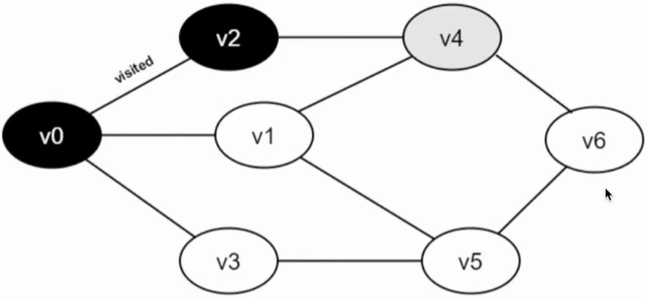

# 树 & 图算法

树和图也是一种代码中的数据结构，用来描述一些特定场景下的特定逻辑，其中树的使用更为广泛，树的经典算法也更为多样，面试中经常会考察对于树形数据结构的算法。

相比较而言，对于图类型的算法，图在面试中考察会比较少，因为图的数据结构，只在特定的算法中才可以使用到，但对于树形数据结构，**常见的 DOM 结构**，还有一些**嵌套的 json 结构**，都可以看作是树形数据结构的变种，所以相对面试来说，树的考察会更为重点和广泛，图类型的算法在比赛中可能比较常见。

## 树型数据结构‼️

### 树的定义

* 根（root）：树中的一个特定元素称为根
* 子树（subtree）：除了根之外，树中的其他元素都称为子树
* 结点（node）：树中的元素
* 双亲（parent）：一个结点有子树，子树的根为该结点的孩子
* 度（degree）：结点拥有的子树的个数（对于二叉树来讲，只有3种情况：0、1、2）
* 叶子（leaf）：度为 0 的结点
* 层次（level）：根结点的层次为 1，其余结点的层次等于结点双亲的层次 + 1（即，层高）

### 二叉树和森林

**二叉树**是每个节点**最多有两个子树**的树结构。通常子树被称作 “左子树” 和 “右子树”

一棵深度为 k，且有 $2^k-1$ 个结点的二叉树，称为***满二叉树***。这种树的特点是每一层上的结点数都是最大结点数。

而在一棵二叉树中，除最后一层外，若其余层都是满的，或者最后一层是满的，或者是在右边缺少连续若干结点，则此二叉树为**完*全二叉树***。具有 n 个结点的完全二叉树的深度为 $floor(log2n)+1$ ，深度为 k 的完全二叉树，至少有 $2k-1$ 个叶子结点，至多有 $2k-1$ 个结点。

#### 二叉树的性质

* 在二叉树的第 i 层上，至多有 $2^{i-1}$ 个结点 $$(i \geq 1)$$ 。⚠️
* 深度为 k 的二叉树最多有 $2^k-1$ 个结点 $(k \geq 1)$ 。⚠️
* 一棵二叉树的叶子结点数为 $n_0$ ，度为 2 的结点数为 $n_2$ ，则 $n_0 = n_2 + 1$ 。
* 具有 n 个结点的完全二叉树的深度为 $Math.floor(log2n) + 1$ 。
* 如果对一棵有 n 个结点的完全二叉树（ 其深度为 $floor(log2n) + 1$ ）的结点按层序编号，则对任一结点 i $$(1 \leq i \leq n)$$有：
  * 如果 i = 1 ，则结点 i 是二叉树的根，无双亲；如果 i > 1 ，则其双亲 parent(i) 是结点 $floor(\frac{i}{2})$ ；
  * 如果 2i > n ，则结点 i 无左孩子；否则其左孩子 lchild(i) 是结点 2i；
  * 如果 2i + 1 > n ，则结点 i 无右孩子；否则其右孩子 rchild 是结点 2i + 1 。

### 二叉树的相关常见算法

在 JS 中，我们可以通过这种结构定义一个树结点：

```js
function TreeNode(val) {
    this.val = val;
    this.left = this.right = null;
}
```

#### 深度优先遍历 DFS‼️‼️‼️

在深度遍历中，**每个节点都需要遍历三次**，那么我们可以在不同的阶段，执行不同的操作，根据我们处理节点位置的不同，我们分为前序、中序、后序遍历。

| 示例二叉树                          | ⚠️ 深度优先遍历图示                          |
| ----------------------------------- | ------------------------------------------- |
|  |  |
|                                     | 总步数：29                                  |

* 前序值（第 1 次访问）：1，2，3，4，5，6，7
* 中序值（第 2 次访问）：3，2，5，4，6，1，7
* 后序值（第 3 次访问）：3，5，6，4，2，7，1

##### 前序遍历‼️

在 DFS 第 1 次遇到节点时即进行处理。

```js
var preorderTraversal = (node, result=[]) => {
    if (node) {
        // 先根节点
        result.push(node.val);
        // 然后遍历左子树
        preordertraversal(node.left, result);
        // 再遍历右子树
        preordertraversal(node.right, result);
    }
    return result;
}
```

##### 中序遍历‼️

在 DFS 第 2 次遇到节点时即进行处理。

⚠️ 前提：左子树都已经遍历过了

```js
var inorderTraversal = (node, result=[]) => {
    if (node) {
        // 遍历左子树
        inorderTraversal(node.left, result);
        // 根节点
        result.push(node.val);
        // 再遍历右子树
        inorderTraversal(node.right, result);
    }
    return result;
}
```

##### 后序遍历‼️

在 DFS 第 3 次遇到节点时即进行处理。

⚠️ 前提：左子树  和右子树 都已经遍历过了，即最后一次遍历

```js
var postorderTraversal = (node, result=[]) => {
    if (node) {
        // 遍历左子树
        postorderTraversal(node.left, result);
        // 再遍历右子树
        postorderTraversal(node.right, result);
        // 根节点
        result.push(node.val);
    }
    return result;
}
```

##### DFS 应用场景举例

* webpack
* 自己实现的一些打包工具
* 热更新的依赖关系（后序）
* ……

#### 广度优先遍历 BFS‼️‼️

广度优先就简单一些，**水平**进行树的遍历，每一层横向处理，最终遍历到结尾。

| 示例二叉树                          | ⚠️ 广度优先遍历图示                          |
| ----------------------------------- | ------------------------------------------- |
|  |  |
|                                     | 总步数：29                                  |

图中的二叉树，处理结果即为：1，2，7，3，4，5，6

```js
var levelOrder = function(root) {
    const ret = [];
    if (!root) {
        return ret;
    }

    const q = [];
    q.push(root);
    while (q.length !== 0) {
        const currentLevelSize = q.length;
        ret.push([]);
        for(let i=1; i<=currentLevelSize; ++i) {
            const node = q.shift();
            ret[ret.length - 1].push(node.val);
            if (node.left) {
                q.push(node.left);
            }
            if (node.right) {
                q.push(node.right);
            }
        }
    }

    return ret;
}

// 返回的是个`二维数组`
```

#### 计算树的高度‼️

```js
var maxDepth = function(root) {
    if (!root) return 0;
    if (!root.left && !root.right) return 1;
    return Math.max(maxDepth(root.left), maxDepth(root.right)) + 1;
}
```

#### 左子叶之和‼️

```js
var sumOfLeftLeaves = function(root) {
    var val = 0;
    if (!root) return 0;
    if (root.left && !root.left.left && !root.left.right) {
        val = root.left.val;
    }
    return val + sumOfLeftLeaves(root.left) + sumOfLeftLeaves(root.right);
}
```

#### 反转二叉树‼️

```js
var invertTree = function(root) {
    if (!root || (!root.left && !root.right)) return root;
    root.left = invertTree(root.left);
    root.right = invertTree(root.right);
    return exchangeChildNode(root);
}

var exchangeChildNode = function(node) {
    var temp = new TreeNode();
    temp = node.left;
    node.left = node.right;
    node.right = temp;
    return node;
}
```

反转二叉树：DFS 深度优先

### DFS *vs* BFS

* DFS Postorder ：深度优先（后序）
* DFS Preorder ：深度优先（前序）
* DFS Inorder ：深度优先（中序）
* DFS ：广度优先


## 图类型数据结构

图分类：

* 有向图（典型例子：电路图）
* 无向图（例：本文中的示例图）

### 图的定义

### 图的遍历算法 DFS 与 BFS

BFS 和 DFS 算法解析，图遍历的定义：从图的某个顶点出发，访问遍图中所有顶点，且每个顶点仅被访问一次。

#### BFS

广度优先搜索**类似于树**的层次遍历过程。他需要借助一个队列来实现。要想遍历从 v0 到 v6 的每一个顶点，我们可以设 vo 为第一层，v1、v2、v3 为第二层，v4、v5 为第三层，v6 为第四层，再逐个遍历每一层的每个顶点。


具体步骤：

1. 准备工作：创建一个 visited 数组，用来记录已被访问过的顶点；创建一个队列，用来存储每一层的顶点；初始化图G

2. 从图中的 v0 开始访问，将 visited[v0] 数组的值设置为 true，同时将 v0 入队

3. 只要队列不空，则重复如下操作：

   (1) 队头顶点 u 出队

   (2) 依次检查 u 的所有邻接顶点 w，若 visited[w] 的值为 false，则访问 w，并将 visited[w] 设置为 true，同时将 w 入队

   

v0 的全部邻接点均已被访问完毕。将队头元素 v2 出队，开始访问 v2 的所有邻接点。开始访问 v2 邻接点 v0，判断 visited[0]，因为其值为 1，不进行访问。继续访问 v2 邻接点 v4，判断 visited[4]，因为其值为 0，访问 v4。

v2 的全部邻接点均已被访问完毕。将队头元素 v1 出队，开始访问 v1 的所有邻接点。开始访问 v1 邻接点 v0，因为 visited[0] 值为 1，不进行访问。继续访问 v1 邻接点 v4，判断 visited[4] 的值为 1，不进行访问。继续访问 v1 邻接点 v5，因为 visited[5] 值为 0，访问 v5。

v5 的全部邻接点均已被访问完毕。将队头元素 v6 出队，开始访问 v6 的所有邻接点。开始访问 v6 邻接点 v4，因为 visited[4] 值为 1，不进行访问。继续访问 v6 邻接点 v5，因为 visited[5] 值为 1，不进行访问。

#### DFS

DFS 遍历**类似于树的前序遍历**，是树的前序遍历的推广。

具体步骤：

1. 准备工作：创建一个 visited 数组，用来记录所有被访问过的顶点
2. 从图中的 v0 出发，访问 v0
3. 找出 v0 的第一个未被访问的邻接点，访问该顶点。以该顶点为新顶点，重复此步骤，直至刚访问过的顶点没有未被访问的邻接点为止
4. 返回前一个访问过的仍有未被访问邻接点的顶点，继续访问该顶点的下一个未被访问的邻接点
5. 重复3、4步骤，直至所有顶点均被访问，搜索结束。



访问 v2 的邻接点 v0，判断 visited[0]，其值为 1，不访问。继续访问 v2 的邻接点 v4，判断 visited[4]，其值为 0，访问 v4

访问 v4 的邻接点 v1，判断 visited[1]，其值为 0，访问 v1

访问 v1 的邻接点 v0，判断 visited[0]，其值为 1，不访问。继续访问 v1 的邻接点 v4，判断 visited[4]，其值为 1，不访问。继续访问 v1 的邻接点 v5，判断 visited[5]，其值为 0，访问 v5

访问 v5 的邻接点 v1，判断 visited[1]，其值为 1，不访问。继续访问 v5 的邻接点 v3，判断 visited[3]，其值为 0，访问 v3

访问 v3 的邻接点 v0，判断 visited[0]，其值为 1，不访问。继续访问 v3 的邻接点 v5，判断 visited[5]，其值为 1，不访问。v3 的所有邻接点均已被访问，回溯到其上一个顶点 v5，遍历 v5 所有邻接点。访问 v5 的邻接点 v6，判断 visited[6]，其值为 0，访问 v6

v5 的所有邻接点均已被访问，回溯到其上一个顶点 v1，v1 的所有邻接点均已被访问，回溯到其上一个顶点 v4，遍历 v4 剩余邻接点 v6。v4 的所有邻接点均已被访问，回溯到其上一个顶点 v2，v2 的所有邻接点均已被访问，回溯到其上一个顶点 v1，遍历 v1 剩余邻接点 v3。v1 的所有邻接点均已被访问，搜索结束。
