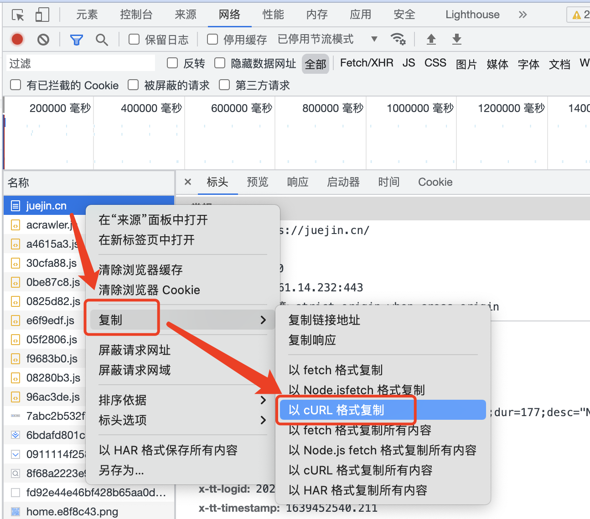

# 课前讨论

在面试中，一般不会考到 “**贪心算法**” 和 “**动态规划**” 这类题型。因为时间有限，需要考察前端的基础知识，在算法中如果考察到 “**贪心算法**” 和 “**动态规划**” 这类题型，其实算是比较复杂的场景了。

动态规划里面的**状态转移方程**，既需要平时对动态规划相关的问题比较熟悉，还需要一定的运气，基于数学归纳法总结出来的东西，现场做出来，其实相当难。所以，面试中基本不会考察到动态规划，如果考察的话，基本就是比较简单的几种：。大致范围不会有太大的变数，其实爬楼梯问题已经算是比较复杂的了。

## node 爬取网页【curl】

### 方案

直接通过 http 去请求它，然后对 response 进行处理 即可。

### 具体实现

例如：访问一个普通页面 [掘金首页](https://juejin.cn/)

如图，通过开发者工具，在 Network 里面 copy 出 **curl** 信息，如下：

然后把它复制到命令行里面，基于这个请求来发送数据。（这一步，和在浏览器中访问是一致的）

```shell
# curl 格式
curl 'https://juejin.cn/' \
  -H 'authority: juejin.cn' \
  -H 'cache-control: max-age=0' \
  -H 'sec-ch-ua: " Not A;Brand";v="99", "Chromium";v="96", "Google Chrome";v="96"' \
  -H 'sec-ch-ua-mobile: ?0' \
  -H 'sec-ch-ua-platform: "macOS"' \
  -H 'upgrade-insecure-requests: 1' \
  -H 'user-agent: Mozilla/5.0 (Macintosh; Intel Mac OS X 10_15_7) AppleWebKit/537.36 (KHTML, like Gecko) Chrome/96.0.4664.93 Safari/537.36' \
  -H 'accept: text/html,application/xhtml+xml,application/xml;q=0.9,image/avif,image/webp,image/apng,*/*;q=0.8,application/signed-exchange;v=b3;q=0.9' \
  -H 'sec-fetch-site: none' \
  -H 'sec-fetch-mode: navigate' \
  -H 'sec-fetch-user: ?1' \
  -H 'sec-fetch-dest: document' \
  -H 'accept-language: zh-CN,zh;q=0.9' \
  -H 'cookie: MONITOR_WEB_ID=f9b5f441-7378-4901-8f58-63dfa9b69692; _ga=GA1.2.1655815117.1620985072; ttcid=996f5a82bffc4c14b38cd941cd54cdfc35; sid_guard=a7d70997829130916f2d369780f37b49%7C1628205298%7C5184000%7CMon%2C+04-Oct-2021+23%3A14%3A58+GMT; odin_tt=b2ce3441e52744b0fdb9f37ac89c81683d3e4aae3b5c3f260e18778e8a9c102a99753e6cfc31e19674ab2575f5eb2032a17a5f697e470c4b3e0faf88dbe91614; _gid=GA1.2.157463480.1639452526; tt_scid=d1q1ErTso0Avye7NNu9a85sk.cKJC7XnG5L0.tMuVQ4alB05mW5X9guh6vr9f4jP6de7' \
  -H 'if-none-match: "2f80e-ILPSCrwI9XfQXkQl+N2SAbchV08"' \
  --compressed
```



## 搜索算法：DFS / BFS

### 深度优先遍历 DFS

* 前序遍历
* 中序遍历
* 后序遍历

### 广度优先遍历 BFS
