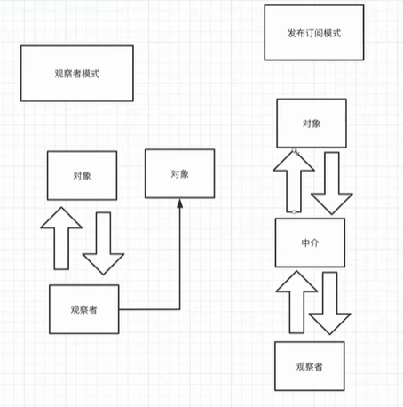

# 设计模式实战

使用开发者模式创建一个《头条》

## 单例模式（singleton）‼️

### 模块级别

典型应用：redux store

```js
// store.js
import reducer form './reducer';
import { configureStore } from 'redux';

const store = configureStore({ reducer });

export {
    store,
};

// app-a.js
import { store } from './store';

// app-b.js
import { store } from './store';

// a文件 和 b文件 引入的 store 应该是同一个
```

### 类级别

***饿汉*** 的单例模式

```js
/**
 * `饿汉`的单例模式
 * @desc 很饿，很着急吃东西
 */
class Eager {
    static instance = new Eager("eager");

    constructor(name) {
        console.log("Eager constructor::", name);
        this.name = name;
    }
}

module.exports = {
    Eager,
};
```

```js
// index.js
const { Eager } = require("./eager"); // 直接引入，已经实例化了
```

***懒汉*** 的单例模式

```js
/**
 * `懒汉`的单例模式
 * @desc 很懒，你不让我做事情，我就不做事情
 */
class Lazy {
    // 这里的 “#” 代表 这是一个私有变量
    static #instance = null;

    static getInstance() {
        if (!Lazy.#instance) {
            Lazy.#instance = new Lazy("lazy");
        }
        return Lazy.#instance;
    }

    constructor(name) {
        console.log("Lazy constructor::", name);
        this.name = name;
    }
}

module.exports = {
    Lazy,
};
```

```js
const { Lazy } = require("./lazy"); // 直接引入，并不会实例化

const ins1 = Lazy.getInstance(); // 在这里调用，才会实例化
Lazy.instance = null;
const ins2 = Lazy.getInstance();

console.log(ins1 === ins2); // true，符合预期
```

### 第三方

```html
<html>
    <head></head>

    <body>
        <script src="loadScript.js"></script>
        <script>
            const l1 = LodashLoader.getInstance();
            // 很多中间的代码
            const l2 = LodashLoader.getInstance();

            console.log(l1 === l2);
        </script>
    </body>
</html>
```

```js
// loadScript.js
class LodashLoader {
    static instance = null;

    static getInstance() {
        if (!LodashLoader.instance) {
            LodashLoader.instance = new LodashLoader();
        }

        return LodashLoader.instance;
    }

    constructor() {
        loadScript("https://cdn.jsdelivr.net/npm/lodash@4.17.15/lodash.min.js");
    }
}

function loadScript(url) {
    const $script = document.createElement("script");
    $script.src = url;
    $script.onload = () => {
        console.log("loaded::", url);
    };

    document.body.appendChild($script);
}

// UMD
window.LodashLoader = LodashLoader;
```

借助 http-server 进行调试：

```shell
npm i http-server
```

```shell
# 启动一个 http 服务：
python3 -m http.server 1234
```

在浏览器中访问 <http://localhost:1234/> ，开发者模式观察 lodash 的加载情况

**总结一下：**

虽然在 **index.html** 中执行了多次 `LodashLoader.getInstance();` 但是页面里面只包含了一份

```html
<script src="https://cdn.jsdelivr.net/npm/lodash@4.17.15/lodash.min.js"></script>
```

符合预期！

## 观察者模式（pub-sub）‼️

观察者模式又叫做**发布-订阅**模式，是我们最常见的设计模式之一。

### 观察者模式 *vs* 发布订阅模式



观察者模式：

* **优点：** 实现起来比较简单，抽象成本要低一些

* **缺点：** 对象跟观察者耦合

发布订阅模式：

* **优点：** 把对象和观察者隔离开来

* **缺点：** 多了一个中介，写起来比较麻烦

### 例（EventEmitter 的实现）

EventEmitter 的实现：

```js
// events.js
class EventEmitter {
    constructor() {
        this._events = {};
    }

    // 事件监听
    on(name, cb) {
        if (!this._events[name]) {
            this._events[name] = [];
        }

        this._events[name].push(cb);
    }

    // 触发事件
    emit(name, ...args) {
        if (!this._events[name]) {
            return;
        }
      
        for(const fn of this._events[name]) {
            fn.apply(null, args);
        }
    }

    // 取消事件
    off(name, cb) {
        if (!this._events[name]) {
            return;
        }

        const index = this._events[name].findIndex(evt => evt === cb);
        if (index >= 0) {
            this._events[name].splice(index, 1);
        }
    }
}

module.exports = {
    EventEmitter,
};
```

EventEmitter 的使用：

```js
// index.js
const { EventEmitter } = require("./events");

const eventEmitter = new EventEmitter();

eventEmitter.on("data", (value) => {
    console.log("on data::", value);
});

const cb = () => {
    console.log("cb");
};
eventEmitter.on("data", cb);
eventEmitter.emit("data", "hello");
eventEmitter.off("data", cb);
eventEmitter.emit("data", "hey");

// on data:: hello
// cb
// on data:: hey

// ===================继承=======================
class Runner extends EventEmitter {
    run() {
        this.emit("run");
    }
}

const runner = new Runner();

runner.on("run", () => {
    console.log("running!!!");
});

runner.run();

// EventEmitter 其实现的功能类似于：
// document.body.addEventListener('click', () => {
//     // ...
// })
```

### 例（Observable 的实现）

Observable 的实现：

```js
// observable.js
class Observable {
    static of(list) {
        return new Observable((observer) => {
            setTimeout(() => {
                for(const item of list) {
                    observer.next(item);
                }
            }, 0);
        });
    }

    static clickEvent(dom) {
        return new Observable((observer) => {
            dom.addEventListener("click", () => {
                observer.next();
            });
        });
    }

    constructor(subscriber) {
        this._subscriber = subscriber;
    }

    subscribe(observer) {
        if ("object" !== typeof observer || observer === null) {
            observer = {
                next: observer,
            };
        }

        return new Subscription(observer, this._subscriber);
    }
}

class Subscription {
    constructor(observer, subscriber) {
        this._observer = observer;

        const subscriptionObserver = new SubscriptionObserver(this);

        subscriber.call(null, subscriptionObserver);
    }
}

class SubscriptionObserver {
    constructor(subscription) {
        this._subscription = subscription;
    }

    next(value) {
        notify(this._subscription, "next", value);
    }
}

function notify(subscription, type, ...args) {
    if (subscription._observer[type]) {
        subscription._observer[type].apply(null, args);
    }
}

module.exports = {
    Observable,
};
```

Observable 的使用：

```js
// index.js
const { Observable } = require("./observable");

Observable.of([1, 2, 3]).subscribe((value) => console.log(value));
```

## 代理模式（proxy）

## 迭代器模式（iterator）

## 职责链模式（chain）

## 装饰器模式（decorator）

## 策略模式（strategy）

策略模式
