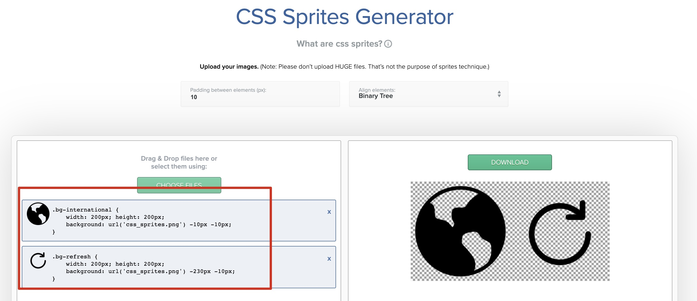

# 性能优化总结

## 白屏时间

读取页面首字节时间（ttfb - Time To First Byte），可以理解为用户拿到页面资源占用的时间。浏览器对 html 文档的解析和渲染是一个渐进的过程，一般在拿到首字节之后便会有内容绘制在页面上，正常网络状态下基本上白屏时间很短。

### 资源加载

浏览器在接收到服务器返回的 html 文档数据之后，会起一系列的线程去请求文档解析中遇到的各种资源，js脚本、css样式表、图片，以及发起异步请求。我们这里的资源认为是  js/css/图片，后面统计资源加载情况时，会统计这些资源的文件大小、文件数量、总的加载时间。ajax 异步请求我们会另外统计。

### 用户可操作时间

在查阅相关资料时，会看到用户等待页面时间、用户可操作时间等概念，不同资料和文章的定义也不同，这里我们认为用户可操作时间就是用户可以进行页面操作的时间，此时 html 文档解析完成（domContentLoadedEventEnd）。另一种用户等待页面的时间，一般是按照页面加载完成的时间来统计（loadEventEnd）。但在我们这次的前端性能监控方案中，并不将其作为主要的监控指标。

### 雅虎军规

* 内容
  * **Make Fewer HTTP Requests：** 减少 `HTTP` 请求
  * **Reduce DNS Lookups：** 减少 `DNS` 查询
  * **Avoid Redirects：** 避免重定向
  * **Make Ajax Cacheable：** 缓存 `AJAX` 请求
  * **Postload Components：** 延迟加载资源
  * **Preload Components：** 预加载资源
  * **Reduce The Number Of DOM Elements：** 减少 `DOM` 元素数量
  * **Split Components Across Domains：** 跨域拆分资源
  * **Minimize The Number Of Iframes：** 减少 `iframe` 数量
  * **No 404s：** 消除 `404` 错误
* 样式
  * **Put Stylesheets At The Top：** 置顶样式
  * **Avoid CSS Expressions：** 避免 `CSS` 表达式
  * **Choose Over @import：** 选择代替 `@import`
  * **Avoid Filters：** 避免滤镜
* 脚本
  * **Put Script At The Bottom：** 置底脚本
  * **Make JavaScript And CSS External：** 使用外部 `JS` 和 `CSS`
  * **Minify JavaScript And CSS：** 压缩 `JS` 和 `CSS`
  * **Remove Duplicate Scripts：** 删除重复脚本
  * **Minimize DOM Access：** 减少 `DOM` 操作
  * **Develop Smart Event Handlers：** 开发高效的事件处理

* 图像
  * **Optimize Images：** 优化图片
  * **Optimize CSS Sprites：** 优化 `CSS精灵图`
  * **Don't Scale Images In HTML：** 不在 `HTML` 中缩放图片
  * **Make favicon.ico Small And Cacheable：** 使用小体积可缓存的 `favicon.ico`
* 缓存
  * **Reduce Cookie Size：** 减少 `Cookie` 大小
  * **Use Cookie-Free Domains For Components：** 使用无 `Cookie` 域名的资源
* 移动端
  * **Keep Components Under 25kb：** 保持资源小于 `25kb`
  * **Pack Components Into A Multipart Document：** 打包资源到多部分文档中
* 服务端
  * **Use A Content  Delivery Network：** 使用 `CDN`
  * **Add An Expires Or A Cache-Control Header：** 响应头添加 `Expires` 或`Cache-Control`
  * **Gzip Components：** `Gzip` 资源
  * **Configure ETags：** 配置 `ETags`
  * **Flush The Buffer Early：** 尽早输出缓冲
  * **Use Get For AJAX Requests：** `AJAX` 请求时使用 `get`
  * **Avoid Empty Image Src：** 避免图片空链接

### 首屏渲染时间

> 首屏渲染时间的统计比较复杂，因为涉及图片资源的下载及异步请求等因素。有些资源统计中不计算图片的下载时间，但我们认为既然是首屏的展示，应当包括图片加载的完成。判断首屏图片加载完成的方法，这里不再详述，可以查阅文章。我们这次的前端优化性能分析方案中，并没有涉及到图片，而是关注页面初始化过程中的异步请求。

### 相关知识 影响网页性能的因素

* HTML 的解析和渲染、服务端处理的速度（负载均衡，缓存策略）、客户端带宽（网络状况）
* 浏览器解析渲染 HTML 页面的过程

HTML 文档的解析和渲染是一个渐进的过程。为达到更好的用户体验，呈现引擎会力求尽快将内容显示在屏幕上。它不必等到整个 HTML 文档解析完毕，就会开始构建呈现树和设置布局。在不断接收和处理来自网络的其余内容的同时，呈现引擎会将部分内容解析并显示出来。浏览器的预解析机制。

* HTML 文档的解析和渲染过程中，外部样式表和脚本顺序执行、并发加载。

* JS 脚本会阻塞 HTML 文档的解析，包括 DOM 树的构建和渲染树的构建；CSS 样式表会阻塞渲染树的构建，但 DOM 树依然继续构建（除非遇到 script 标签且 css 文件此时仍未加载完成），但不会绘制到页面上。在 HTML 文档的解析过程中，解析器遇到 `<script>` 标签时会立即解析并执行脚本，HTML 文档的解析将被阻塞，直到脚本执行完毕。如果脚本是外部的，那么解析过程会停止，直到从网络抓取资源并解析和执行完成后，再继续解析后续内容。但无论是哪种情况导致的阻塞，该加载的外部资源还是会加载，例如外部脚本、样式表和图片。HTML 文档的解析可能会被阻塞，但外部资源的加载不会被阻塞。

* 浏览器并发连接数

  Chrome 浏览器的并发连接数为 6 个，超过限制数目的请求会被阻塞。

## 常见的性能优化方法

### 减少 HTTP 请求数

从设计实现层面简化页面 合理设置 HTTP 缓存 资源合并与压缩

CSS Sprites

Inline Images Lazy Load Images

### 将外部脚本置底

浏览器是可以并发请求的，这一特点使得其能够更快的加载资源，然而外链脚本在加载时却会阻塞其他资源，例如在脚本加载完成之前，它后面的图片、样式表以及其他脚本都处于阻塞状态，直到脚本加载完成后才会开始加载。如果将脚本放在比较靠前的位置，则会影响整个页面的加载速度从而影响用户体验。

### 异步执行 inline 脚本

inline 脚本对性能的影响与外部脚本相比，是有过之而无不及。异步的方式有很多种，例如使用 script 元素的 defer 属性（存在兼容性问题和其他一些问题，例如不能使用 document.write）、使用 setTimeout ，此外，在 HTML5 中引入了 Web Workers 的机制，恰恰可以解救此类问题。

### Lazy load javascript

只有在需要加载的时候加载，在一般情况下并不加载信息内容。动态加载 JS 内容。

### 减少不必要的 HTTP 跳转

对于以目录形式访问的 HTTP 链接，很多人都会忽略链接最后是否带 `'/'` ，假如你的服务器对此是区别对待的话，那么你也需要注意，这其中很可能隐藏了 301 跳转，增加了多余请求。

避免重复的资源请求

> 这种情况主要是由于疏忽或页面由多个模块拼接而成，然而每个模块中请求了同样的资源时，会导致资源的重复请求

### 精简 JavaScript 和 CSS / 使用 CDN 加速

CDN 的全称是 Content Delivery Network，即内容分发网络。CDN 是构建在现有网络基础之上的智能虚拟网络，依靠部署在各地的边缘服务器，通过中心平台的负载均衡、内容分发、调度等功能模块，使用户就近获取所需内容，降低网络阻塞，提高用户访问响应速度和命中率。CDN 的关键技术主要有**内容存储**和**分发**技术。

### 缓存存储对象

使用 localstorage 缓存常用的数据。现代化浏览器都支持 localStorage，我们可以实现一个类似这样的功能，但我们取一个数据的时候，先去 localStorage 中寻找，没有再向服务器发送请求。

夸张一点，我们可以把图片、js 文件存储到里面。淘宝真是物尽所用，所有存储对象基本都用了。在 localStorage 存储了大量的数据，包含图片、icon 等等。当页面第二次加载的时候就不用去重复请求后台相应的资源了。

CDN 域名不携带 cookie，cookie 存储能带给后端，所以主要是用来鉴别客户端的唯一性，知道你是哪个用户。所以 cookie 中的数据不能无意义，不能太大。我们的 CDN 域名最好和主域名分开，这样在请求静态资源的时候就不会带上这个 cookie 了，减少了请求头的大小，减少了客户所需的流量。可能感觉微乎其微，但是你假设你的 cookie 是 1k，一天有 1 万人访问，访问静态资源请求 2 万次，那么你就会白白耗费 1w k 的流量。

> 其余的存储对象都可以在适当的场景，适当的使用。使用的时候要考虑兼容，和最大存储容量。
>
> 用的好是跑车，用不好是拖拉机

### cache-control

max-age 指定缓存的最大有效时间，时间之内再次请求资源，不去发送 http 请求

s-maxage 指定 public 的缓存的最大有效时间，优先级高于 max-age，会发送请求，返回状态码 304，private 用户所独有的缓存，就是单一用户浏览器的缓存。

public 公共缓存，例如 cdn的，代理服务器的缓存。

no-cache 指定缓存是否要发送 http 请求，来询问服务器当前的缓存内容是否还有效，搭配 max-age=0 使用，有这个属性就会发送 http 请求询问服务器。

no-store 完全不会存储。

## JS 性能优化‼️

### 节流与防抖‼️‼️

debounce 和 throttle，主要大家需要明白这两个的区别以及具体的实现

**共同点：** 都是针对高频操作进行控制的方式。

**区别：**

* debounce 防抖
* throttle 节流

```js
// debounce 防抖
function debounce(fn, time) {
    var timer = null;
    return function () {
        if (timer) {
            clearTimeout(timer);
        }
        var self = this;
        var args = arguments;
        timer = setTimeout(() => {
            fn.apply(self, args);
        }, time);
    }
}

window.debounce = debounce;
```

```js
// throttle 节流
function throttle(fn, time) {
    var timer = null; // 闭包变量
    var lastTriggerTimeStamp = null;
    return function () {
        var self = this;
        var args = arguments;
        var currentTimeStamp = +new Date();
        if (lastTriggerTimeStamp && currentTimeStamp < lastTriggerTimeStamp + time) {
            if (timer) {
                clearTimeout(timer);
            }
            timer = setTimeout(() => {
                lastTriggerTimeStamp = currentTimeStamp;
                fn.apply(self, args);
            }, time);
        } else {
            // 超过 time 时间，还没有执行过 fn
            lastTriggerTimeStamp = currentTimeStamp;
            fn.apply(self, args);
        }
    }
}

window.throttle = throttle;
```

应用：

```js
function callback() {
    console.log(new Date().getTime());
}

// 使用 debounce
var debouncedCb = window.debounce(callback, 1000);
document.body.onmousemove = debouncedCb;

// 使用 throttle
var throttleCb = window.throttle(callback, 1000);
document.body.onmousemove = throttleCb;
```

### CSS Image Sprites

主要涉及一些图片相关优化，能够让我们以更少的成本加载图片信息（优化点：减少 http 请求）。

借助网站：

* [CSS Sprites Generator](https://www.toptal.com/developers/css/sprite-generator)
* [Iconfont](https://www.iconfont.cn)

实现步骤：

1. 先在 Iconfont 网站，下载几个 PNG 的图标

2. 在 CSS Sprites Generator 网站，利用下载好的 PNG 图标，生成雪碧图 css_sprites.png

3. 在页面中通过 img 标签的 class 属性进行加载

   ```html
   <!DOCTYPE html>
   <html lang="en">
       <head>
           <meta charset="UTF-8">
           <meta name="viewport" content="width=device-width, initial-scale=1.0">
           <title>Document</title>
           <style>
               .bg-international {
                   width: 200px; height: 200px;
                   background: url('css_sprites.png') -10px -10px;
               }
               .bg-refresh {
                   width: 200px; height: 200px;
                   background: url('css_sprites.png') -230px -10px;
               }
           </style>
       </head>

       <body>
           
           
       </body>
   </html>
   ```



### 优化合并请求、懒加载

主要在于，在我们的代码中，基于路由做一些懒加载的工作，使用 webpack 等工具，能轻松通过 jsonp 加载 chunk 文件。

注意：区分**同步加载**和**异步加载**

```js
// 同步加载：
import Home from './Home';
import About from './About';

const router = new Router({
    mode: 'history',
    routes: [
        { path: '/', component: Home },
        { path: '/about', component: About },
    ]
});

// 异步加载：
const router = new Router({
    mode: 'history',
    routes: [
        { path: '/', component: () => import('./Home') },
        { path: '/about', component: () => import('./About') },
    ]
});
```

### 服务端渲染、增加渲染速度

使用服务端渲染，可以减少客户端渲染的压力，对于一些纯 UI 层面的视图，可以使用服务端渲染的形式。

例如：用 nuxtjs 做服务端渲染

## Node.js 性能优化

### 更新 node.js 版本

Node.js 每个版本，它的性能一定会比前一个版本好，主要体现在：

* 随着 node.js 更新的内部解析引擎 v8 的版本。
* node.js 内部代码的更新优化。

### 使用 JSON schema 来增加 JSON.parse 和 stringify 速度

使用 schema 提前进行对象格式的提醒，增加解析速度

这里可以关注一下 <https://github.com/fastify/fast-json-stringify>

### bluebird 提升原生 promise 性能 / async await 提升性能

在早期，由于性能关系，原生 promise 实现中因为多次实例化等等的问题，性能其实大打折扣，使用 bluebird 可以有效优化性能。

### 正确地使用 Stream 来优化同步操作性能

```js
http.createServer(function (req, res) {
    fs.readFile(__dirname + '/data.txt', function (err, data) {
        res.end(data);
    });
});

// good
http.createServer(function (req, res) {
    const stream = fs.createReadStream(__dirname + '/data.txt');
    stream.pipe(res);
});
```

可以关注一下，基于 performance 的一些 API：

```js
performance.memory
...
```

## Others

### ❓从浏览器输入 url 到页面显示，发生了什么？

1. 输入 url

2. 浏览器**解析域名**对应的 IP 地址

3. 浏览器向 web 服务器发送一个 http 请求

   拿到 IP 地址后，浏览器会以一个随机端口（1024<端口<65535）向服务器的 web 程序（常用的有 httpd、nginx 等）80 端口发起 TCP 的连接请求。

   最终建立 TCP/IP 的连接。

   建立了 TCP 连接之后，发起一个 http 请求。

4. 服务器的永久重定向响应

5. 服务器处理请求

6. 服务器返回一个 http 响应

7. 浏览器显示 html 文档

   解析 html 以构建 dom 树

   构建render 树

   布局 render 树

   绘制 render 树

8. 浏览器发送请求获取嵌入在 html 文档中的资源（如图片、音频、视频、CSS、JS 等等）
