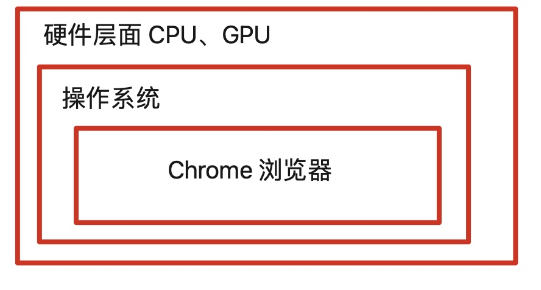
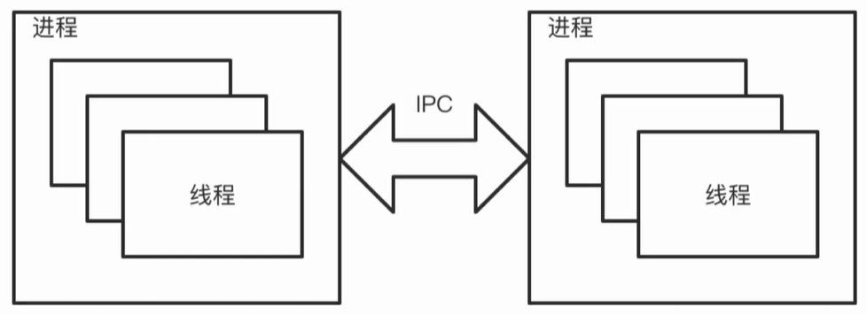
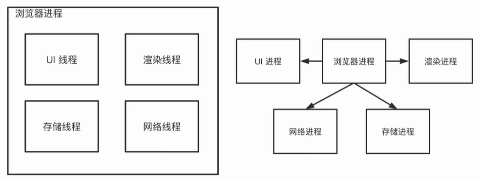
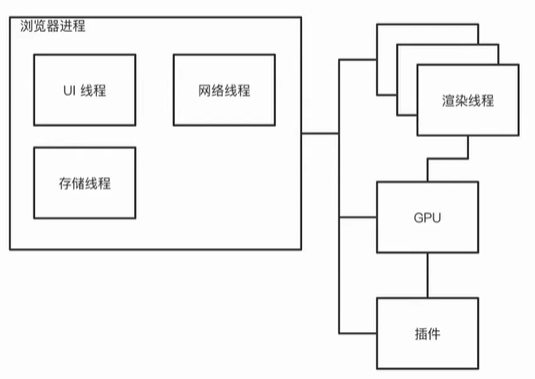
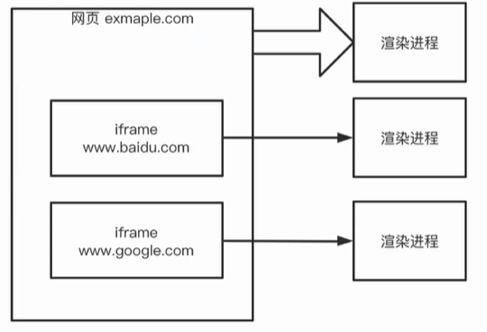
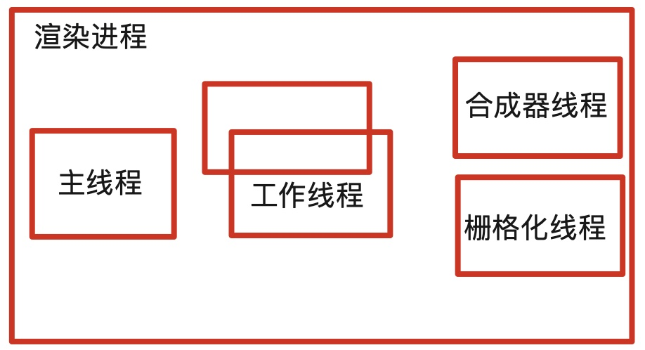
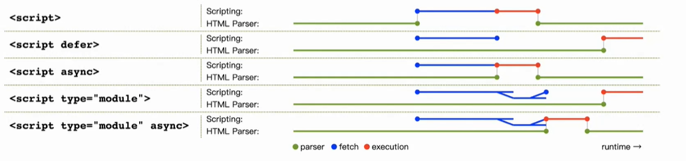
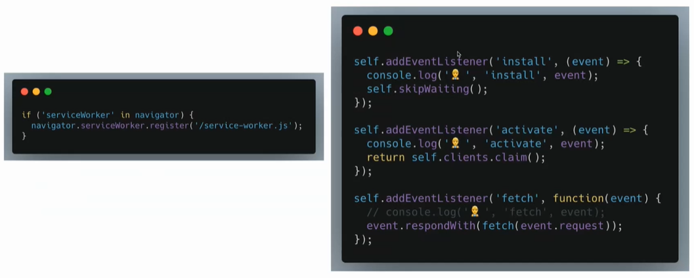
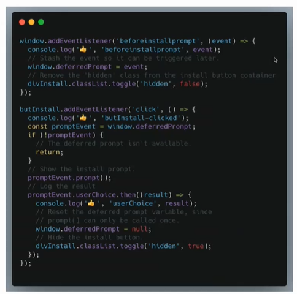

# 浏览器原理与PWA

## 现代浏览器原理

### 基础

#### CPU 中央处理器

* 计算机的 “大脑”
* 一块芯片
* 能够处理多任务

#### GPU 图形处理器

* 主要处理图形的计算
* 计算请求在硬件层面被并行的处理

#### 浏览器运行

1. 操作系统运行在硬件之上
2. 浏览器运行在操作系统之上

#### 进程与线程

**进程：** 进程是程序的基本执行实体，是**线程**的容器。

**线程：** 是**操作系统**能够进行运算**调度**的最小单位。一个进程可以有很多线程，每条线程并行执行不同的任务。创建线程的开销比创建进程小。

#### 执行程序

#### 进程之间通信



进程之间通信：通过 IPC 协议（Inter-Process Communication）

### 浏览器进程



左边的架构**特点**：所有的线程都在同一个进程容器下

右边的架构**特点**：把原先用线程实现的东西，现在用进程来实现

#### Chrome 浏览器架构

* 浏览器进程是主进程
  * UI：地址栏、书签、导航跳转
  * 网络：网络请求
  * 存储：文件权限
* 渲染进程
  * 每个标签页的渲染
* GPU 进程
  * 调用 GPU 进行渲染（同一个平面）
* 插件进程
  * 管理 Chrome 的插件机制

#### 多进程架构的优势

* 隔离渲染，单个标签页崩溃不影响整个浏览器

* 安全性，提供了沙盒环境

* CORS（Cross Origin Resource Security）跨域的问题

  

  CORS 前端需要做些什么工作？

  * 如果接入第三方的话，有可能给你 jsonp 的格式
  * 服务器进行代理
  * ...

## 网页导航过程

1. 处理导航输入

   * 在地址栏输入一个网址 <www.baidu.com>

   * 在地址栏输入一个 react <https://www.baidu.com/s?wd=react>

2. 开始导航

   * 对目标站点发起网络请求
   * 设置标签页的 loading 状态
   * 网络请求经过 DNS，HTTP 握手，或者收到重定向请求，重新发起
   * 最终获得 HTTP 响应

3. 处理响应

   * 处理 HTTP 响应
   * 根据 Content-Type 来决定后续的处理方式
     * html 交给渲染进程渲染
     * 文件类型 交给下载管理器开始下载过程

4. 创建渲染过程

   * 浏览器进程创建一个渲染进程对内容进行渲染
   * 或者，同个网站会复用同一个渲染进程

5. 提交渲染

   * 所有的数据准备完毕
   * 渲染进程准备完毕
   * 浏览器进程将信息传输给渲染进程
   * 渲染进程确认
   * 导航完成

⭐️ 典型面试题目：从浏览器输入 url 到页面显示，发生了什么？

## Service Worker

### Service Worker 特点

* 应用层网络代理
* 运行 web 开发者控制缓存
* JavaScript 代码
* 运行在渲染进程

### Service Worker 运行

* 网络层发出请求之前，查找是否在当前范围有注册的 Service Worker
* 若有，则会调用一个渲染进程来执行 Service Worker 的代码
  * 读取本地缓存
  * 向一个新的资源发起请求

## 浏览器渲染过程

### 渲染进程架构

将 HTML、CSS、JS 代码转换成可交互的网页



### 解析过程

* 构建 DOM（Document Object Model）
* 子资源加载（`<link>` 、 ``）
* 运行 JavaScript

#### 解析-构建 DOM

根据 HTML 的标准从 html 文件内容 构建出 DOM 树

document --> body --> p --> text

```html
<html>
    <body>
        <p>text 123</p>
    </body>
</html>
```

#### 解析-子资源加载

* `<link href="abc.css">`
* ``
* `<script src="index.js"></script>`

#### 解析-运行 JavaScript

当解析器遇到 `<script>` 标签就会暂停构建过程，优先执行 JavaScript 代码。

* 原因：JavaScript 执行结果可能会影响最终的 DOM 树，所以优先执行 document.write

* `<script>` 标签详解：

  * async

  * defer

  * type module

    

### 样式计算

浏览器只有 DOM 还不能渲染出页面，还需要有位置信息。从 css 文件中进行计算。

```css
* {
    font-size: 14px;
    font-family: serif;
}

p {
    color: blue;
    margin: 10px;
}
```

### 布局

DOM 表示了网页的所有内容，加上样式计算后的结果，得到布局结果

DOM + Computed Styles = Layout Tree

### 绘制

有了 Layout Tree 之后，仍然不能渲染出网页，还需要**决定渲染的顺序**。

绘制就是决定最终渲染对象的顺序，保证渲染网页内容的正确性。

```css
z-index: 0;
z-index: 1;
```

## PWA

**PWA：**（Progressive Web Application）渐进式 Web 应用

### 什么是 PWA ？

* 渐进式 web 应用
* 通过 web 的方式**分发**应用程序
* 使用 HTML、CSS、JavaScript 的技术栈
* 跨平台

### 为什么要有 PWA ？

* 移动互联网时代
* 帮助曾经的 web 应用获得更好的原生体验
* 不需要特定的分发商介入，如 Apple Store、Google Play

### 怎么做 PWA ？

#### [manifest.json](https://developer.mozilla.org/zh-CN/docs/Web/Manifest)

```html
<head>
    <link rel="manifest" href="%PUBLIC_URL%/manifest.json" />
</head>
```

#### 注册 service worker

service-worker.js



#### Installable



### 工具

* <https://www.pwabuilder.com/> 可以快速的将你的网站变为 PWA 应用
* <https://developers.google.com/speed/pagespeed/insights/> 使你的网页在所有设备上都能快速加载
