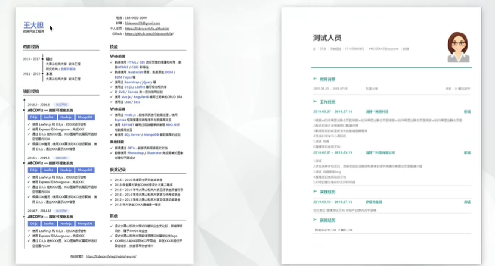

# 就业课之大厂面试指导

前端面试总结：面试官的角度分析 **软实力** + **硬实力**

## 前端研发岗需要具备的硬实力‼️‼️

### 基本能力树

#### 1、HTML / CSS 基础

能够完成页面基本的结构和样式，同时能够理解多种技术栈（ejs / less）

##### 设计稿还原

能够从设计稿中抽离出一些重要的元素……

##### 布局（flex|grid）

* flex 布局 ⭐️⭐️⭐️⭐️⭐️

* grid 布局（珊格布局）⭐️⭐️⭐️

##### 技术栈（less|sass|postcss）

* less|sass：预处理框架，**编译**成 css 进行使用

* postcss：后处理框架，一般用来处理一些**兼容性**的问题

##### 预处理框架（ejs）

我们除了直接写 html 标签，还可以利用一些预处理框架（比如：ejs）来生成 html 结构模板，方便加载动态的数据。

在 vue 和 react 出来之前，我们常使用 **模板引擎** 来处理

经典的模板引擎：

* pug / jade

  ```
  p#test
    span
  ```

* ejs / art-template

  ```
  <p><%=data.test%></p>
  ```

#### 2、JS（ES5 / ES6）

基础扎实，熟悉 ES5/ES6 常见API / 模块化等知识，编码能力过硬

重点关注 ES6（ES2015）

* includes `[1, 2].includes(2) // true`

* decorate `@`（decorate语法还未进入规范，目前处于试用阶段，但是需要熟悉，因为太常见）

* 新增的语法，需要熟悉 `??` 、 `()=>{}` 等

  ```js
  // 双问号语法 ??
  // 判断一个值是否是 undefined 或 null
  // 类似于 lodash 里面的 _.isNil(value)
  _.isNil(null); // => true
  _.isNil(void 0); // => true
  _.isNil(NaN); // => false
  ```

⚠️ 常见的 API 需要非常熟悉‼️

#### 3、Web / node.js / 小程序

熟悉常见 JS 运行环境及环境相关的API

语法层面｜引擎层面｜平台层面

* 浏览器环境（web 环境）
* node.js 环境
* 小程序环境

**环境：** 基于 JavaScript 语言，对一些内置的对象，进行了一些封装

例：浏览器环境（web 环境）：基于 JavaScript 语言，对 document、window、navigation ……，还有一些常规的操作进行了封装。这样一来，我们就可以使用 JavaScript 规范，通过操作浏览器里面封装的 document 对象，来获取一些信息（比如 浏览器渲染的 html 结构）`document.getElementById('demo')` 获取ID为demo的元素的DOM 结构。

#### 4、数据可视化等垂直领域

数据可视化前端 / TOB 在线工具型前端 / TOC 产品前端

##### 数据可视化领域

基于一些第三方库，绘制 折线图、饼状图、树状图……之间的联动等，实现一些大屏、报表等。

* Echarts（细节的配置）
  * 基于框架的配置
  * 理解框架的原理
  * 基于图形学，封装一些常用的操作（渲染）
* Highcharts
* Bizcharts
* Three.js 图形学领域（渲染、排列等）
* 蚂蚁金服的 G2
* ...

##### TOB 在线工具

井喷式发展

产生了一些工具型作品：石墨文档、幕布、Process ON 在线工具、脑图、……

重点关注：状态组织、性能优化等

##### TOC 产品

实现一个简单的落地页

展示一个页面、用户提交数据、后台交互等

TOC 的页面可以更好的沉淀一些东西：公共组件提取、性能优化小技巧

#### 5、网络

熟悉网络请求 / 状态等基础知识

大多数情况下，数据是放置在服务端的，前端开发人员需要通过 AJAX 请求来获取数据，然后对数据进行一些操作处理，进而渲染到页面结构里面去。（比如：登录业务。需要使用到 cookie、header 来标记用户登录的状态等）

* http 请求
* debug 能力
* 状态码
* 浏览器的一些策略：同源策略……
* cookie
* 浏览器中，一个http请求的完整过程

#### 6、算法

理解并能够写出基础算法

能够针对一些特殊的数据结构，进行一些特殊的处理（如：针对一个二维数组，渲染出一些DOM结构等）

针对服务端获取到的数据，进行一些特殊的处理，使用到页面

对于业务开发来说，网络和算法是基本功。

对于算法，我们不需要太深层次的掌握。大多数的算法，已经有人为我们封装好了，我们只需要掌握调用的参数，以及返回值即可。（重点掌握：**数据的转换**）

比如：一个对象转换成数组

对于常用算法，我们需要重点掌握 算法的**思路**（比如：快速排序）

常用算法：

* 排序算法：快速排序

* TopK：找到一组数据中第 K 大的元素

## 面试者需要具备的软实力

沟通技巧、社交能力等等都是

### 1、基础扎实 ⭐️⭐️⭐️⭐️⭐️

社招对基础知识更为看重，需要更短的适应新环境的时间，更加看重**解决问题的能力**。

项目工程化、系统设计（发布、打包、编译……）

### 2、主动思考

针对产品同学提出的需求，进行评估

产品同学有时候比较 天马行空，不知道技术实现上的重难点，需要我们主动思考分析。不做被动的接收，能够主动思考，从而为团队发展提出一些建设性的观点。

* 对问题有自己的理解

  对于不懂的问题，说一下自己的理解，面试官会基于你的理解，进一步的引导去解决（考察你的上限）

* 在实际开发中，能从技术角度提出更好的建议（针对产品来讲）

* 面对原型时，能提出合理的建议

  通用的封装（如：点击一个区域，产生一个动画的效果）

⚠️ 针对不会的问题，不需要主动去问。先说一些自己的理解，面试官会根据你理解的内容，引导性的提问，循序渐进的考察。如果没有引导，或者是提出一些异议，那其实已经对你有一些认可了（默认的认可）。

### 3、有广度

技术层面

技术发展比较快，人员更新比较快

发展比较快的 **大前端** 。

现在已经不只是浏览器层面的前端页面，还有App层面的（React Native、Flutter）

保持对前端技术的热情；关注社区中其他语言的发展：

* 对社区新出的框架或库，保持学习的热情
* 主动学习过其他领域的语言（如：flutter、rust）
  * flutter：跨平台
  * rust：高性能

### 4、有深度

技术层面

有一些业务的经验之后，思考一下架构层面的东西

通过架构，对业务进行一些优化，抽离一些公共的部分。对业务有一些深度的思考。

对于所在的垂直领域，是否有技术沉淀：

* 数据可视化、金融相关、sass 建站、云、ToC页面等

  * 针对百万级用户的一些优化
  * UE、UI层面的组件沉淀

  * 数据可视化（3D、WebGL）

  * 金融

    * 技术层面（数据存储、数据表示）
    * 业务层面（支付流程、区块链运作流程）

  * sass 建站（典型的ToB场景。通过拖拽式，来生成一个网站，对前端的**状态管理**比较严格）

  * 云（控制台页面。与我们的后台页面很相似，列举很多tab，全都是表格。典型场景：CRUD）

    可以封装一些配置型工具，基于配置，生成一些页面出来

* 遇到问题时，多研究背后深层次的原因，而不是想办法先绕过去（如：追踪某个bug，一直了解它本质的原因）

  * 针对 deadline 可能不太能确保，每个bug都深入挖掘，但是尽量去研究一下，也是一种技术沉淀

### 5、有视野

对于现有社区的发展，能够进行一些判断。

不一定永远写前端，针对整个行业的发展，有一些了解，尝试一些新的东西。比如，最近发展比较火的：Rust/Go

## 如何去准备这些能力

### 深入学习基础知识

* 通过书本、视频、网站等渠道，学习并理解前端的知识。

* 订阅 GitHub、Twitter、slack 等途径，了解国内外新兴技术的发展。

### 项目经验

有了基础知识后，还必须有实际的项目经验，很多知识和经验是依靠实际内容去学习和理解的。

* 常见的布局/样式处理能力（淘宝首页、京东首页）

* 封装一些组件库（JS 处理能力、框架使用能力）

* 写一些前后端基本的项目

  * 后端：一些简单的 API、登录逻辑、数据库存储
  * 前端
  * 后台

  能够让我们整个的，对前后端交互、请求等有一些宏观上的理解。这样，对我们以后写一些大型项目，或者是复杂项目，有一些感觉

### 团队协作

需要关注项目从 0 到1 的过程，并不是单纯的累积功能。

脚手架、框架的搭建

webpack 的配置，框架的选型，项目打包发布，编译，多机部署，更新，测试等

有了项目经验之后，社招同学还需要在自己目前的公司内熟悉团队相关运作，例如：

* 如何写好一个项目？
* 如何使用 git 团队提交代码？（review等）
* 前后端如何联调排查问题等等。

## 简历要点以及面试常见问题

### 简历要点

* 简历不要过长，保持整体结构整洁。发送时最好以 pdf 格式发送

* 姓名、联系方式、毕业时间等必要信息要有，简历名称也可以使用这种方式命名

* 技术领域写自己比较**熟悉的技术栈**，例如 react / vue 等

  考察点：是不是能够基于自己的技术栈，实现一个简单的应用

  最次最次，也要基于自己的技术栈，做过一个完整的项目。

  比如熟悉 react+redux 相关技术栈，那么你最少要基于 `react` + `immutable` + `react-redux` + `redux` 做过一个完整的项目。

  不在乎项目小，但是要真正实践过。

  比如 redux 的源码很短，也许100行都不到。那么你是不是能够实现一个简短的 createStore、getState 等相关的方法。

* 按照时间顺序从近到远的顺序写公司及负责项目内容，**突出项目重点、难点**

  方便与面试官之间的交流，明白我们在项目中都做了什么

* 最好附上自己的在线作品或博客等内容，博客内容最好有自己的想法

  简历是一个干巴巴的东西，比如你负责了一个大型项目，无法判断你是否真的负责了，那么需要我们附加一下 在线作品/博客/GitHub

  * 博客：并不需要很多的文章，需要一些精品，能看出来你自己的理解、有自己的思考在里面
  * 在线作品
  * GitHub：为我们的每一个项目，实现一个 GitHub Pages 落地。让别人来看我们项目的时候，立马明白我们实现了一个什么东西。（README.md 的表现形式相对来说比较差，可以采用在线形式：更完善的表现形式 GitHub Pages）

⚠️ 不要过于冗长，每一个项目，列举出**重难点**即可。最好一条一行【最好不要超过2页】

比如：开发一些具体的业务页面。

扪心自问，单纯的写一些业务页面其实并不复杂，那么我们跟别人相比，竞争力在哪里呢？？

我们需要在简历中突出自己的**竞争力（亮点）**：

比如，基于这个业务页面，我做了一些优化

* 实现业务页面的过程中，优化了首屏渲染速度，从 x% 到 xx%
* 用户的留存率，从 x% 到 xx%

### 简历模板



### 常见考点

#### 1、promise / ajax 封装及应用‼️

典型案例：`axios` 、 `whatwg-fetch`

#### 2、浏览器事件应用‼️

* 冒泡
* 捕获
* 事件行为

#### 3、模块化相关内容‼️‼️

JS 基础里面的重中之重，基本上 10次面试，9次都能考到

* 掌握 ES Module、CommonJS、AMD 之间的区别、使用场景、各自特点

* 判断不同模块化之间的东西

* 各自的实现原理

  ES Module 最复杂，它是编译阶段实现的，不会现场实现；但是 CommonJS、AMD 是可以现场实现的。

重点：模块化的原理、判断当前实现是哪种模块化规范

## 交流群问题集锦

1、做过 sdk 项目，这种是不是会问设计模式多一点？

2、现在会的东西，大家都差不多，如何突出自己的亮点呢？

------封装组件库，可以参考 [Ant Design](https://ant.design/index-cn) （典型场景：form 表单）

------性能优化

------监控、埋点、报警

3、设计模式，需要掌握哪几种？

------常见的设计模式：

* 单例模式（singleton）⭐️⭐️⭐️⭐️⭐️
* 观察者模式（pub-sub）⭐️⭐️⭐️⭐️⭐️
* 代理模式（proxy）
* 迭代器模式（iterator）
* 职责链模式（chain）
* 装饰器模式（decorator）
* 策略模式（strategy）

4、单元测试需要掌握到什么程度？

------对于前端开发来说，其实不需要太深入（深入挖掘的话，还挺难的）。

点到为止，知道有这么个东西，会用它即可。[jest 测试框架](https://jestjs.io/zh-Hans/)

* 逻辑层面（如：一个 sum 函数）
* UI 层面（比较复杂）

5、源码，从入口开始看明白，能总结出流程图（思想架构）-写不出来，能看明白？

------总结输出博客，知识共享，让别人能看明白

6、平时写博客，面试会是加分项？

------要有自己的思考，不要当一个搬运工

7、算法？

------技多不压身，会学习，更要会创造输出

8、面试通过，不想去的话，该怎么拒绝？

------实话实说就好，面试本身就是一个双向选择的过程。

9、跟 hr 谈薪资，有什么策略吗？

------大公司的话，基本都是依据职级定位的。但是也会根据你上一份工作的薪资水平去压。

尽可能的把自己的期望说高一点，给自己一个空间。
