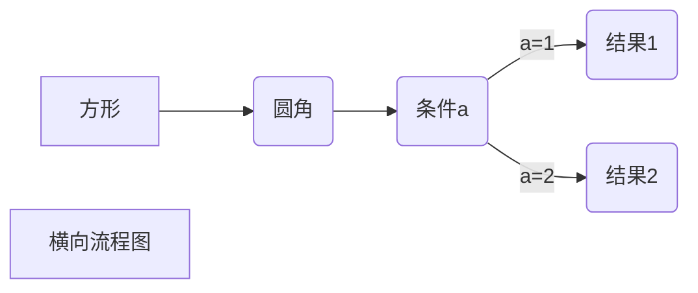
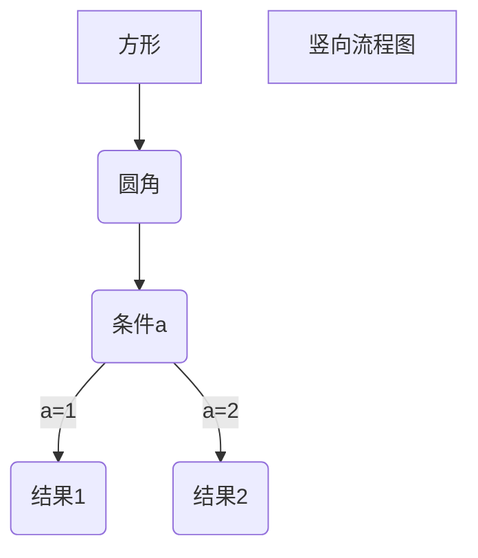
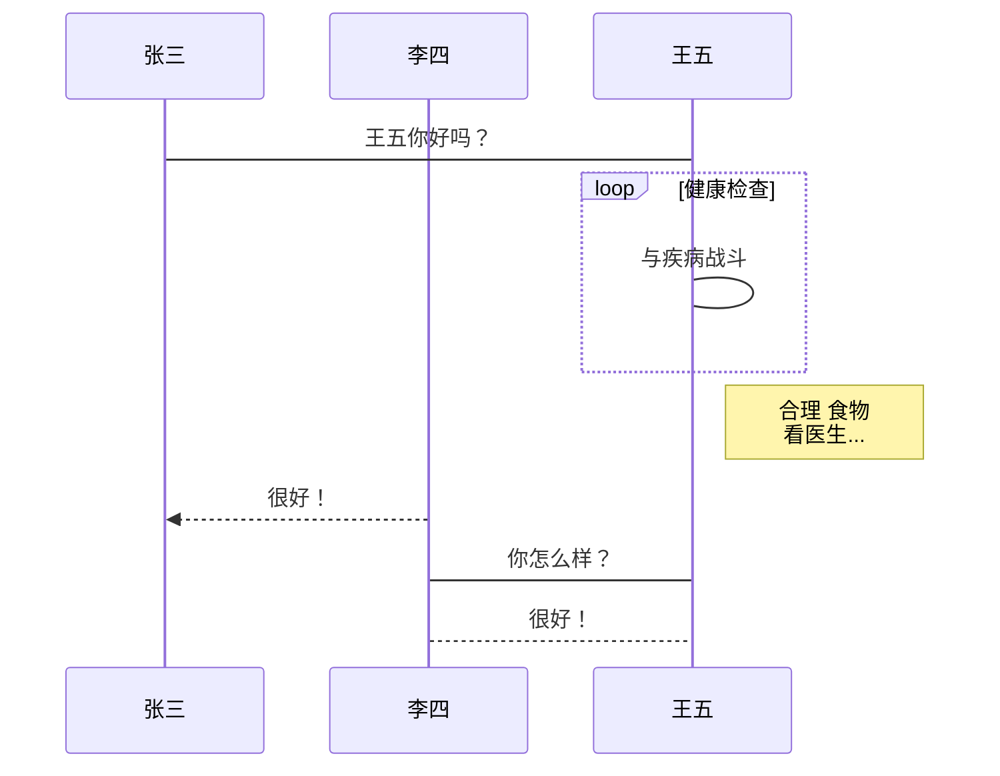
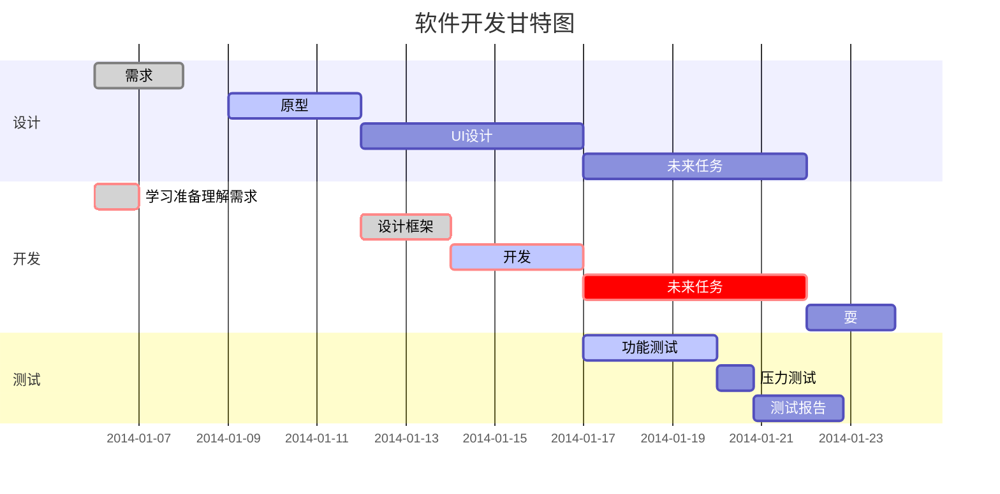

# Markdown教程

Markdown是一种轻量级标记语言，它允许使用易读易写的纯文本格式编写文档。

Markdown编写的文档可以导出HTML、Word、图像、PDF、Epub等多种格式。

Markdown编写的文档后缀为 **.md**，**.markdown**。

## Markdown应用

Markdown能被用来撰写电子书，如：Gitbook。

当前许多网站都广泛使用Markdown来撰写帮助文档或是用于论坛上发表消息。例如：GitHub、简书、reddit、Diaspora、Stack Exchange、OpenStreeMap、SourceForge等。

## 编辑器

Typora，支持MacOS、Windows、Linux平台，且包含多种主题，编辑后直接渲染出效果。

支持导出HTML、PDF、Word、图片等多种类型文件。

Typora官网：https://typora.io/

Markdown在线编辑器：https://c.runoob.com/front-end/712

## 有用的书籍

《了不起的Markdown》

## 1 Markdown标题

Markdown标题有2种格式。

### 1.1 使用 = 和 - 标记一级和二级标题

----------------------------

我展示的是一级标题
=================

我展示的是二级标题
-----------------

### 1.2 使用 # 号标记

# 一级标题

## 二级标题

### 三级标题

#### 四级标题

##### 五级标题

###### 六级标题

## 2 Markdown段落格式

### 2.1 Markdown段落

Markdown段落没有特殊的格式，直接编写文字就好，段落的换行是使用2个以上空格加上回车。

方法一：末尾添加2个空格

方法二：使用空行来换行

### 2.2 字体

Markdown可以使用以下几种字体：

*斜体文本*

_斜体文本_

**粗体文本**

__粗体文本__

***粗斜体文本***

___粗斜体文本___

### 2.3 分割线

你可以在一行中用三个以上的星号、减号、底线来建立一个分割线，行内不能有其他东西。你也可以在信号或是减号中间插入空格。下面的每种写法都可以建立分割线：

***
* * *
******
----
_____

### 2.4 删除线

如果段落上的文字要添加删除线，只需要在文字的两端加上两个波浪线即可，实例如下：

RUUOOB.COM

GOOGLE.COM

~~BAIDU.COM~~

### 2.5 下划线

下划线可以通过HTML的<u>标签来实现：

<u>带下划线的文本</u>

<span style="color: red;"><u>带下划线的红色文本</u></span>

### 2.6 脚注

脚注是对文本的补充说明。

以下实例演示了脚注的用法：

创建脚注的格式类似这样[^RUNOOB]。

[^RUNOOB]: 菜鸟教程--学的不是技术，更是梦想！！！

## 3 Markdown列表

Markdown支持有序列表和无序列表。

### 3.1 无序列表

无序列表使用星号、加号或是减号作为列表标记，这些标记后面要添加一个空格，然后再填写内容：

* 第一项
* 第二项
  + 第一项
  + 第二项
    - 第一项
    - 第二项

### 3.2 有序列表

有序列表使用数字并加上.好来表示，如：

1. 第一项

2. 第二项

### 3.3 列表嵌套

列表潜逃只需要在子列表中的选项前面添加四个空格即可：

1. 第一项
    - 第一项嵌套的第1个元素
    - 第一项嵌套的第2个元素
    
2. 第二项

    * 第二项嵌套的第1个元素

    * 第二项嵌套的第2个元素

    * 第二项嵌套的第3个元素

## 4 Markdown区块

Markdown区块应用是在段落开头使用>符号，然后后面紧跟一个空格符号：

> 区块应用1

两个区块中间的文字，需要前后空一行

> 区块应用2

另外，区块是可以嵌套的，一个>符号是最外层，两个>符号是第一层嵌套，以此类推：

> 最外层
> > 第一层嵌套
> >
> > > 第二层嵌套

### 4.1 区块中使用列表

> 区块中使用列表
>
> 1. 第一项
> 2. 第二项
>
> + 第一项
> + 第二项

### 4.2 列表中使用区块

如果要在列表项目内放进区块，那么就需要在>前添加4个空格的缩进。

* 第一项

> 区块引用1
>
> 区块引用2

* 第二项

## 5 Markdown代码

如果是段落上的一个函数或片段的代码可以使用反引号把它包起来。例如：

`print()`函数

### 5.1 代码区块

代码区块使用4个空格或者一个制表符（Tab键）。

    // 备注信息
    line 1 of code
    line 2 of code
    line 3 of code

你也可以用6个反引号包裹一段代码，并指定一种语言（也可以不指定）：

```javascript
$(document).ready(function() {
    alert('hello');
});
```

## 6 Markdown链接

链接使用方法如下：

方法一：这是一个链接：[菜鸟教程](https:www.runoob.com)

方法二：直接使用链接地址：<https://www.runoob.com>

### 6.1 高级链接

我们可以通过变量来设置一个链接，变量赋值在文档末尾进行：

这个链接用1作为网址变量 [Google][1]

这个链接用runoob作为网址变量 [Runoob][runoob]

然后在文档的结尾为变量赋值（网址）

[1]:http://www.google.com
[runoob]:http:www.runoob.com

## 7 Markdown图片

Markdown图片语法格式如下：

``````


当然，你也可以像网址那样对图片网址使用变量：

这个链接用1作为网址变量 [Runoob][1].

然后在文档的结尾为变量赋值（网址）

[1]:https://static.runoob.com/images/runoob-logo.png

Markdown还没有办法指定图片的高度与宽度，如果你需要的话，你可以使用普通的标签。


## 8 表格

Markdown制作表格使用｜来分隔不同的单元格，使用 - 来分隔表头和其他行。

|表头|表头|
|---|---|
|单元格|单元格|
|单元格|单元格|

### 8.1 对齐方式

我们可以设置表格的对齐方式：

-:	设置内容和标题栏居右对齐

:-	设置内容和标题栏居左对齐

:-:	设置内容和标题栏居中对齐
|第1列居左对齐|第2列居右对齐|第3列居中对齐|
|:---|---:|:---:|
|单元格|单元格|单元格|
|单元格|单元格|单元格|

## 9 Markdown高级教程

### 9.1 支持的HTML元素

不在Markdown涵盖范围之内的标签，都可以直接在文档里面用HTML撰写。

目前支持的HTML元素有：<kbd><b><i><em><sup><sub><br>等，如：
使用 <kbd>Ctrl</kbd>+<kbd>Alt</kbd>+<kbd>Del</kbd> 重启电脑

### 9.2 转义

Markdown使用了很多特殊符号来表示特定的意义，如果需要显示特定的符号则需要使用转义字符，Markdown使用反斜杠转义特殊字符：

**文本加粗**

\*\*正常显示星号\*\*

Markdown支持以下这些符号前面加上反斜杠来帮助插入普通的符号：

```
\   反斜线
`   反引号
*   星号
_   下划线
{}  花括号
[]  方括号
()  小括号
#   井字号
+   加号
-   减号
.   英文句点
!   感叹号
```

### 9.3 公式

当你需要在编辑器中插入数学公式时，可以使用2个美元符$$包裹TeX或LaTeX格式的数学公式来实现。提交后，问答和文章会根据需要加载Mathjax对数学公式进行渲染。如：
$$
\mathbf{V}_1 \times \mathbf{V}_2 =  \begin{vmatrix} 
\mathbf{i} & \mathbf{j} & \mathbf{k} \\
\frac{\partial X}{\partial u} &  \frac{\partial Y}{\partial u} & 0 \\
\frac{\partial X}{\partial v} &  \frac{\partial Y}{\partial v} & 0 \\
\end{vmatrix}
${$tep1}{\style{visibility:hidden}{(x+1)(x+1)}}
$$

## 10 流程图

### 10.1 横向流程图源码格式



### 10.2 竖向流程图源码格式



### 10.3 标准流程图源码格式

```flow
st=>start: 开始框
op=>operation: 处理框
cond=>condition: 判断框（是或否？）
sub1=>subroutine: 子流程
io=>inputoutput: 输入输出框
e=>end: 结束框
st->op->cond
cond(yes)->io->e
cond(no)->sub1(right)->op
```

### 10.4 标准流程图源码格式（横向）

```flow
st=>start: 开始框
op=>operation: 处理框
cond=>condition: 判断框（是或否？）
sub1=>subroutine: 子流程
io=>inputoutput: 输入输出框
e=>end: 结束框
st(right)->op(right)->cond
cond(yes)->io(bottom)->e
cond(no)->sub1(right)->op
```

### 10.5 UML时序图源码样例

```sequence
对象A->对象B: 对象B你好吗？（请求）
Note right of 对象B: 对象B的描述
Note left of 对象A: 对象A的描述（提示）
对象B-->对象A: 我很好（响应）
对象A->对象B: 你真的好吗？
```

### 10.6 UML时序图源码复杂样例

```sequence
Title: 标题：复杂使用
对象A->对象B: 对象B你好吗？（请求）
Note right of 对象B: 对象B的描述
Note left of 对象A: 对象A的描述（提示）
对象B-->对象A: 我很好（响应）
对象B->小三: 你好吗？
小三-->>对象A: 对象B找我了
对象A->对象B: 你真的好吗？
Note over 小三,对象B: 我们是朋友
participant C
Note right of C: 没人陪我玩
```

### 10.7 UML标准时序图样例



### 10.8 甘特图样例


