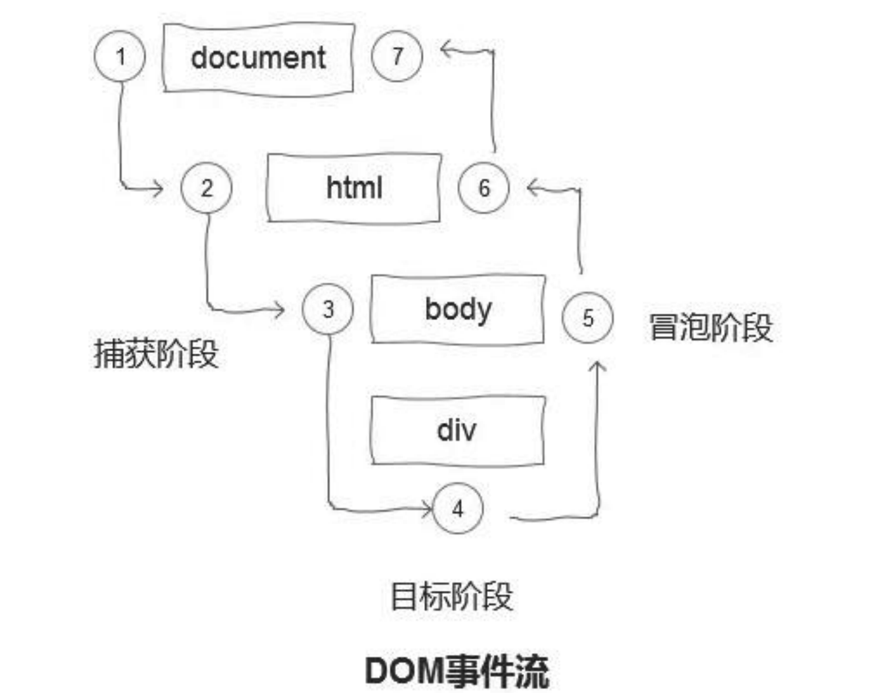

# 【JS内功修炼】浏览器内置对象/事件/ajax

## 浏览器内置对象/事件/ajax

### 1 Window浏览器内置对象

浏览器是一个 JS 的运行环境，它基于 JS 解析器的同时，增加了许多环境相关的内容。用一张图表示各个环境和 JS 解析器的关系如下：


我们把常见的，能够用 JS 这门语言控制的内容称为一个 JS 的运行环境。常见的运行环境有 Node.js、浏览器、小程序、一些物联网设备等等。所有的运行环境都必须有一个 JS 的解释器，在解释器层面符合 ECMAScript 规范，定义了 JS 本身语言层面的东西。比如：关键字、语法等等。

在每个环境中，也会基于 JS 开发一些当前环境中的特性，例如 Node.js 中的 global 对象，process 对象；浏览器环境中的 window 对象，document 对象等等，这些属于运行环境在 JS 基础上的内容。

这也就解释了为什么在 node.js 和浏览器中都能使用数组，函数，但是只能在 node.js 使用 require 加载模块，而不能在浏览器端使用的原因，因为 require 是 node.js 特有的运行环境中的内容。

#### 1.1 Window

window 是在浏览器中代表全局作用域，所有的全局作用域下声明的变量和内容最终都会变成 window 对象下的属性。比如：

```javascript
var num = 123;
console.log(window.123); // 123
```

访问未声明的变量时，如果直接访问则会报错，而如果使用 window 进行访问，就像通过对象访问那样，会返回 undefined。

```javascript
var name = oldName; // 报错
var name2 = window.oldName; // undefined
```

##### 1.1.1 setTimeout 和 setInterval

setTimeout 和 setInterval 他们都可以接受2个参数，第一个参数是一个**回调函数**，第二个参数是**等待执行的时间**。在等待时间结束之后，就会将回调函数放到 event loop 中进行执行。它们都返回一个 id，传入 clearTimeout 和 clearInterval 能够清除这次的定时操作。

```javascript
var id = setTimeout(function() {
  console.log('hello world');
}, 2000);
clearTimeout(id);
```

可视化工具网站：<http://latentflip.com/loupe/>

重点：如果此时队列中没有内容，则会立即执行此回调函数，如果此时队列中有内容的话，则会等待内容执行完成之后再执行此函数。（所以即使等待时间结束，也不是立刻执行这个回调函数的！）

因为 setTimeout 执行时间的不可确定性，所以大部分时候，我们会使用 setTimeout 来模拟 setInterval

##### 1.1.2 alert、confirm、prompt 等交互相关 API

alert 会弹出一个警告框，而 confirm 和prompt 则可以与用户交互，confirm 会弹出一个确认框，最终返回 true（用户点击确定）或返回 false（用户点击取消），而 prompt 用户则可以输入一段文字，最终返回用户输入的结果。

#### 1.2 Location

##### 1.2.1 属性

* hash:	返回一个 URL 的锚部分
* host:	返回一个 URL 的主机名和端口
* hostname:	返回一个 URL 的主机名
* href:	当前 url
* pathname:	返回 URL 路径名
* port:	返回一个 URL 服务器使用的端口号
* protocal:	返回一个 URL 协议
* search:	返回一个 URL 的查询部分

##### 1.2.2 方法

* reload:	重新载入当前页面
* replace:	用新的页面替换当前页面

#### 1.3 Document

##### 1.3.1 方法：选择器

选择器是考察浏览器相关知识点的重中之重，一般会结合实际场景进行考察。

`getElementById`，`getElementsByClassName`，`getElementsByTagName` 等早期规范定义的 API，还有新增的`querySelector`，`querySelectorAll` 等新规范增加的选择器。

重点：`getElementsByTagName` 等返回多个 node 节点的函数返回值并不是数组，而是浏览器实现的一种数据结构。

##### 1.3.2 方法：创建元素

`document.createElement` 能够创建一个 dom 元素，在新增多个元素时，可以先在内存中拼接出所有的 dom 元素后一次插入。

```javascript
var fruits = ['Apple', 'Orange', 'Banana', 'Melon'];
var fragment = document.createDocumentFragment();
fruits.forEach(fruit => {
  const li = document.createElement('li');
  li.innerHTML = fruit;
  fragment.appendChild(li);
});
document.body.appendChild(fragment);
```

##### 1.3.3 属性

* title:	`document.title` 可以设置或返回当前页面标题
* domain:	展示当前网站的域名
* url:	当前网站的链接
* anchors:	返回所有的锚点，带 name 属性的 a 标签
* forms:	返回所有的 form 标签集合
* images:	返回所有的 img 标签集合
* links:	返回所有带 href 属性的 a 标签

#### 1.4 Element

Element 元素的 nodeType 均为 1，大多数标签都是一个 Element 实例。

##### 1.4.1 属性

* tagName:	返回当前元素的标签名

##### 1.4.2 方法

* getAttribute:	获取当前节点属性的结果
* setAttribute:	设置当前节点属性

#### 1.5 Text 类型

Text 类型包含所有纯文本内容，它不支持子节点，同时他的 nodeType 均为 3

#### 1.6 History

History 对象包含用户（在浏览器窗口中）访问过的 URL。在 HTML5 中，history 还与客户端路由息息相关。

##### 1.6.1 属性

* length:	返回历史列表中的网址数

##### 1.6.2 方法

* back:	加载 history 列表中的前一个 URL
* forward:	加载 history 列表中的下一个 URL
* go:	加载 history 列表中的某个具体页面
* pushState:	替换地址栏地址，并且加入 history 列表，但并不会刷新页面
* replaceState:	替换地址栏地址，替换当前页面在 history 列表中的记录，并不刷新页面

### 2 事件

事件是浏览器中的一个非常重要的内容，无论是面试还是工作中都是重点考察和使用的内容。

#### 2.1 定义事件

我们可以通过多种方式对 DOM 元素定义一个事件：

```html
<!-- 点击 p标签，弹出 alert -->
<p>点击后弹出 alert</p>
```

第一种方式，直接在 dom 元素中添加，不过这种方式一般不推荐，过分的将视图与逻辑部分的代码耦合。

```html
<script>
  function showAlert() {
    alert('hello event');
  }
</script>
<p onclick="showAlert()">点击后弹出 alert</p>
```

第二种方式，纯 JS 解决，获取 dom 元素之后通过设置其 onclick 属性

```javascript
document.getElementsByTagName('p')[0].onclick = function() {
  alert('hello event');
}

// 取消事件只需要设置 onclick 属性为 null 即可
document.getElementsByTagName('p')[0].onclick = null;
```

* 优点：纯 JS 实现，视图与逻辑解耦。
* 缺点：一个 dom 元素仅能设置一个 onclick 事件

第三种方式，纯 JS 解决，DOM2 级规范实现新的 API，`addEventListener` 和 `removeEventListener` 两个 API

```javascript
var onClickFunc = function() {
  alert('hello event');
}
document.getElementsByTagName('p')[0].addEventListener('click', onClickFunc);

// 取消事件，使用 removeEventListener 即可
document.getElementsByTagName('p')[0].removeEventListener('click', onClickFunc);
```

* 优点：
  * 纯 JS 实现，视图与逻辑解耦；
  * 通过 addEventListener 可以对 click 设置多个事件回调函数，它们会依次触发
* 缺点：
  * removeEventListener 删除的事件函数必须与设置时保持相同的函数引用，所以设置事件时尽量不使用匿名函数。

在IE中，为保证兼容性，我们需要通过 attachEvent 和 detachEvent 定义和删除事件，第一个参数接受事件名，第二个参数接受触发事件时的回调函数。

与 DOM2 规范定义的方法有区别的是，attachEvent 的事件名参数（第一个参数），需要加上 on 的前缀，例如：

```javascript
var btn = document.getElementsById('btn');
var onClickFunc = function() {
  alert('hello attachEvent');
}
btn.attachEvent('onclick', onClickFunc);
btn.detachEvent('onclick', onClickFunc);
```

同时，如果多次对同一个元素设置相同事件，attachEvent 会按照相反的顺序来进行执行。

与 DOM2 事件规范相似的是，移除一个事件时还必须保证着事件的相同引用，否则无法清除事件。

#### 2.2 事件捕获及冒泡

DOM 是一个嵌套性的树形树状结构，在浏览器中的表现就是叠加在一起的，所以在浏览器中点击一个区域，在DOM 结构中会依次遍历多个 dom，**自顶向下我们称之为【事件捕获】**，**自下而上称为【事件冒泡**】。

DOM2 事件规范规定，一个标准的事件流分为三个阶段。首先是自上而下的【事件捕获】状态，然后是到达真正触发事件的元素，最后再从这个元素回到顶部的【事件冒泡】。



DOM2 级事件规范新增的事件定义函数 addEventListener，就可以通过第三个参数来指定究竟是在捕获阶段触发事件还是在冒泡阶段触发事件。第三个参数为 true 则在捕获阶段触发，第三个参数为 false 则在冒泡阶段触发。

IE 中的 attachEvent 不支持捕获或冒泡阶段的选择，仅支持在冒泡阶段触发。

#### 2.3 事件对象

触发事件之后，浏览器会传入一个事件对象进入事件回调函数本身。

```javascript
document.getElementsByTagName('p')[0].onclick = function(event) {
  console.log(event);
  alert('hello event');
};

var onClickFunc = function() {
  alert('hello event');
}
document.getElementsByTagName('p')[0].addEventListener('click', function(event) {
  console.log(event);
  alert('hello event');
});
```

##### 2.3.1 event 对象下的属性

* bubbles:	表明事件是否冒泡
* cancelable:	表示是否可以取消事件的默认行为
* currentTarget:	事件当前正在处理的元素
* defaultPrevented:	为 true 则代表已经调用了 preventDefault 函数
* detail:	事件细节
* eventPhase:	事件所处阶段，1 代表捕获；2 代表在事件目标；3 代表冒泡
* type:	事件类型（ click 等）

##### 2.3.2 event 对象下的方法

* preventDefault:	取消事件的默认行为
* stopImmediatePropagation:	取消事件的进一步捕获或冒泡，同时阻止事件处理程序调用
* stopPropagation:	取消事件的进一步捕获或冒泡

IE 对象下的 event 有些许不同，如果通过 DOM0 规范定义的事件，是通过 window 来获取 event 内容，如果 attachEvent 定义事件，同样也是通过传入回调函数中去。

```javascript
var btn = document.getElementsById('btn');

// DOM0 方式定义事件
btn.onclick = function() {
  var event = window.event;
}

btn.attachEvent('onclick', function(event) {
  console.log(event.type); //click
});
```

##### 2.3.3 IE 下的 event 的属性方法

* cancelBubbles:	默认为 false，设置为 true 即取消了事件冒泡
* returnValue:	默认为 true，设置为 false 就会取消事件默认行为
* srcElement:	事件的目标
* type:	被触发的类型

#### 2.4 事件委托

```html
<ul id="ul">
  <p>1234</p>
  <li>1</li>
  <li>2</li>
  <li>3</li>
  <li>4</li>
</ul>
```

```javascript
document.getElementsById('ul').onclick = function(event) {
  var target = event.target;
  if(target.nodeName.toLowerCase() === 'li') {
    alert(target.innerHTML);
  }
}
```

#### 2.5 一个通用的事件模型

通用的事件模型主要是为了兼容多个 DOM 等级间设置事件的区别及 IE 和主流规范的不同，同时兼容 event 事件本身的内容。

```javascript
var addEvent = function (element, eventType, handler) {
    if (element.addEventListener) {
        element.addEventListener(eventType, handler, false);
    } else if (element.attachEvent) {
        element.attachEvent('on' + eventType, handler);
    } else {
        element['on' + eventType] = handler;
    }
}

var removeEvent = function (element, eventType, handler) {
    if (element.removeEventListener) {
        element.removeEventListener(eventType, handler, false);
    } else if (element.detachEvent) {
        element.detachEvent('on' + eventType, handler);
    } else {
        element['on' + eventType] = null;
    }
}

var getEvent = function (event) {
    return event ? event : window.event;
}

var getTarget = function (event) {
    return event.target || event.srcElement;
}

var preventDefault = function (event) {
    if (event.preventDefault) {
        event.preventDefault();
    } else {
        event.returnValue = false;
    }
}

var stopPropagation = function (event) {
    if (event.stopPropation) {
        event.stopPropation();
    } else {
        event.cancelBubble = true;
    }
}
```

### 3 ajax

#### 3.1 ES6 之后的 fetch API

#### 3.2 封装的通用 ajax 请求