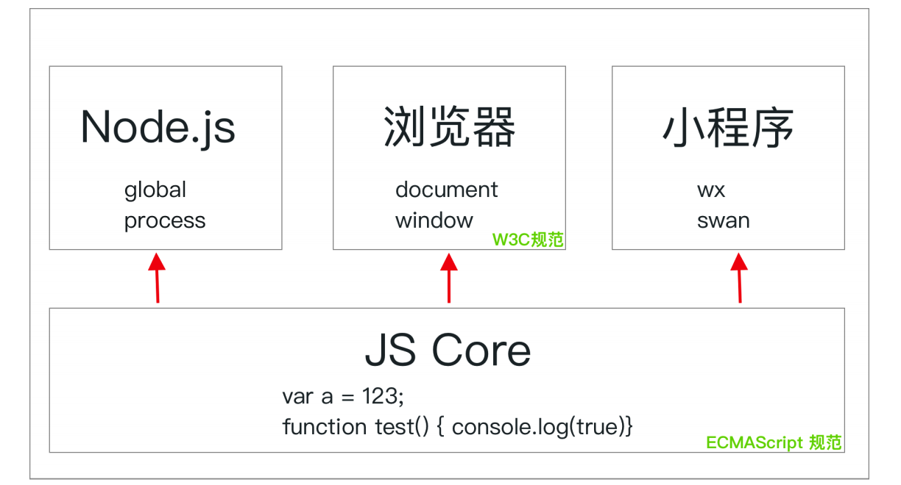

# 【JS内功修炼】浏览器内置对象/事件/ajax

## 浏览器内置对象/事件/ajax

### 1 Window浏览器内置对象

浏览器是一个 JS 的运行环境，它基于 JS 解析器的同时，增加了许多环境相关的内容。用一张图表示各个环境和 JS 解析器的关系如下：

我们把常见的，能够用 JS 这门语言控制的内容称为一个 JS 的运行环境。常见的运行环境有 Node.js、浏览器、小程序、一些物联网设备等等。所有的运行环境都必须有一个 JS 的解释器，在解释器层面符合 ECMAScript 规范，定义了 JS 本身语言层面的东西。比如：关键字、语法等等。

在每个环境中，也会基于 JS 开发一些当前环境中的特性，例如 Node.js 中的 global 对象，process 对象；浏览器环境中的 window 对象，document 对象等等，这些属于运行环境在 JS 基础上的内容。

这也就解释了为什么在 node.js 和浏览器中都能使用数组，函数，但是只能在 node.js 使用 require 加载模块，而不能在浏览器端使用的原因，因为 require 是 node.js 特有的运行环境中的内容。

#### 1.1 Window

##### 1.1.1 setTimeout 和 setInterval

##### 1.1.2 alert、confirm、prompt 等交互相关 API

#### 1.2 Location

##### 1.2.1 属性

##### 1.2.2 方法

#### 1.3 Document

##### 1.3.1 方法：选择器

##### 1.3.2 方法：创建元素

##### 1.3.3 属性

#### 1.4 Element

##### 1.4.1 属性

##### 1.4.2 方法

#### 1.5 Text 类型

#### 1.6 History

##### 1.6.1 属性

##### 1.6.2 方法

### 2 事件

#### 2.1 定义事件

#### 2.2 事件捕获及冒泡

#### 2.3 事件对象

#### 2.4 事件委托

#### 2.5 一个通用的事件模型

### 3 ajax

#### 3.1 ES6 之后的 fetch API

#### 3.2 封装的通用 ajax 请求